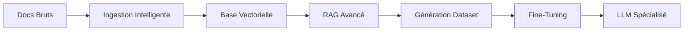

# Spectra — Domain LLM Builder 🚀

[](https://github.com/devdownin/SpectraLLM/actions/workflows/ci.yml)
[](https://github.com/devdownin/SpectraLLM/actions/workflows/codeql.yml)
[](https://github.com/devdownin/SpectraLLM/actions/workflows/dependency-scan.yml)
[](https://www.gnu.org/licenses/agpl-3.0)
[](https://adoptium.net/)
[](https://spring.io/projects/spring-boot)
[](https://react.dev/)

🌍 **Langues :** [English](README.md) · Français

> **Transformez vos documents métier bruts en LLMs spécialisés, prêts pour la production. 100 % local, souverain et respectueux de la vie privée.**

Spectra est une plateforme complète conçue pour construire, optimiser et déployer des modèles de langage (LLM) spécialisés à partir de vos propres données. De l'ingestion de PDF au fine-tuning QLoRA, en passant par le déploiement GGUF, Spectra gère l'intégralité du cycle de spécialisation des modèles dans une seule stack simplifiée.

---

## 🏗️ Le Pipeline de Spécialisation Complet

Spectra n'est pas seulement un outil RAG ; c'est une **usine à intelligence spécialisée**.



1.  **Ingestion** : PDF (Layout-aware), DOCX, HTML, URLs et ZIPs.
2.  **Traitement** : Chunking sémantique, nettoyage de texte en 8 étapes et embeddings Nomic.
3.  **Recherche** : Recherche hybride BM25 + Vecteurs avec re-ranking Cross-Encoder.
4.  **Enrichissement** : RAG Agentique (boucle ReAct) pour un raisonnement profond et des requêtes multi-étapes.
5.  **Synthèse** : Génération automatique de datasets Q&A, DPO et résumés.
6.  **Spécialisation** : Fine-tuning QLoRA (Unsloth) pour injecter vos connaissances dans le modèle.
7.  **Déploiement** : Export au format GGUF et service via une API compatible OpenAI.

---

## 📚 Documentation Pédagogique
Pour comprendre les idées et les algorithmes de Spectra (embeddings, HNSW, BM25 + RRF, les 6 stratégies de RAG, DPO/QLoRA, résilience, déploiement…), chacun illustré d'un exemple d'usage concret, consultez notre **[Mini-Livre Pédagogique](./DOCUMENTATION_PEDAGOGIQUE.fr.md)**.

---

## ✨ Pourquoi Spectra ? (Originalité & Innovation)

### 🧩 Workflow Unifié "Tout-en-un"
La plupart des outils se concentrent sur un seul maillon de la chaîne (uniquement le RAG ou uniquement le fine-tuning). Spectra unifie le **cycle complet**, des données brutes au modèle fine-tuné. Plus besoin de jongler entre cinq outils différents ; tout est dans un seul Docker Compose.

### 🔍 RAG Avancé : Hybride & Agentique
*   **Recherche Hybride** : Combine la précision des **mots-clés BM25** avec la profondeur sémantique des **Vecteurs**, fusionnés via Reciprocal Rank Fusion (RRF).
*   **Re-ranking Cross-Encoder** : Utilise un modèle spécialisé pour réévaluer les meilleurs candidats, garantissant que seul le contexte le plus pertinent atteint le LLM.
*   **RAG Agentique (ReAct)** : Le LLM peut "réfléchir" et effectuer plusieurs itérations de recherche (PENSÉE -> ACTION -> RECHERCHE) pour répondre à des requêtes complexes impossibles à résoudre en une seule passe.

### 📊 Mesurer le gain de chaque option (Ablation A/B)
Spectra ne se contente pas d'activer des modules : il **quantifie leur apport**. L'écran **Optimisation** (`POST /api/ablation`) compare plusieurs configurations (*bras*) sur un benchmark tenu à l'écart — le **delta** entre deux bras est le gain marginal d'une option (RAG vs fine-tuning, et module par module). Trois familles de métriques : génération (exactitude, hallucination), retrieval (Hit@k / MRR / Recall@k), coût (tokens, latence) ; avec **moyenne ± écart-type** sur plusieurs répétitions pour distinguer un gain réel du bruit.

### 🕵️ Traçabilité des Algorithmes (Mode Trace)

Le Playground intègre un mode **Trace** pour démythifier le pipeline. Pour chaque réponse, un simple clic permet de visualiser exactement ce qui s'est passé :
- La **stratégie RAG** appliquée (Agentique, Standard, ou Directe) et le nombre d'itérations.
- Les **optimisations déclenchées** (Recherche Hybride, Multi-Query, Compression de Contexte...).
- Le **texte exact** des sources qui a été injecté dans le contexte du LLM après toutes les étapes de filtrage.

### 📄 Ingestion Respectueuse de la Mise en Page (Layout-Aware)
Spectra comprend que les documents ne sont pas que des suites de texte. En utilisant **PyMuPDF4LLM** et **IBM Docling**, il préserve la structure des tableaux, des en-têtes et des listes, convertissant les PDF complexes en Markdown propre pour une meilleure récupération.

### 🛡️ 100 % Local & Souverain
Exécutez tout sur votre propre matériel. Pas d'APIs cloud, pas de fuites de données, pas d'abonnements. Conçu pour les environnements isolés (air-gapped) et les données métier sensibles.

---

## 🖥️ Expérience Visuelle Moderne

Spectra propose un tableau de bord réactif sous **React 19 / Tailwind CSS 4** qui donne vie à vos opérations LLM.

*   **📊 Moniteur en Direct** : Visualisation en temps réel de l'ingestion, de la génération de dataset et de la progression du fine-tuning via SSE (Server-Sent Events).
*   **🎮 RAG Playground** : Une interface de chat complète avec réponses en streaming, paramètres réglables (température, top-p, top-k) et transparence des sources.
*   **📂 Gestion Documentaire** : Ingestion par glisser-déposer, récupération d'URL distantes (via Chrome headless) et suivi d'état.
*   **🧬 Fine-Tuning Studio** : Configurez votre rang LoRA, l'alpha et le taux d'apprentissage via une interface guidée avec suivi de la perte en temps réel.
*   **📦 Model Hub** : Changez de modèle à chaud, téléchargez les GGUF recommandés depuis HuggingFace et gérez votre registre de modèles local.

---

## ⚡ Mode Batch Automatisé

Besoin d'entraîner un modèle pendant la nuit ? Spectra inclut un puissant **Mode Batch Automatisé**.

Configurez un répertoire source, et Spectra va :
1.  **Ingérer** automatiquement tous les fichiers supportés dans le dossier.
2.  Lancer la **Génération de Dataset** sur l'ensemble du corpus.
3.  Soumettre un **Job de Fine-Tuning** utilisant les données générées.
4.  Produire un **Modèle GGUF** spécialisé prêt à l'emploi.

Pointez simplement vos données, activez `spectra.batch.enabled=true`, et réveillez-vous avec un LLM spécialisé.

---

## 🛠️ Stack Technique

| Composant | Technologie |
| :--- | :--- |
| **Backend** | Java 25 / Spring Boot 4.1 (Virtual Threads / Loom) |
| **Frontend** | React 19 / Vite / Tailwind CSS v4 / Recharts |
| **Inférence** | llama.cpp (GGUF, API compatible OpenAI) |
| **Base Vectorielle** | ChromaDB (API v2) |
| **Fine-Tuning** | Unsloth / PEFT (QLoRA) |
| **Parsing** | PyMuPDF4LLM / Docling / Browserless (Chrome Headless) |
| **Recherche** | BM25 (implémentation Java) + Cross-Encoder Reranker |

---

## 🚀 Démarrage Rapide

### Environnement de Développement

Spectra nécessite **Java 25 (LTS)**. Pour configurer votre environnement local :

- **SDKMAN!** : Un fichier `.sdkmanrc` est présent à la racine. Lancez `sdk env install` puis `sdk env use`.
- **VS Code DevContainer** : Un `.devcontainer` est disponible pour ouvrir le projet dans un environnement prêt à l'emploi.
- **Manuel** : Installez **Eclipse Temurin 25 (LTS)** depuis [Adoptium](https://adoptium.net/).

Vérifiez votre environnement avec :
```bash
bash scripts/setup-java.sh
```

### Prérequis
*   **Java 25 (LTS)** — pour la compilation locale
*   **Docker Desktop** (ou Docker Engine + Compose v2)
*   **16 Go+ de RAM** (32 Go recommandés pour les gros datasets)
*   **GPU (Optionnel)** : Accélère l'inférence et l'entraînement (NVIDIA recommandé).

### Installation Rapide
```bash
# Cloner le dépôt
git clone https://github.com/YourOrg/Spectra.git && cd Spectra

# Exécuter la configuration (vérifie les ressources et crée les dossiers)
./setup.sh

# Démarrer la stack (mode CPU)
./start.sh --detach
```

Pour l'accélération GPU : `./start.sh --detach --gpu`

### Accès
*   **Interface Web** : `http://localhost:80`
*   **Docs API** : `http://localhost:8080/swagger-ui.html`
*   **Serveur LLM** : `http://localhost:8081`
*   **Métriques Prometheus** : `http://localhost:8080/actuator/prometheus`

### Déploiement Kubernetes / GKE (optionnel)
Spectra fournit des manifestes Kubernetes complets (`k8s/`, kustomize) et un pipeline CI/CD pour **Google Kubernetes Engine** :

```bash
./scripts/gke-seed-models.sh          # 1. seed des modèles GGUF sur les PVC (idempotent)
kubectl apply -k k8s/base             # 2. déploiement (minikube, kind, k3s, GKE…)

# Variantes (overlays kustomize)
kubectl apply -k k8s/overlays/gpu     # accélération GPU NVIDIA (opt-in)
kubectl apply -k k8s/overlays/gke     # Ingress GKE natif + TLS managé Google
kubectl apply -k k8s/monitoring       # alertes Prometheus + dashboard Grafana
```

Le workflow `.github/workflows/deploy-gke.yml` build, push et déploie sur GKE à chaque push sur `main` (authentification **Workload Identity Federation**, sans clé JSON). Points forts : **seeding des modèles en une commande**, **HTTPS managé** (certificat Google, timeouts compatibles SSE), **observabilité** (Prometheus/Grafana). Guide complet : **[docs/DEPLOY_GKE.md](docs/DEPLOY_GKE.md)**.

---

## ⚖️ Licence

Spectra est publié sous licence **GNU AGPL-3.0**. Vous pouvez l'utiliser, le modifier et l'auto-héberger librement. L'AGPL est une licence copyleft forte : si vous exécutez une version modifiée comme service réseau, vous devez en mettre le code source correspondant à disposition de ses utilisateurs. Voir [LICENSE](LICENSE) pour le texte complet.

---

*Spectra — Du document brut à l'expertise métier.*
