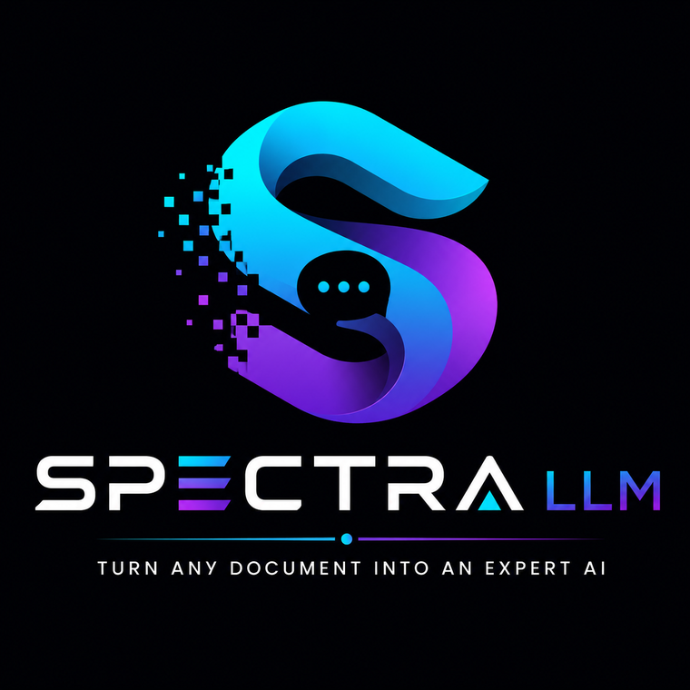
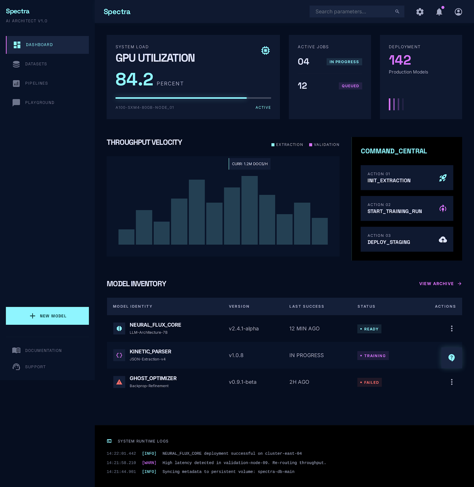
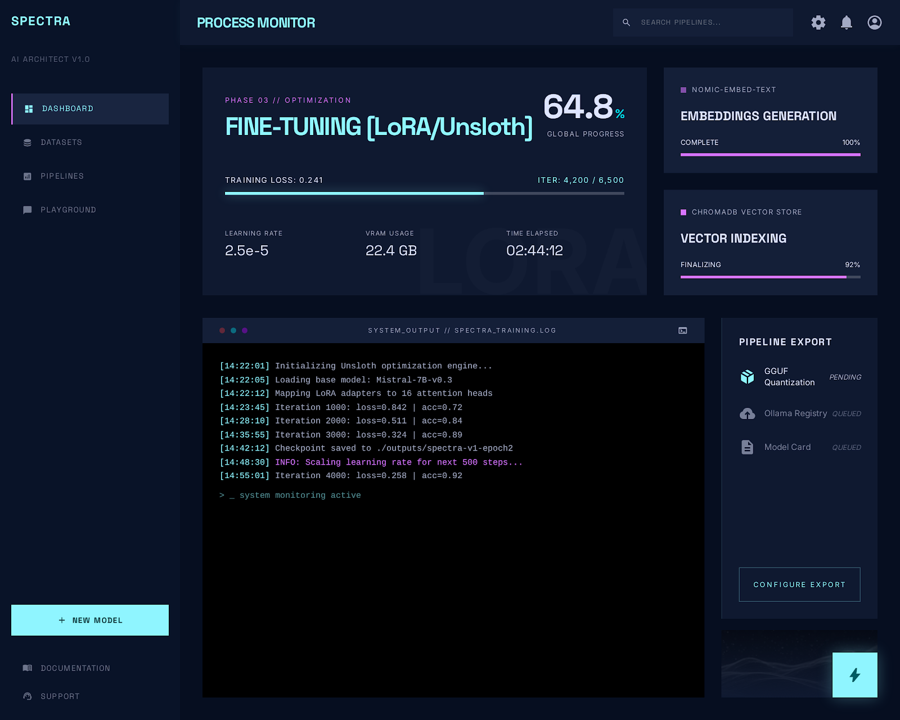

<div align="center">



### Transformez vos documents en IA privée et fine-tunée — en une commande.

**100 % local · Sans cloud · Sans clé API · Sans abonnement**

[](https://github.com/devdownin/SpectraLLM/actions/workflows/ci.yml)
[](https://codecov.io/gh/devdownin/SpectraLLM)
[](https://securityscorecards.dev/viewer/?uri=github.com/devdownin/SpectraLLM)
[](https://www.gnu.org/licenses/agpl-3.0)

[Démarrage rapide](#-démarrage-rapide) · [Pourquoi Spectra](#-pourquoi-spectra) · [Comment ça marche](#-comment-ça-marche) · [Documentation](#-documentation) · [English](./README.md)



</div>

---

Le savoir de votre organisation vit dans des PDF, des documents Word, des wikis et des exports. Les LLM généralistes n'en connaissent rien — et envoyer vos documents internes à une API cloud est souvent exclu.

> **Spectra lit vos documents, y répond à vos questions, puis fine-tune un modèle local qui connaît définitivement votre domaine — exporté en un fichier unique, exécutable partout, même hors ligne.**

La plupart des outils vous donnent le RAG *ou* le fine-tuning, et vous laissent l'intégration. Spectra fait tout le parcours — automatiquement, sur votre matériel :

```
 vos documents ─► 📥 ingestion ─► 🔍 questions (RAG) ─► 🧪 dataset
                                                            │
    déployez partout ◄─ 📦 export ◄─ 🎓 fine-tuning ◄───────┘
```

Un seul `docker compose up`. Une interface web pour tout le parcours. Vos données ne quittent jamais votre machine.

## 🚀 Démarrage rapide

```bash
git clone https://github.com/devdownin/SpectraLLM.git && cd SpectraLLM
./scripts/start.sh --first-run      # Windows : scripts\start.bat --first-run
```

Spectra télécharge les modèles par défaut (~1,2 Go), démarre la stack et ouvre l'interface sur **http://localhost**. Déposez un PDF sur la page Ingestion et posez vos questions.

> **Prérequis :** Docker (Compose v2) et 16 Go de RAM. GPU optionnel — NVIDIA, AMD/ROCm et Vulkan supportés, détection automatique. Vous préférez le pas-à-pas ? → **[Getting Started](docs/GETTING_STARTED.md)**

## 🏆 Pourquoi Spectra

| | Spectra | LangChain | Haystack | Open WebUI |
|---|:--------:|:---------:|:---------:|:---------:|
| Plateforme de bout en bout | ✅ | ❌ | ❌ | ❌ |
| RAG hybride avancé | ✅ | ⚠️ | ✅ | ❌ |
| RAG agentique | ✅ | ⚠️ | ⚠️ | ❌ |
| Génération de dataset synthétique | ✅ | ❌ | ❌ | ❌ |
| Fine-tuning QLoRA | ✅ | ❌ | ❌ | ❌ |
| DPO / apprentissage continu | ✅ | ❌ | ❌ | ❌ |
| Évaluation de modèles intégrée | ✅ | ❌ | ❌ | ❌ |
| Déploiement GGUF en un fichier | ✅ | ❌ | ❌ | ⚠️ |
| 100 % local | ✅ | ✅ | ✅ | ✅ |

> ✅ Intégré &nbsp; ⚠️ Intégration à développer &nbsp; ❌ Indisponible

Construire cela vous-même, c'est assembler un framework d'orchestration, une base vectorielle, un chunker, un serveur d'embeddings, un pipeline de fine-tuning, un harnais d'évaluation et un frontend — chacun avec sa configuration et ses modes de panne. Spectra livre le tout, intégré.

## ⚙️ Comment ça marche

Quatre étapes, un flux continu — le tout piloté par une interface web guidée (FR/EN) :

- **📥 Ingestion** — PDF, DOCX, HTML, JSON, XML, TXT, ZIP, URLs, et même des flux Kafka en continu. Le parsing préserve tableaux et titres.
- **🔍 Questions** — Recherche hybride (mots-clés + vecteurs) avec re-ranking et **sources citées**. Six stratégies de récupération choisies adaptativement par question — jusqu'à une boucle agentique ReAct pour le raisonnement multi-étapes.
- **🎓 Fine-tuning** — Spectra construit un dataset d'entraînement à partir de votre corpus, puis grave le savoir dans les poids du modèle (QLoRA/DPO, CPU ou GPU). Les réponses approuvées alimentent une boucle d'apprentissage continu.
- **📦 Déploiement** — En sortie, un fichier GGUF unique, exécutable partout (llama.cpp, Ollama, LM Studio…). Évaluation intégrée, comparaison A/B et benchmarks d'ablation prouvent le gain à chaque étape.

| | |
|:---:|:---:|
|  |  |
| **Interrogez** vos documents — réponses avec sources citées | **Fine-tunez** un modèle local qui garde le savoir |

*Curieux du fonctionnement réel de la fusion hybride, du re-ranking et des recettes de fine-tuning ? → **[Architecture & internals](docs/ARCHITECTURE.md)***

## 📚 Documentation

Tout est accessible depuis l'**[index de la documentation](docs/README.md)**, ou allez directement au but :

| Guide | Contenu |
|---|---|
| **[Getting Started](docs/GETTING_STARTED.md)** | Installation pas-à-pas, téléchargement des modèles, profils Docker, déploiement Kubernetes/GKE |
| **[Architecture & Services](docs/ARCHITECTURE.md)** | Chaque service en détail : internals RAG, ingestion, évaluation, stack technique |
| **[Configuration](docs/CONFIGURATION.md)** | Toutes les variables d'environnement, endpoints de santé, métriques Prometheus |
| **[Manuel utilisateur](docs/user/USER_MANUAL.md)** | Parcours complet de l'interface web |
| **[Référence technique](docs/tech/TECHNICAL_DOC.md)** | Détail au niveau implémentation |
| **[Comment marche Spectra (FR)](docs/user/DOCUMENTATION_PEDAGOGIQUE.fr.md)** | Les idées en clair : embeddings, BM25 + RRF, les stratégies RAG, DPO/QLoRA |
| **[Guide llama.cpp](docs/tech/llama.cpp.md)** | Détails et réglages du moteur d'inférence |
| **[Fiabilité](docs/process/RELIABILITY.md)** · **[Sécurité](SECURITY.md)** | Garanties opérationnelles et politique de sécurité |

**Stack :** Java 25 / Spring Boot 4 · React 19 · llama.cpp · ChromaDB · Python (fine-tuning, parsing, re-ranking) — détaillée dans [Architecture](docs/ARCHITECTURE.md#technology-stack).

## 🤝 Contribuer

Issues et pull requests bienvenues — voir [CONTRIBUTING.md](CONTRIBUTING.md). Si Spectra vous est utile, une ⭐ aide les autres à le découvrir.

## 📄 Licence

**GNU AGPL-3.0** — utilisez, modifiez et auto-hébergez librement, en production, sur site ou hors ligne. L'AGPL est un copyleft fort : si vous exploitez une version modifiée comme service réseau, vous devez rendre les sources correspondantes accessibles à ses utilisateurs. Texte complet dans [LICENSE](LICENSE).

---

<div align="center">

*De vos documents bruts à l'expertise métier — le tout sur votre matériel.*

</div>
