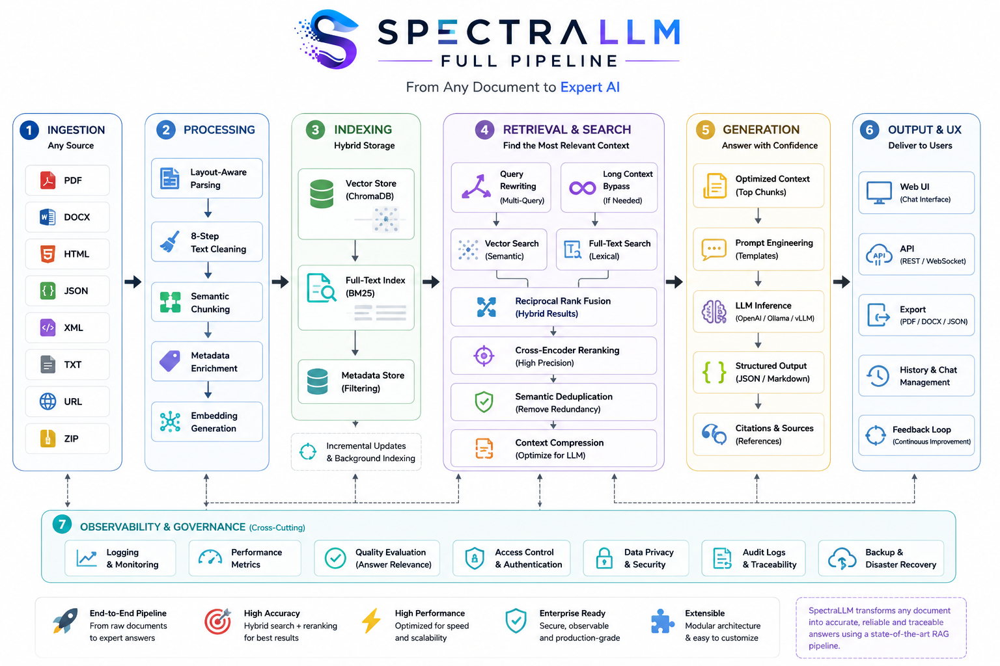

# Spectra — Domain LLM Builder

[](https://github.com/devdownin/SpectraLLM/actions/workflows/ci.yml)
[](https://codecov.io/gh/devdownin/SpectraLLM)
[](https://github.com/devdownin/SpectraLLM/actions/workflows/codeql.yml)
[](https://github.com/devdownin/SpectraLLM/actions/workflows/dependency-scan.yml)
[](https://securityscorecards.dev/viewer/?uri=github.com/devdownin/SpectraLLM)
[](https://www.gnu.org/licenses/agpl-3.0)
[](https://adoptium.net/)
[](https://spring.io/projects/spring-boot)
[](https://react.dev/)

🌍 **Languages:** English · [Français](README.fr.md)

> **Turn your business documents into a specialized, production-ready AI assistant. 100% local. No cloud. No subscriptions.**

📖 **Want to understand the ideas and algorithms behind Spectra?** Read the
**[Pedagogical Mini-Book (FR)](./DOCUMENTATION_PEDAGOGIQUE.fr.md)** — embeddings,
HNSW, BM25 + RRF, the six RAG strategies, DPO/QLoRA, and more, each with a
concrete usage example.

---

## What Is Spectra?

Most AI tools ask you to choose: _do you want RAG, or do you want fine-tuning?_ Spectra does both — in sequence, automatically, on your own hardware.

The idea is simple: your organization has knowledge locked inside PDFs, Word documents, internal wikis, and data exports. A generic LLM doesn't know any of it. Spectra provides a single, self-contained pipeline that:

1. **Ingests** your documents (files, URLs, ZIPs)
2. **Indexes** them for fast, smart retrieval
3. **Answers questions** using your own content as context (RAG)
4. **Generates a training dataset** from that knowledge base
5. **Fine-tunes** a local model to permanently internalize your domain
6. **Exports** a GGUF file you can deploy anywhere

No cloud APIs. No data leaving your infrastructure. No ongoing costs.

---

# Why choose Spectra

| Feature | Spectra | LangChain | Haystack | Open WebUI |
|---------|:--------:|:---------:|:---------:|:---------:|
| End-to-end platform | ✅ | ❌ | ❌ | ❌ |
| Advanced Hybrid RAG | ✅ | ⚠️ | ✅ | ❌ |
| Agentic RAG | ✅ | ⚠️ | ⚠️ | ❌ |
| Synthetic Dataset Generation | ✅ | ❌ | ❌ | ❌ |
| QLoRA Fine-tuning | ✅ | ❌ | ❌ | ❌ |
| DPO Training | ✅ | ❌ | ❌ | ❌ |
| Continuous Learning | ✅ | ❌ | ❌ | ❌ |
| Model Evaluation | ✅ | ❌ | ❌ | ❌ |
| GGUF Deployment | ✅ | ❌ | ❌ | ⚠️ |
| Kubernetes Ready | ✅ | ⚠️ | ⚠️ | ⚠️ |
| 100% Local | ✅ | ✅ | ✅ | ✅ |

> ✅ Built-in &nbsp;&nbsp; ⚠️ Requires custom integration &nbsp;&nbsp; ❌ Not available

## The Full Pipeline at a Glance



```
Raw documents
     │
     ▼
┌─────────────────────────────────────────────────────┐
│  INGESTION                                          │
│  PDF · DOCX · HTML · JSON · XML · TXT · ZIP · URL  │
│  Layout-aware parsing → 8-step text cleaning        │
│  → Semantic chunking → Embedding                   │
└────────────────────┬────────────────────────────────┘
                     │
                     ▼
┌─────────────────────────────────────────────────────┐
│  SEARCH & RETRIEVAL                                 │
│  Long-Context bypass · Multi-Query fusion           │
│  ChromaDB (Vector) + BM25 (Full-text)               │
│  Reciprocal Rank Fusion → Cross-Encoder Reranking   │
│  Semantic Dedup · Context Compression               │
└────────────────────┬────────────────────────────────┘
                     │
                     ▼
┌─────────────────────────────────────────────────────┐
│  GENERATION                                         │
│  Standard RAG · Hybrid RAG · Agentic ReAct loop     │
│  Corrective RAG · Self-RAG · Adaptive routing       │
│  Streaming responses via SSE                        │
└────────────────────┬────────────────────────────────┘
                     │
                     ▼
┌─────────────────────────────────────────────────────┐
│  DATASET SYNTHESIS                                  │
│  LLM-generated Q&A, DPO, summaries from your docs  │
│  Jaccard guard: rejects DPO pairs with overlap > 85%│
│  LLM-as-a-Judge automatic evaluation (1–10 scores) │
└────────────────────┬────────────────────────────────┘
                     │
                     ▼
┌─────────────────────────────────────────────────────┐
│  ARTICLE COMMENTING                                 │
│  Human or RAG-grounded AI comments per document    │
│  👍/👎 ratings → DPO pairs for next training cycle │
│  ↺ Auto-trigger: every N approvals → fine-tune job │
└────────────────────┬────────────────────────────────┘
                     │
                     ▼
┌─────────────────────────────────────────────────────┐
│  FINE-TUNING                                        │
│  QLoRA (Unsloth) · Configurable rank/alpha/epochs  │
│  Comment DPO + SFT dataset · GGUF export            │
│  Model sync verification: registry ↔ llama-server  │
└────────────────────┬────────────────────────────────┘
                     │
              ↺ feedback loop
                     │
     ▼ (metrics dashboard: GET /api/metrics/personalization)
```

---

## Why Spectra Is Different

### One stack, zero integration work

Building this yourself means stitching together LangChain, a vector database, a chunker, an embedding server, a fine-tuning framework, an export pipeline, and a frontend. Each piece has its own configuration model, failure modes, and version constraints. Spectra ships all of it in a single `docker compose up`.

### Advanced retrieval — not just a vector search

Most RAG demos use only vector similarity. That works well for semantic matches but fails on exact terms, proper nouns, and technical identifiers. Spectra combines two fundamentally different signals:

- **BM25 (keyword-based)**: fast, exact, strong on rare terms
- **Vector search (semantic)**: catches paraphrases and synonyms

These are fused using **Reciprocal Rank Fusion (RRF)** — a statistically robust method that doesn't require tuning a weighting parameter. The result outperforms either approach alone.

### Agentic reasoning loop

Standard RAG retrieves once and generates. That's fine for simple lookups. For multi-hop questions — _"What changed in the process described in section 4 of the Q3 report compared to the previous year?"_ — a single retrieval isn't enough.

Spectra's **Agentic RAG** uses a ReAct (Reasoning + Acting) loop: the LLM decides whether it has enough information to answer, or whether it needs to search again with a refined query. It keeps iterating (up to a configurable limit) until it's confident. This dramatically improves accuracy on complex queries.

### Production-grade retrieval pipeline

Beyond the basics, Spectra ships four additional retrieval modules designed for real-world corpora:

- **Multi-Query RAG**: generates N reformulations of each question (synonyms, alternative phrasings, different abstraction levels), runs retrieval for each, and merges the results. Catches relevant chunks that a single phrasing would miss.
- **Context Compression**: after retrieval, extracts only the sentences directly relevant to the question from each chunk. Drastically reduces prompt noise and lets you fit more diverse sources in the same context window.
- **Semantic Deduplication**: removes near-duplicate chunks after reranking using Jaccard word-overlap similarity. No extra API calls — pure Java, zero latency overhead. Prevents the LLM from reading the same passage twice in different words.
- **Long-Context bypass**: when the entire corpus fits below a configurable chunk threshold, skips vector search entirely and loads all documents directly. Simpler, faster, and more accurate for small knowledge bases.

### Layout-aware PDF parsing

A standard PDF parser produces a flat string of text. Tables become garbage. Multi-column layouts interleave their columns. Headers and footers pollute every chunk.

Spectra's **docparser** service (powered by PyMuPDF4LLM or IBM Docling) produces structured Markdown that preserves headings, tables, and document hierarchy. The result is cleaner chunks, better retrieval, and more accurate answers.

### The model learns your domain permanently

RAG answers questions at query time by looking things up. Fine-tuning bakes knowledge directly into the model's weights. After fine-tuning, the model answers faster, handles questions that fall outside your indexed chunks, and can be deployed without a vector database at all.

Spectra closes this loop: it uses RAG to build a high-quality Q&A dataset, then uses that dataset to fine-tune the model, then redeploys the improved model. The knowledge compound over time.

### Hardware-aware self-configuration

Spectra detects your hardware at startup (CPU cores, RAM, VRAM, GPU vendor) and computes optimal `llama-server` parameters automatically: thread count, context window, GPU layer count, KV cache type. You don't need to know what `--n-gpu-layers` should be for your card — Spectra figures it out.

---

## Architecture Overview

```
┌──────────────────────────────────────────────────────────┐
│                     Browser / Client                     │
└───────────────────────────┬──────────────────────────────┘
                            │ HTTP + SSE
┌───────────────────────────▼──────────────────────────────┐
│           Spring Boot API  :8080                         │
│  Java 25 · Virtual Threads · OpenAI-compatible REST      │
│                                                          │
│  ┌─────────────┐  ┌────────────┐  ┌──────────────────┐  │
│  │  Ingestion  │  │    RAG     │  │   Fine-Tuning    │  │
│  │  Pipeline   │  │  Service   │  │    Service       │  │
│  └──────┬──────┘  └─────┬──────┘  └────────┬─────────┘  │
│         │               │                  │             │
└─────────┼───────────────┼──────────────────┼─────────────┘
          │               │                  │
    ┌─────▼───────┐  ┌────▼──────┐  ┌────▼──────┐  ┌───────▼────────┐
    │  ChromaDB   │  │ llm-chat  │  │ llm-embed │  │  train.sh      │
    │  :8000      │  │ :8081     │  │ :8082     │  │  (Unsloth)     │
    │  (vectors)  │  │ (chat)    │  │ (embed)   │  │                │
    └─────────────┘  └───────────┘  └───────────┘  └────────────────┘
          │
    ┌─────▼──────────────────────────────────────────┐
    │  Optional services (Docker profiles)           │
    │  docparser :8001  · reranker :8002             │
    │  browserless :3000                             │
    └────────────────────────────────────────────────┘
```

### Component list

| Service | Role | Always on |
|---|---|:---:|
| `model-init` | Checks GGUF model files exist before startup | ✅ |
| `spectra-api` | Spring Boot backend, all business logic | ✅ |
| `llm-chat` | llama.cpp — chat inference (port 8081) | ✅ |
| `llm-embed` | llama.cpp — embedding only (port 8082) | ✅ |
| `chromadb` | Vector database — API v2 | ✅ |
| `docparser` | Layout-aware PDF → Markdown | optional |
| `reranker` | Cross-Encoder re-ranking | optional |
| `browserless` | Headless Chrome for JS-rendered pages | optional |

---

## Getting Started

### Development Environment

Spectra requires **Java 25 (LTS)**. To set up your local development environment, you can use one of the following methods:

- **SDKMAN!**: A `.sdkmanrc` file is provided at the root. Run `sdk env install` then `sdk env use` to automatically switch to the correct Java version.
- **VS Code DevContainer**: A pre-configured `.devcontainer` is available. When opening the project in VS Code, click "Reopen in Container".
- **Manual**: Install **Eclipse Temurin 25 (LTS)** from [Adoptium](https://adoptium.net/).

You can verify your environment by running:
```bash
bash scripts/setup-java.sh
```

### Prerequisites

- **Java 25 (LTS)** — for local compilation
- **Docker Desktop** (or Docker Engine + Compose v2)
- **16 GB RAM** minimum (32 GB recommended for 7B models)
- A `.gguf` model file placed in `data/models/`

GPU is optional but strongly recommended for inference speed. NVIDIA, AMD (ROCm), and Vulkan are all supported.

### Quick start — one command

```bash
git clone https://github.com/your-org/Spectra.git
cd Spectra
./start.sh --first-run        # Windows: start.bat --first-run
```

This downloads the default models (embedding ~81 MB + chat ~1.1 GB), starts the full stack in the background, waits for every service to be ready, then opens the Web UI at **http://localhost**. Steps 1–4 below do the same thing manually, for when you want control over each stage.

### 1. Clone and prepare

```bash
git clone https://github.com/your-org/Spectra.git
cd Spectra
./detect-env.sh               # auto-detects hardware and writes .env
mkdir -p data/models data/documents data/dataset
```

### 2. Download the models

Two GGUF files are required — one for chat, one for embeddings:

```bash
# Chat model (~1.1 GB) — Phi-4-mini by default
huggingface-cli download unsloth/Phi-4-mini-reasoning-GGUF \
  Phi-4-mini-reasoning-UD-IQ1_S.gguf --local-dir data/models/

# Embedding model (~81 MB) — nomic-embed-text by default
huggingface-cli download nomic-ai/nomic-embed-text-v1.5-GGUF \
  nomic-embed-text-v1.5.Q4_0.gguf \
  --local-dir data/models/ --filename embed.gguf
```

If the models are missing at startup, `model-init` will print exact download instructions and abort before the LLM servers start.

### 3. Start the stack

```bash
# Base stack (inference + vector DB)
docker compose up -d

# With layout-aware PDF parsing
docker compose --profile layout-parser up -d

# With cross-encoder reranking
docker compose --profile reranker up -d

# With both optional services
docker compose --profile layout-parser --profile reranker up -d
```

### 4. Access

| Interface | URL |
|---|---|
| **Web UI** | `http://localhost:80` |
| **API Docs** (Swagger) | `http://localhost:8080/swagger-ui.html` |
| **System status** | `http://localhost:8080/api/status` |
| **llama.cpp chat** | `http://localhost:8081` |
| **llama.cpp embed** | `http://localhost:8082` |
| **Prometheus metrics** | `http://localhost:8080/actuator/prometheus` |

### 5. Deploy to Kubernetes / GKE (optional)

Spectra ships complete Kubernetes manifests (`k8s/`, kustomize) and a one-push CI/CD pipeline for **Google Kubernetes Engine**:

```bash
# 1. Seed the GGUF models onto the PVCs (idempotent)
./scripts/gke-seed-models.sh

# 2. Deploy the stack (minikube, kind, k3s, GKE…)
kubectl apply -k k8s/base

# Variants (kustomize overlays)
kubectl apply -k k8s/overlays/gpu    # GPU acceleration (NVIDIA, opt-in)
kubectl apply -k k8s/overlays/gke    # GKE native Ingress + Google-managed TLS
kubectl apply -k k8s/monitoring      # Prometheus alerts + Grafana dashboard
```

A GitHub Actions workflow (`.github/workflows/deploy-gke.yml`) builds and pushes the images and rolls out to GKE on every push to `main`, authenticated via **Workload Identity Federation** (no JSON keys). Highlights:

- **One-command model seeding** — a Job downloads the GGUF models directly onto the PVCs (no manual `kubectl cp`).
- **Managed HTTPS** — `ManagedCertificate` + HTTP→HTTPS redirect, with SSE-friendly backend timeouts.
- **Observability** — `/actuator/prometheus` metrics, ready-to-apply `ServiceMonitor`, alert rules and a Grafana dashboard.

See **[docs/DEPLOY_GKE.md](docs/DEPLOY_GKE.md)** for the full GCP setup, cluster creation, and the GPU / TLS / monitoring variants.

---

## Services In Depth

### `spectra-api` — The Backend

The core of Spectra. A Spring Boot 4.1 application running on Java 25 with **virtual threads** (Project Loom) enabled. Every blocking I/O operation (embedding calls, ChromaDB queries, LLM generation, file reads) runs on a virtual thread, giving you thousands of concurrent operations without the overhead of a traditional thread pool.

**Key responsibilities:**
- Document ingestion pipeline (extraction → cleaning → chunking → embedding → indexing)
- RAG query pipeline (standard, hybrid, and agentic modes)
- Dataset generation and export
- Fine-tuning orchestration
- Model registry management
- Hardware profiling and llama-server auto-configuration
- REST API + SSE streaming

**Configuration:**
```yaml
spectra:
  llm:
    provider: llama-cpp
    chat:
      base-url: http://llm-chat:8081
    embedding:
      base-url: http://llm-embed:8082
    model: phi-4-mini
    embedding-model: nomic-embed-text
  pipeline:
    chunk-max-tokens: 512        # Max tokens per chunk
    chunk-overlap-tokens: 64     # Overlap between consecutive chunks
    embedding-batch-size: 10     # Embeddings computed in parallel
    embedding-timeout-seconds: 30
    concurrent-ingestions: 4     # Max parallel ingestion tasks
```

**Environment variables:**
```bash
SPECTRA_LLM_PROVIDER=llama-cpp
SPECTRA_LLM_CHAT_BASE_URL=http://llm-chat:8081
SPECTRA_LLM_EMBEDDING_BASE_URL=http://llm-embed:8082
SPECTRA_LLM_MODEL=phi-4-mini
SPECTRA_LLM_EMBEDDING_MODEL=nomic-embed-text
SPECTRA_CHUNK_MAX_TOKENS=512
SPECTRA_EMBEDDING_BATCH_SIZE=10
SPECTRA_CONCURRENT_INGESTIONS=4
```

---

### `llm-chat` and `llm-embed` — Inference Engines

Two separate **llama.cpp** containers (`ghcr.io/ggml-org/llama.cpp:server`), each dedicated to one task:

| Service | Port | Model | Role |
|---|---|---|---|
| `llm-chat` | 8081 | `LLM_CHAT_MODEL_FILE` | `/v1/chat/completions` |
| `llm-embed` | 8082 | `LLM_EMBED_MODEL_FILE` | `/v1/embeddings` |

**Why two containers?** A chat model (instruction-tuned, large context) and an embedding model (small, optimised for vector similarity) have incompatible architectures. Running them as separate processes avoids contention and allows independent scaling.

**Configuration:**
```bash
LLM_CHAT_MODEL_FILE=Phi-4-mini-reasoning-UD-IQ1_S.gguf   # chat GGUF in data/models/
LLM_CHAT_MODEL_NAME=phi-4-mini
LLM_EMBED_MODEL_FILE=embed.gguf                           # embedding GGUF in data/models/
LLM_EMBED_MODEL_NAME=nomic-embed-text
LLM_PARALLEL=2                                            # parallel slots per server
```

**Embedded runtime mode:** Spectra can also launch and manage a local `llama-server` process directly (without Docker), configured in `application.yml`:
```yaml
spectra:
  llm:
    provider: llama-cpp
    runtime:
      enabled: true
      executable: llama-server   # path to llama-server binary
      port: 8081
      context-size: 4096
      threads: 8
      parallelism: 2
```
In this mode, the `ResourceAdvisorService` detects your hardware and fills in optimal parameters automatically.

---

### `chromadb` — Vector Database

**ChromaDB** stores document embeddings (dense float vectors) and supports approximate nearest-neighbor search. Every chunk ingested into Spectra gets embedded and stored here.

When you ask a question, Spectra:
1. Embeds your question using the same model used during ingestion
2. Queries ChromaDB for the `top_k` most similar chunks
3. Passes those chunks as context to the LLM

**Configuration:**
```bash
CHROMADB_URL=http://chromadb:8000
```

Data is persisted in a named Docker volume (`chromadb-data`) and survives container restarts.

---

### `FtsService` + `BM25Index` — Full-Text Search

The in-memory BM25 (Okapi BM25) index runs inside the JVM alongside the API. It's populated during ingestion in parallel with the ChromaDB vector index.

**How BM25 differs from vector search:**
- BM25 is term-frequency based: it scores documents by how often query terms appear relative to document length and corpus frequency
- It's deterministic, fast, and very good at exact matches
- It's weak on synonyms and paraphrases (a document about "vehicles" won't rank for "cars" unless the word appears)

**How they're combined (Hybrid Search):**
Both indexes produce a ranked list. Spectra merges them using **Reciprocal Rank Fusion**:

```
RRF_score(doc) = Σ  1 / (k + rank_i(doc))
                 i
```

Where `k=60` is a smoothing constant. This formula rewards documents that rank well in multiple lists without requiring score normalization between the two systems.

**Configuration:**
```bash
SPECTRA_HYBRID_SEARCH_ENABLED=true   # Enable hybrid mode (default: false)
SPECTRA_HYBRID_BM25_TOP=20           # Candidates fetched from BM25 before fusion
SPECTRA_HYBRID_BM25_WEIGHT=1.0       # Weight multiplier for BM25 scores
```

**Status endpoint:**
```bash
GET /api/status/fts                  # Aggregated BM25 index stats
GET /api/status/fts?collection=name  # Per-collection stats
```

---

### `docparser` — Layout-Aware PDF Service

An optional Python FastAPI microservice (Docker profile: `layout-parser`) that converts PDF files to structured Markdown while preserving document layout.

**Why this matters:** Standard PDF text extraction concatenates text streams in drawing order, which mangles multi-column layouts and tables. The docparser service uses page rendering + spatial analysis to reconstruct logical reading order.

**Two parsing backends:**
- **PyMuPDF4LLM** (default): fast, lightweight, no GPU required, excellent for most business documents
- **Docling** (IBM Research): higher accuracy on complex layouts (scientific papers, financial reports), enabled via `USE_DOCLING=true`

**Activation:**
```bash
SPECTRA_LAYOUT_PARSER_ENABLED=true           # Enable in API
SPECTRA_LAYOUT_PARSER_URL=http://docparser:8001
SPECTRA_LAYOUT_PARSER_TIMEOUT=120            # Seconds per document
SPECTRA_LAYOUT_PARSER_BUFFER_MB=100          # Max upload size (MB)
USE_DOCLING=false                            # Switch to Docling backend
```

Start with the profile:
```bash
docker compose --profile layout-parser up -d
```

---

### `reranker` — Cross-Encoder Re-ranking

An optional Python FastAPI microservice (Docker profile: `reranker`) that re-scores retrieval candidates using a **Cross-Encoder** model.

**The two-stage retrieval problem:**
Vector search and BM25 both use *bi-encoder* architectures — the query and document are embedded independently, then compared by dot product. This is fast (no joint computation) but less accurate.

A Cross-Encoder reads the query and a candidate document *together* as a single sequence, producing a much more accurate relevance score. The trade-off is speed: you can't index with a Cross-Encoder, only re-score.

Spectra solves this with a two-stage approach:
1. **Stage 1** (fast): Vector + BM25 retrieves the top-20 candidates
2. **Stage 2** (accurate): Cross-Encoder re-scores those 20 and returns the top-5

The result is near Cross-Encoder accuracy at near bi-encoder speed.

**Model:** `cross-encoder/mmarco-mMiniLMv2-L12-H384-v1` (multilingual, works in French, English, and 25+ languages)

**Configuration:**
```bash
SPECTRA_RERANKER_ENABLED=true
SPECTRA_RERANKER_URL=http://reranker:8000
SPECTRA_RERANKER_TOP_CANDIDATES=20     # Candidates fed to the re-ranker
RERANKER_MODEL=cross-encoder/mmarco-mMiniLMv2-L12-H384-v1
```

Start with the profile:
```bash
docker compose --profile reranker up -d
```

---

### Agentic RAG — ReAct Loop

When enabled, the standard "retrieve once, generate once" pattern is replaced by an iterative reasoning loop. The LLM operates as an agent following the **ReAct** (Reasoning + Acting) framework:

```
THOUGHT: I need to find information about X
ACTION: SEARCH
QUERY: specific search query

[Spectra performs the search, adds results to context]

THOUGHT: I now have enough context to answer
ACTION: ANSWER
RESPONSE: Final answer to the user's question
```

The loop continues until the LLM emits `ACTION: ANSWER` or reaches `max-iterations`. This enables multi-hop reasoning: the model can reformulate its query based on what it found in the previous iteration.

**Configuration:**
```bash
SPECTRA_AGENTIC_RAG_ENABLED=true
SPECTRA_AGENTIC_MAX_ITERATIONS=3      # Max search rounds
SPECTRA_AGENTIC_INITIAL_TOP_K=5       # Chunks retrieved per iteration
SPECTRA_AGENTIC_LANGUAGE=fr           # Response language: fr, en, auto
SPECTRA_AGENTIC_MAX_CONTEXT_TOKENS=3000
```

---

### Ingestion Pipeline

Documents enter Spectra through several channels:

| Source | Endpoint | Supported formats |
|---|---|---|
| File upload | `POST /api/ingest` | PDF, DOCX, HTML, JSON, XML, TXT |
| ZIP archive | `POST /api/ingest` | Any combination of the above |
| Remote URL | `POST /api/ingest/url` | HTML pages, PDF, TXT |

**The ingestion pipeline for each document:**

1. **Extraction** — format-specific extractor (PDF via PDFBox or docparser, DOCX via Apache POI, HTML via Jsoup, etc.)
2. **Cleaning** — 8-step normalization: Unicode NFC, OCR ligature replacement, page markers, headers/footers, table borders, bullet point normalization, whitespace compression, blank line collapse
3. **Chunking** — sliding window by token count (default: 512 tokens, 64-token overlap). The overlap ensures that sentences crossing chunk boundaries aren't split in half for the embedder
4. **Embedding** — batched calls to the embedding model (default batch: 10 chunks)
5. **Vector indexing** — chunks + embeddings stored in ChromaDB
6. **BM25 indexing** — chunks indexed in the in-memory BM25 index (if hybrid search is enabled)

**URL ingestion specifics:**
- A `HEAD` request first determines the content type
- HTML pages are rendered by **Browserless** (headless Chrome) to handle JavaScript-rendered content
- Binary files (PDF, TXT) are downloaded directly
- If Browserless is unavailable, direct download is used as a fallback

---

### Kafka Streaming Ingestion — Living Data, Fed to RAG On the Fly

Beyond one-shot uploads, Spectra can **continuously enrich the RAG index from a Kafka
cluster**. Each message is *upserted*: the model's effective knowledge stays current in
seconds, without any retraining.

**Disabled by default** — no Kafka bean is created and startup is unchanged unless you set
`SPECTRA_KAFKA_ENABLED=true`.

**How it works:**
- The **message key** becomes a stable business identity
  (`sourceFile = kafka://<topic>/<key>`). A new version of the same entity reuses that key,
  so Spectra **deletes the previous version** (from both the vector index and BM25) and
  reindexes the current one — a true upsert. Without a key, it falls back to
  `kafka://<topic>/<partition>-<offset>` (append-only).
- A **null value** (Kafka log-compaction tombstone) **deletes** the entry.
- **Idempotent**: an unchanged payload is a no-op (absorbs at-least-once redeliveries).
- **Raw payload by default**: the message value is passed as-is to the extractor, routed by
  `SPECTRA_KAFKA_FORMAT` (`json`, `txt`, `xml`, `avro`). Optionally set
  `SPECTRA_KAFKA_CONTENT_FIELD` (field name or JSON pointer) to index only one field of a
  structured event, and `SPECTRA_KAFKA_METADATA_FIELDS` to copy chosen fields into chunk
  metadata (for retrieval-time filtering).
- **Freshness**: every chunk carries `ingestedAt` and `eventTime` (Kafka record timestamp)
  metadata, available for recency filtering/weighting at retrieval.
- **Metrics**: Micrometer counter `spectra.kafka.messages{topic,result}` (result =
  upserted/unchanged/deleted/failed) and timer `spectra.kafka.processing{topic}`, exposed on
  `/actuator/prometheus`.
- **At-least-once**: offsets are committed only after successful indexing; a poison message
  is retried then routed to a **Dead Letter Topic** `<topic>.DLT` instead of blocking the
  partition.
- **Retention**: a nightly job purges sources not updated for
  `SPECTRA_KAFKA_RETENTION_TTL_DAYS` days (0 = disabled) so a continuous stream doesn't grow
  the index unbounded.

A **dedicated collection** (`spectra_stream`) isolates living data from the static document
corpus.

**Start the optional broker (Docker profile `kafka`, single-node KRaft):**
```bash
SPECTRA_KAFKA_ENABLED=true SPECTRA_KAFKA_TOPICS=my-topic \
  docker compose --profile kafka up -d
# Produce test messages from the host on localhost:29092; spectra-api reads kafka:9092
```

**Configuration:**

| Environment variable | Default | Description |
|---|---|---|
| `SPECTRA_KAFKA_ENABLED` | `false` | Enable Kafka streaming ingestion |
| `SPECTRA_KAFKA_BOOTSTRAP_SERVERS` | `kafka:9092` | Broker list (host:port,…) |
| `SPECTRA_KAFKA_TOPICS` | *(empty)* | Topics to consume (comma-separated) |
| `SPECTRA_KAFKA_GROUP_ID` | `spectra-ingestion` | Consumer group id |
| `SPECTRA_KAFKA_COLLECTION` | `spectra_stream` | Dedicated ChromaDB collection |
| `SPECTRA_KAFKA_FORMAT` | `json` | Extractor routing: `json`/`txt`/`xml`/`avro` |
| `SPECTRA_KAFKA_CONTENT_FIELD` | *(empty)* | JSON field/pointer to index (empty = raw payload) |
| `SPECTRA_KAFKA_METADATA_FIELDS` | *(empty)* | JSON fields copied into chunk metadata (comma-separated) |
| `SPECTRA_KAFKA_CONCURRENCY` | `1` | Concurrent consumers (~partitions in parallel) |
| `SPECTRA_KAFKA_MAX_POLL_RECORDS` | `20` | Max records per poll (embedding is the bottleneck) |
| `SPECTRA_KAFKA_RETENTION_TTL_DAYS` | `0` | Purge stale sources after N days (0 = disabled) |
| `SPECTRA_KAFKA_SECURITY_PROTOCOL` | `PLAINTEXT` | `PLAINTEXT`/`SSL`/`SASL_SSL`/`SASL_PLAINTEXT` |
| `SPECTRA_KAFKA_SASL_MECHANISM` | *(empty)* | e.g. `SCRAM-SHA-512`, `PLAIN` (if SASL) |
| `SPECTRA_KAFKA_SASL_JAAS_CONFIG` | *(empty)* | Full JAAS config (holds credentials) |

See **[docs/DESIGN_KAFKA_STREAMING_UPSERT.fr.md](docs/DESIGN_KAFKA_STREAMING_UPSERT.fr.md)**
for the detailed design (upsert algorithm, tombstones, idempotency, performance notes).

---

### `TextCleanerService` — 8-Step Text Normalization

Raw extracted text is noisy. The cleaner applies these steps in order:

| Step | What it removes/fixes |
|---|---|
| 1. Unicode NFC | Normalizes composed vs. decomposed characters |
| 2. OCR ligatures | Converts ff fi fl → ff fi fl |
| 3. Page markers | Lines like `- 47 -` or `Page 3` alone on a line |
| 4. Headers/footers | Recurring `Confidentiel`, `© Company`, `Page X/Y` patterns |
| 5. Table borders | Pipe characters from markdown-style tables → spaces |
| 6. Bullet normalization | `•`, `●`, `■`, `▸` → `-` |
| 7. Whitespace | Multiple consecutive spaces → single space |
| 8. Blank lines | 3+ consecutive newlines → 2 newlines |

---

### Dataset Generation

Once documents are indexed, Spectra can automatically generate a fine-tuning dataset from your corpus. The LLM reads each chunk and produces:

- **Q&A pairs**: question + answer grounded in the chunk
- **Summaries**: condensed version of each chunk
- **DPO pairs** (Direct Preference Optimization): chosen vs. rejected responses

This synthetic dataset is exported as JSONL in the format expected by Unsloth.

**Endpoint:** `POST /api/dataset/generate`

---

### GED — Document Lifecycle Management

Every document ingested into Spectra gets a full lifecycle record managed by the **GED** (Gestion Électronique de Documents) module. This enables traceability from raw ingestion to fine-tuning and beyond.

**Lifecycle state machine:**

```
INGESTED ──► QUALIFIED ──► TRAINED ──► ARCHIVED
    │                                      ▲
    └──────────────────────────────────────┘
         (re-ingestion resets to INGESTED)
```

Transitions are validated — you cannot skip states or go backwards (except re-ingestion). Each transition is recorded in the audit trail.

**Core features:**

| Feature | Description |
|---|---|
| **Audit trail** | Every action (ingest, qualify, tag, archive, delete) is logged with actor and timestamp |
| **Tags** | Free-form thematic labels — add, remove, bulk-assign |
| **Model links** | Associate a document to a model as `TRAINED_ON` or `EVALUATED_ON` |
| **Quality score** | 0–1 score assigned at ingestion; drives auto-qualification |
| **Auto-qualification** | If `autoQualifyThreshold > 0`, documents scoring above it are auto-promoted to `QUALIFIED` at ingestion |
| **Retention policies** | Nightly cron: auto-archive after N days, auto-purge ARCHIVED after M days |
| **Synchronized deletion** | Deleting a document removes it from both the GED (H2) and ChromaDB in one call |
| **Statistics** | Lifecycle distribution, quality histogram, top tags, total indexed chunks |
| **Article commenting** | Human and AI-generated comments per document; rated comments export as DPO training pairs |

**API endpoints:**

```
GET    /api/ged/documents                              # Paginated list with filters
GET    /api/ged/documents/{sha256}                     # Full document sheet + model links + audit
DELETE /api/ged/documents/{sha256}                     # Delete from GED + ChromaDB
PUT    /api/ged/documents/{sha256}/lifecycle           # Transition lifecycle
POST   /api/ged/documents/{sha256}/tags                # Add tags
DELETE /api/ged/documents/{sha256}/tags                # Remove tags
POST   /api/ged/documents/{sha256}/models              # Link to a model
GET    /api/ged/models/{modelName}/documents           # Documents linked to a model
GET    /api/ged/documents/{sha256}/audit               # Audit trail
GET    /api/ged/stats                                  # Aggregate statistics
POST   /api/ged/documents/bulk/lifecycle               # Bulk lifecycle transition
POST   /api/ged/documents/bulk/tags                    # Bulk tag assignment

# Article commenting
GET    /api/ged/documents/{sha256}/comments            # List comments for a document
POST   /api/ged/documents/{sha256}/comments            # Add human comment or generate AI comment via RAG
PATCH  /api/ged/documents/{sha256}/comments/{id}/rating  # Rate an AI comment (APPROVED / REJECTED)
DELETE /api/ged/documents/{sha256}/comments/{id}       # Delete a comment
POST   /api/ged/documents/export/comments-dpo          # Export rated comments as DPO JSONL
```

**Filtering the document list:**

```bash
# All QUALIFIED documents with tag "contrat", quality ≥ 0.7, page 2
GET /api/ged/documents?lifecycle=QUALIFIED&tag=contrat&minQuality=0.7&page=2&size=20
```

Available filters: `lifecycle`, `tag`, `collection`, `minQuality`, `from` (ISO-8601), `to` (ISO-8601).

**Configuration:**

```bash
SPECTRA_GED_ARCHIVE_DIR=./data/archive           # Where archive manifests are written
SPECTRA_GED_AUTO_QUALIFY_THRESHOLD=0.75          # 0.0 = disabled; 0.0 < x ≤ 1.0 = auto-qualify
SPECTRA_GED_ARCHIVE_AFTER_DAYS=90                # 0 = disabled; archive INGESTED docs after N days
SPECTRA_GED_PURGE_AFTER_DAYS=365                 # 0 = disabled; purge ARCHIVED docs after N days
```

---

### Article Commenting — RAG Generation + DPO Feedback Loop

Every GED document supports a comment thread. Comments can be written by a human analyst or **generated automatically by the LLM**, grounded by the document's own indexed chunks via RAG.

**How AI-generated comments work:**

```
User provides a focus angle (optional)
           ↓
  RAG: retrieve top-6 chunks from the document's collection
           ↓
  LLM generates an analytical comment (temperature 0.4 — factual mode)
           ↓
  User rates the comment:  👍 APPROVED  /  👎 REJECTED
           ↓
  countByCommentTypeAndRating(AI_GENERATED, APPROVED)
           ↓ (when approvedCount % threshold == 0)
  ↺ Auto-trigger: export DPO pairs → submit fine-tuning job automatically
           ↓ (or manually)
  POST /export/comments-dpo  →  comments_dpo.jsonl
           ↓
  Fine-tune on the rated pairs (next training cycle)
```

**Jaccard similarity guard on DPO pairs:**

Before accepting a `(chosen, rejected)` pair, Spectra computes the Jaccard similarity of the two responses' word sets:

```
J(A, B) = |A ∩ B| / |A ∪ B|
```

If `J > 0.85`, the pair is rejected and a warning is logged — a pair where chosen and rejected are nearly identical provides no useful training signal.

**Model registry ↔ llama-server sync:**

After every `setActiveModel()` call, an async health check (via `CompletableFuture.runAsync`) verifies that llama-server is actually serving the newly activated model. A `WARN` is logged if the registry and server are out of sync.

**Why this combination is optimal:**

| Approach | What it adds |
|---|---|
| RAG alone | Comment is grounded in the actual document chunks — no hallucination |
| Fine-tuning alone | Model learns domain style and terminology — but may invent details |
| RAG + DPO fine-tuning | RAG grounds each comment; DPO trains the model to prefer the kind of comments **you** approve — quality compounds over cycles |

**Adding a comment via the API:**

```bash
# Human comment
curl -X POST http://localhost:8080/api/ged/documents/{sha256}/comments \
  -H 'Content-Type: application/json' \
  -d '{"content": "This document covers section R23 of the operational protocol.", "generate": false}'

# AI-generated comment (RAG + LLM)
curl -X POST http://localhost:8080/api/ged/documents/{sha256}/comments \
  -H 'Content-Type: application/json' \
  -d '{"content": "safety procedures and emergency contacts", "generate": true}'
# "content" is used as the focus/retrieval query when generate=true

# Rate an AI comment
curl -X PATCH "http://localhost:8080/api/ged/documents/{sha256}/comments/42/rating?rating=APPROVED"

# Export as DPO pairs
curl -X POST http://localhost:8080/api/ged/documents/export/comments-dpo
# → {"pairs": 18, "file": "./data/dataset/comments_dpo.jsonl", "exportedAt": "..."}
```

The exported JSONL file uses the same `{"prompt","chosen","rejected","source","exportedAt"}` schema as the existing DPO dataset, so it is **directly compatible** with the `DPOTrainer` fine-tuning pipeline.

---

### `EvaluationService` — LLM-as-a-Judge & multi-model comparison

After dataset generation, you can evaluate model quality automatically. Spectra samples 5% of the dataset (min 5, max 50 pairs), loads the target model (switching the active model for the run, then restoring it), and scores each response from 1 to 10 — also recording generation **latency** and **estimated throughput** (tokens/s). Scores are aggregated by category (`qa`, `summary`, `classification`, `negative`), giving a quantitative baseline before and after fine-tuning.

**Compare your custom models against each other:**

- **Batch-evaluate** several models on the *same* shared test set (`POST /api/evaluation/batch`) — apples-to-apples.
- **Compare** completed runs (`GET /api/evaluation/compare`): per-category deltas vs a movable baseline, an overlaid radar, latency/throughput, document attribution (GED `TRAINED_ON` / `EVALUATED_ON`), and each delta flagged `sig`/`ns` via a 95% confidence interval.
- **A/B head-to-head** (`POST /api/evaluation/ab`): a judge picks the better of two answers per pair, with randomized order to cancel position bias → win rates, more robust than comparing absolute means.
- **Neutral judge** (`SPECTRA_EVALUATION_JUDGE_MODEL`): a fixed third model scores everyone impartially (two-phase evaluation — generate, then judge).

**Endpoints:** `POST /api/evaluation` · `POST /api/evaluation/batch` · `GET /api/evaluation/compare` · `POST /api/evaluation/ab`

---

### `RagAblationService` — A/B Ablation (measure the gain of every option)

Where `EvaluationService` scores the **raw model**, the ablation runs each benchmark question through the **full RAG pipeline** and compares several configurations (*arms*) on the same held-out set. The delta between two arms is the **marginal gain** of one option — read against its cost.

Each arm reports three families of metrics:

| Family | Metrics |
|---|---|
| **Generation** | exactitude (LLM-judge /10), hallucination rate, refusal accuracy |
| **Retrieval** (deterministic) | Hit@k, MRR, Recall@k — computed from returned sources vs. the benchmark's `expectedSources` |
| **Cost** | context tokens (deterministic) + p50/avg latency |

- **Per-module ablation**: each arm can force any RAG module on/off via `overrides` (tri-state) — `rerank`, `hybrid`, `multiQuery`, `corrective`, `compression`, `selfRag`, `adaptive`, `conversational`. `appliedCounts` confirms a module actually fired.

### Algorithm Trace (Playground)

To demystify the retrieval pipeline, the Playground features a **Trace** mode. For every generated answer, you can click "Trace" to inspect exactly how the AI reached its conclusion:
- Which **RAG strategy** was used (e.g., Agentic loop, Standard, Direct).
- How many iterations the agentic loop took.
- Which **optimizations** were triggered (Hybrid Search, Multi-Query, Context Compression, etc.).
- The **exact source passages** that were fed into the prompt after filtering and reranking.
- **Two axes**: RAG gain (`useRag` false vs. true) and fine-tuning gain (`model` base vs. fine-tuned).
- **Confidence**: set `runs` (1–10) to repeat each arm → mean ± std per metric; non-significant deltas (≤ combined σ) are flagged.

```bash
# Default matrix: LLM-only vs RAG on the active model
curl -X POST http://localhost:8080/api/ablation

# Cumulative ablation with 3 repetitions for confidence
curl -X POST http://localhost:8080/api/ablation -H 'Content-Type: application/json' -d '{
  "runs": 3,
  "arms": [
    {"label": "vector-only", "useRag": true, "overrides": {"hybrid": false, "rerank": false}},
    {"label": "+ hybrid",    "useRag": true, "overrides": {"hybrid": true,  "rerank": false}},
    {"label": "+ rerank",    "useRag": true, "overrides": {"hybrid": true,  "rerank": true}}
  ]
}'
```

The annotated benchmark `highway_benchmark.jsonl` + aligned corpus `examples/highway/` activate the retrieval metrics out of the box (ingest the corpus, see `examples/README.md`).

**Endpoint:** `POST /api/ablation` · **UI:** the **Optimization** screen (pedagogical option cards, presets, colored delta table with ±σ, cost/quality & marginal-gain charts, CSV export)

---

### `BenchmarkService` — Performance Measurement

Three built-in benchmarks to measure and compare configurations:

| Benchmark | What it measures |
|---|---|
| `rag` | End-to-end latency: embed + search + generate |
| `embedding` | Throughput: tokens/sec for a fixed 512-token input |
| `llm` | Pure generation latency, no retrieval |

Use these to compare quantizations (Q4_K_M vs. IQ3_M) or hardware configurations.

**Endpoint:** `POST /api/benchmark/run?type=rag`

---

### `ResourceAdvisorService` — Hardware Auto-Detection

Runs at startup, detects your hardware, and computes optimal `llama-server` parameters:

**Detection sources (in priority order):**
1. **cgroups v2** — container-aware CPU and memory quotas
2. **`/proc/meminfo`** + `Runtime.availableProcessors()` — host-level values
3. **`nvidia-smi`** — NVIDIA GPU type and VRAM
4. **`/dev/kfd`** — AMD ROCm GPU
5. **`/dev/dri/renderD128`** — Vulkan-compatible GPU

**What it computes:**
- Thread count (based on CPU cores)
- Context size (based on available RAM)
- GPU layer offload count (based on VRAM)
- KV cache type (`f16` or `q8_0`)
- Flash attention eligibility
- Separate profiles for chat and embedding models

**Endpoint:** `GET /api/config/resources`

---

### Batch Mode

Fully automated overnight pipeline. Point Spectra at a directory, set `spectra.batch.enabled=true`, and it will:

1. Ingest all supported files in `spectra.batch.source-dir`
2. Generate a training dataset from the indexed corpus
3. Submit a fine-tuning job
4. Export the resulting GGUF model

```yaml
spectra:
  batch:
    enabled: true
    source-dir: ./data/source
    model-name: my-domain-model
```

---

### Model Hub

The Model Hub UI and API allow you to:

- Browse recommended GGUF models from HuggingFace
- Download models directly to `data/models/`
- Hot-swap the active model without restarting the stack
- Manage the model registry (aliases, metadata)

The registry is a JSON file at `data/models/registry.json`. It maps logical model names (e.g., `mistral-7b`) to physical GGUF filenames.

---

## Configuration Reference

All settings have environment variable overrides. The table below shows the most important ones.

### Core inference

| Environment variable | Default | Description |
|---|---|---|
| `SPECTRA_LLM_PROVIDER` | `llama-cpp` | `llama-cpp` |
| `SPECTRA_LLM_CHAT_BASE_URL` | `http://llm-chat:8081` | Chat server URL |
| `SPECTRA_LLM_EMBEDDING_BASE_URL` | `http://llm-embed:8082` | Embedding server URL |
| `SPECTRA_LLM_MODEL` | `phi-4-mini` | Model alias for chat |
| `SPECTRA_LLM_EMBEDDING_MODEL` | `nomic-embed-text` | Model alias for embeddings |
| `SPECTRA_GENERATION_TIMEOUT` | `120` | Generation timeout (seconds) |
| `LLM_CHAT_MODEL_FILE` | `Phi-4-mini-reasoning-UD-IQ1_S.gguf` | Chat GGUF filename in `data/models/` |
| `LLM_EMBED_MODEL_FILE` | `embed.gguf` | Embedding GGUF filename in `data/models/` |
| `LLM_PARALLEL` | `2` | Parallel inference slots per server |

### Ingestion pipeline

| Environment variable | Default | Description |
|---|---|---|
| `SPECTRA_CHUNK_MAX_TOKENS` | `512` | Max tokens per chunk |
| `SPECTRA_CHUNK_OVERLAP_TOKENS` | `64` | Token overlap between chunks |
| `SPECTRA_EMBEDDING_BATCH_SIZE` | `10` | Chunks embedded per batch |
| `SPECTRA_EMBEDDING_TIMEOUT` | `30` | Embedding timeout (seconds) |
| `SPECTRA_CONCURRENT_INGESTIONS` | `4` | Parallel ingestion workers |

### Optional features

| Environment variable | Default | Description |
|---|---|---|
| `SPECTRA_HYBRID_SEARCH_ENABLED` | `false` | Enable BM25 + vector fusion |
| `SPECTRA_HYBRID_BM25_TOP` | `20` | BM25 candidates before fusion |
| `SPECTRA_HYBRID_BM25_WEIGHT` | `1.0` | BM25 score weight multiplier |
| `SPECTRA_RERANKER_ENABLED` | `false` | Enable Cross-Encoder reranking |
| `SPECTRA_RERANKER_TOP_CANDIDATES` | `20` | Candidates fed to reranker |
| `RERANKER_MODEL` | `cross-encoder/mmarco-...` | HuggingFace model ID |
| `SPECTRA_LAYOUT_PARSER_ENABLED` | `false` | Enable docparser service |
| `SPECTRA_LAYOUT_PARSER_TIMEOUT` | `120` | Docparser timeout (seconds) |
| `USE_DOCLING` | `false` | Use Docling instead of PyMuPDF |
| `SPECTRA_AGENTIC_RAG_ENABLED` | `false` | Enable ReAct loop |
| `SPECTRA_AGENTIC_MAX_ITERATIONS` | `3` | Max search iterations |
| `SPECTRA_AGENTIC_LANGUAGE` | `fr` | Response language (`fr`/`en`/`auto`) |
| `SPECTRA_MULTI_QUERY_ENABLED` | `false` | Enable multi-query retrieval fusion |
| `SPECTRA_MULTI_QUERY_COUNT` | `2` | Number of query variants to generate |
| `SPECTRA_CONTEXT_COMPRESSION_ENABLED` | `false` | Enable LLM-based passage extraction |
| `SPECTRA_SEMANTIC_DEDUP_ENABLED` | `false` | Enable Jaccard near-duplicate removal |
| `SPECTRA_SEMANTIC_DEDUP_THRESHOLD` | `0.85` | Similarity threshold for dedup (0–1) |
| `SPECTRA_LONG_CONTEXT_RAG_ENABLED` | `false` | Load full corpus when small enough |
| `SPECTRA_LONG_CONTEXT_MAX_CHUNKS` | `100` | Max chunks before switching to vector search |
| `SPECTRA_CONVERSATIONAL_RAG_ENABLED` | `false` | Enable history-aware query rewriting |
| `SPECTRA_CORRECTIVE_RAG_ENABLED` | `false` | Enable LLM chunk relevance grading |
| `SPECTRA_ADAPTIVE_RAG_ENABLED` | `false` | Enable automatic strategy selection |
| `SPECTRA_SELF_RAG_ENABLED` | `false` | Enable self-reflection and refinement |

### GED

| Environment variable | Default | Description |
|---|---|---|
| `SPECTRA_GED_ARCHIVE_DIR` | `./data/archive` | Archive manifest directory |
| `SPECTRA_GED_AUTO_QUALIFY_THRESHOLD` | `0.0` | Auto-qualify threshold (0 = disabled) |
| `SPECTRA_GED_ARCHIVE_AFTER_DAYS` | `0` | Auto-archive INGESTED docs after N days (0 = disabled) |
| `SPECTRA_GED_PURGE_AFTER_DAYS` | `0` | Auto-purge ARCHIVED docs after N days (0 = disabled) |
| `SPECTRA_GED_AUTO_RETRAIN_THRESHOLD` | `5` | Approved AI comments per auto fine-tuning trigger (0 = disabled) |

---

## Technology Stack

| Layer | Technology | Why |
|---|---|---|
| **Backend** | Java 25 + Spring Boot 4.1 | Virtual threads, mature ecosystem, strong typing |
| **Frontend** | React 19 + Vite + Tailwind CSS v4 + Recharts | Fast builds, component model, utility CSS, rich visualizations |
| **Inference** | llama.cpp (GGUF) | CPU+GPU, quantization support, OpenAI-compatible |
| **Vector DB** | ChromaDB | Embedded or standalone, simple HTTP API |
| **Full-text** | BM25Okapi (custom Java) | No external dependency, same JVM, thread-safe |
| **Reranker** | sentence-transformers (Python) | Best-in-class Cross-Encoders, multilingual |
| **PDF parsing** | PyMuPDF4LLM / Docling | Layout-aware, Markdown output |
| **HTML rendering** | Browserless (headless Chrome) | Handles JS-rendered pages |
| **Fine-tuning** | Unsloth + PEFT (QLoRA) | 2× faster than standard PEFT, low VRAM |
| **Persistence** | H2 (embedded SQL) | Zero-dependency, task history |
| **Testing** | JUnit 5 + AssertJ + Mockito | 270 tests, full pipeline coverage |

---

## Health & Observability

```bash
# System status (LLM + ChromaDB + optional services)
GET /api/status

# BM25 index stats
GET /api/status/fts
GET /api/status/fts?collection=spectra_documents

# Spring Boot health (used by Docker healthcheck)
GET /actuator/health

# Prometheus metrics (HTTP + RAG latency histograms, tag application=spectrallm)
GET /actuator/prometheus

# Hardware profile and recommended llama-server params
GET /api/config/resources

# Personalization cycle metrics (approved comments, DPO pairs, fine-tuning jobs, eval scores)
GET /api/metrics/personalization

# OpenAPI spec
GET /api-docs
GET /swagger-ui.html
```

---

## License

Spectra is released under the **GNU AGPL-3.0**. You may use, modify, and self-host it freely — in production, on premises, or air-gapped. Note that the AGPL is a strong copyleft license: if you run a modified version as a network service, you must make the corresponding source available to its users. See [LICENSE](LICENSE) for the full text.

---

*From raw documents to domain expertise — all on your hardware.*
