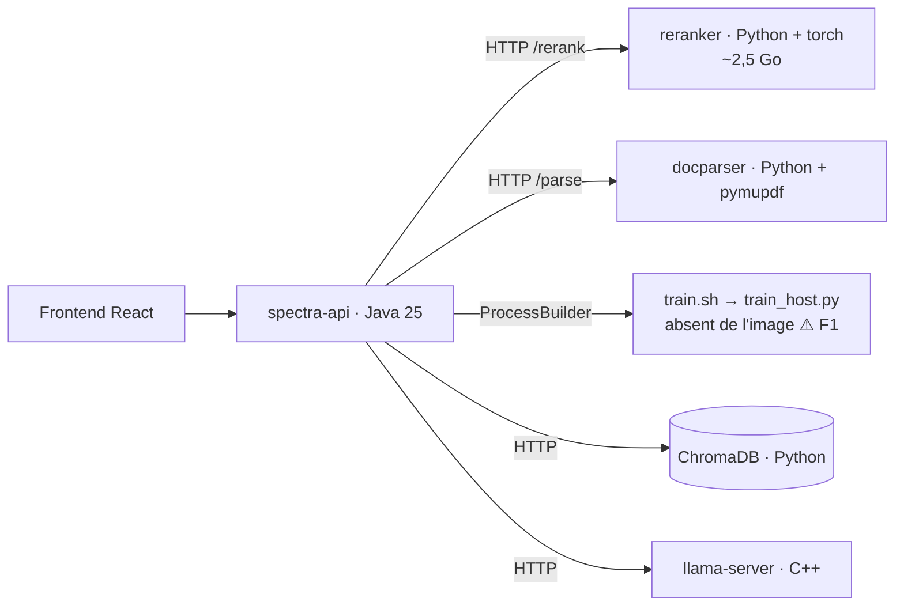
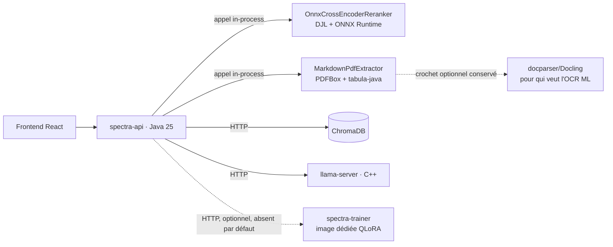

# Audit de la surface Python & plan de migration « full Java »

> **Périmètre.** Tout le code Python du dépôt (13 fichiers, 1 745 lignes) : les deux
> microservices `services/docparser` et `services/reranker`, la chaîne de fine-tuning
> `scripts/*.py`, l'outillage de CI, plus les dépendances Python **indirectes** que la stack
> traîne sans qu'aucune ligne de Python ne soit écrite par le projet (images, healthchecks,
> scripts de conversion téléchargés).
>
> **Complète** [`audit-finetuning.fr.md`](audit-finetuning.fr.md) : le présent document ne
> refait pas l'audit de correction de l'entraînement (F3…F11, corrigés), mais il **tranche
> F1** — « le script d'entraînement et Python sont absents de l'image `spectra-api` » —
> resté ouvert parce que c'est une décision d'architecture, exactement celle que pose la
> question « peut-on être full Java ? ».

---

## 1. Résumé exécutif

La surface Python se répartit en quatre blocs de nature **très différente**, et c'est le point
central : « passer en full Java » n'est pas une seule décision, mais quatre.

| Bloc | Lignes | Substituable en Java ? | Verdict |
|---|---:|---|---|
| **Outillage** (`check-doc-links.py`) | 41 | Oui, à iso-fonctionnalité | 🟢 remplaçable immédiatement |
| **Reranker** (`services/reranker`) | 218 | Oui, à iso-fonctionnalité, via ONNX Runtime/DJL | 🟢 remplaçable, effort modéré |
| **DocParser** (`services/docparser`) | 311 | Oui pour `pymupdf4llm`, **non** pour Docling | 🟡 remplaçable avec un compromis de qualité à mesurer |
| **Fine-tuning QLoRA** (`scripts/*.py`) | 1 216 | **Non** — aucun équivalent Java mature en 2026 | 🔴 pas de Java pur sans régression fonctionnelle |

**Conclusion.** Un produit **100 % Java sur le chemin de requête** (ingestion + RAG + API) est
atteignable, et c'est là que se trouve l'essentiel de la valeur : suppression de deux images
Docker (dont une de ~2,5 Go à cause de `torch`), de deux runtimes ML à maintenir, de trois jobs
de CI, et de la classe entière de pannes « service Python indisponible → repli dégradé ».

En revanche, **l'entraînement QLoRA ne peut pas devenir du Java** aujourd'hui sans renoncer à
LoRA (§8). La cible réaliste et honnête n'est donc pas « zéro Python dans le dépôt » mais :

> **Java pur pour tout ce qui sert une requête ; Python confiné dans un worker
> d'entraînement optionnel, versionné, appelé par HTTP — jamais exécuté par `ProcessBuilder`
> depuis la JVM.**

Cette cible ferme F1 par construction : le fine-tuning cesse d'être une fonctionnalité qui
échoue à mi-course dans un conteneur sans Python, et devient un service explicitement absent
ou explicitement déployé.

---

## 2. Inventaire exhaustif

### 2.1 Code Python du dépôt

| Fichier | Lignes | Rôle | Appelé par | Chemin de requête ? | Optionnel ? |
|---|---:|---|---|:--:|:--:|
| `services/reranker/app.py` | 73 | API FastAPI `/rerank` + `/health`, Cross-Encoder `sentence-transformers` | `CrossEncoderRerankerClient` (HTTP) | **oui** | oui (`spectra.reranker.enabled`) |
| `services/reranker/tests/*` | 145 | Tests unitaires (modules ML stubés) | CI | non | — |
| `services/docparser/app.py` | 149 | API FastAPI `/parse` + `/health`, PDF → Markdown (`pymupdf4llm`, option Docling) | `LayoutParserClient` (HTTP) | **oui** (ingestion) | oui (`spectra.layout-parser.enabled`) |
| `services/docparser/tests/*` | 162 | Tests unitaires (modules ML stubés) | CI | non | — |
| `scripts/train_host.py` | 547 | Moteur d'entraînement SFT/DPO/ORPO, LoRA, packing, masquage du prompt | `scripts/train.sh` ← `FineTuningService` (`ProcessBuilder`) | non | oui |
| `scripts/chat_format.py` | 169 | **Source de vérité** de la mise en forme des conversations d'entraînement | `train_host.py` | non | non (si l'entraînement existe) |
| `scripts/tests/test_chat_format.py` | 205 | 19 tests d'invariants de gabarit, sans torch | CI (`training-scripts`) | non | — |
| `scripts/export_gguf.py` | 126 | Fusion LoRA → modèle plein → GGUF q8_0 | `FineTuningService` (`pythonBin` + `exportScript`) | non | oui (`exportGguf`) |
| `scripts/export_lora_gguf.py` | 94 | Adaptateur LoRA → petit GGUF chargé à chaud par llama-server | manuel (CLI) | non | oui |
| `scripts/base_models.py` | 34 | Chargeur de `base_models.json` (manifeste partagé avec `BaseModelCatalog`) | les 3 scripts ci-dessus | non | — |
| `scripts/check-doc-links.py` | 41 | Vérifie les liens Markdown internes | `.github/workflows/docs-links.yml` | non | — |
| **Total** | **1 745** | | | | |

### 2.2 Dépendances Python indirectes

Souvent oubliées dans ce genre d'inventaire, elles font partie du coût réel :

1. **Image `reranker`** — `torch==2.12.0` + `sentence-transformers==5.5.0` : l'image pèse
   ~2,5 Go pour **73 lignes** de logique métier, et pré-télécharge le modèle au *build*
   (`RUN python -c "…CrossEncoder('${RERANKER_MODEL}')"`), ce qui rend le build dépendant du
   réseau et du Hub HuggingFace.
2. **Healthchecks Docker** — `docker-compose.yml:102` et `:124` exécutent
   `python -c "import urllib.request; …"` : le healthcheck est couplé à la présence d'un
   interpréteur Python dans l'image. Il disparaît avec les services.
3. **Scripts de conversion llama.cpp téléchargés à l'exécution** — `export_gguf.py` et
   `export_lora_gguf.py` récupèrent `convert_hf_to_gguf.py` / `convert_lora_to_gguf.py`
   depuis `raw.githubusercontent.com/…/master/…`. Non épinglé, non reproductible, et en
   contradiction avec la promesse « 100 % local » (déjà F12 de l'audit fine-tuning).
4. **ChromaDB** — image `chromadb/chroma:latest`, serveur écrit en Python. Aucune ligne de
   Python côté Spectra (accès purement HTTP via `ChromaDbClient`), mais la stack n'est pas
   « full Java » au sens strict tant qu'elle en dépend. Hors périmètre de ce plan (§11).
5. **CI** — trois jobs Python : `training-scripts` (pytest sur `scripts/tests`),
   `python-services` (matrice docparser × reranker : ruff + pytest + couverture), et
   `docs-links` (`python3 scripts/check-doc-links.py`). Plus deux `requirements*.txt` de test
   et un `ruff.toml` à maintenir.

---

## 3. Constats

### P1 — Le bloc entraînement est la **seule** dépendance Python non substituable — *structurant*

C'est le constat qui conditionne tous les autres. Les trois autres blocs ont un chemin Java
crédible aujourd'hui ; l'entraînement QLoRA n'en a pas (§8, avec les vérifications à l'appui).
Toute feuille de route qui promet « zéro Python » sans traiter ce point explicitement se
heurtera au mur en fin de parcours. Il faut donc **décider en premier** ce qu'on fait de
l'entraînement, puis migrer le reste — pas l'inverse.

### P2 — Deux runtimes ML complets pour 222 lignes de logique métier — *élevé*

`services/reranker` (73 lignes) et `services/docparser` (149 lignes) sont, en volume de code,
négligeables. Leur coût est ailleurs : deux images à construire et scanner, deux jeux de
dépendances épinglées (`torch`, `sentence-transformers`, `pymupdf`, `fastapi`, `uvicorn`,
`prometheus-fastapi-instrumentator`), deux `Dockerfile`, deux suites pytest, un `ruff.toml`,
un job de CI matriciel, deux `ServiceMonitor`, deux profils Docker. Le rapport
coût/valeur-de-code est le plus mauvais du dépôt.

### P3 — Aucun manifeste Kubernetes pour `docparser` ni `reranker` — *élevé*

`deploy/k8s/monitoring/servicemonitor-python.yaml` déclare deux `ServiceMonitor` (`app:
docparser`, `app: reranker`), mais `deploy/k8s/base/` ne contient **ni Deployment ni Service**
pour eux (`03-chromadb`, `04-browserless`, `05-llama-embed`, `06-llama-chat`, `07-spectra-api`,
`08-spectra-frontend`, `09-ingress`). Les deux `ServiceMonitor` sont orphelins : ils ne
sélectionneront jamais rien. Autrement dit, **reranking et layout-aware parsing ne sont pas
déployables en Kubernetes** — seulement en Docker Compose via profils. Migrer ces deux briques
dans la JVM ne « perd » donc aucune capacité en K8s : elle en **ajoute** une.

### P4 — Contrats HTTP non typés côté Java — *moyen*

`CrossEncoderRerankerClient.rerank` et `LayoutParserClient.parse` désérialisent en
`Map.class` avec `@SuppressWarnings("unchecked")` et des casts manuels
(`((Number) r.get("index")).intValue()`, `(Map<String, String>) response.getOrDefault(…)`).
Aucun schéma partagé entre le producteur Python (Pydantic) et le consommateur Java : un
renommage de champ côté Python ne casse qu'à l'exécution. C'est le prix habituel d'une
frontière de processus ; il disparaît quand l'appel devient un appel de méthode.

### P5 — Les contrôleurs de statut dépendent de la classe *concrète* — *faible, mais bloquant pour la migration*

`StatusController` et `HealthController` injectent `Optional<CrossEncoderRerankerClient>`, pas
`Optional<RerankerClient>` — alors que `RagService` et `AgenticRagService`, eux, dépendent bien
de l'interface. Une implémentation Java du reranker ne serait donc **pas** visible dans
`/api/status` ni `/api/health` sans toucher aux deux contrôleurs. À corriger *avant* la
migration : remonter `checkHealth()` dans l'interface `RerankerClient` (ou une interface
`HealthReporting` dédiée) est un prérequis, pas un détail.

### P6 — Deux implémentations du format de conversation — *moyen*

`scripts/chat_format.py` est déclaré « source de vérité unique » du format de dialogue —
et il l'est, côté Python. Mais le format est aussi présent côté Java
(`fr.spectra.model.AssistantPersona.SYSTEM_PROMPT`, cité en commentaire dans
`export_gguf.py:106`) et côté service (gabarit Jinja embarqué dans le GGUF, appliqué par
`llama-server`). Trois lieux, un seul testé. Si l'entraînement reste en Python, ce constat
reste ouvert ; s'il passe en Java, il faut un moteur Jinja côté JVM (§8, option C).

### P7 — Chaîne d'export GGUF non reproductible — *moyen* (= F12, toujours ouvert)

Rappel : `export_gguf.py:73` et `export_lora_gguf.py:60` téléchargent du code exécutable
depuis la branche `master` de llama.cpp au moment de l'exécution. Deux exports faits à
quelques semaines d'intervalle n'utilisent pas le même convertisseur, et rien ne le signale.
La migration offre une sortie propre (§8.4 : `llama-export-lora` en C++ + écriture GGUF en
Java), mais en attendant, **épingler par SHA de commit** est un correctif d'une ligne.

### P8 — Couplage de build `backend` → `../scripts` — *faible*

`backend/pom.xml` déclare une `<resource>` pointant sur `../scripts` pour embarquer
`base_models.json` au classpath. Solution correcte tant que les deux mondes coexistent, mais
c'est un module Maven qui lit hors de son propre répertoire. Le manifeste devrait vivre dans
`backend/src/main/resources/` et être *lu* par les scripts (l'inverse du couplage actuel), ou
disparaître avec eux.

### P9 — Heuristiques de nettoyage à porter à l'identique — *moyen (risque de régression)*

`docparser/app.py:41-60` contient trois patterns d'artefacts + une quatrième règle
conditionnelle (`DOCPARSER_STRIP_PAGE_NUMBERS`, bornée à 4 chiffres, avec un commentaire
expliquant précisément pourquoi elle est désactivable : une ligne purement numérique peut être
une donnée légitime). Ce genre de règle se re-perd facilement lors d'un portage. Elle doit
être portée **avec ses tests** et son commutateur, pas réécrite « au mieux ».

### P10 — Coût de la triple toolchain en CI et en développement — *moyen*

Aujourd'hui un contributeur doit disposer de Java 25 + Maven, Node 22, **et** Python 3.11/3.12
avec deux jeux de `requirements` pour faire tourner l'intégralité des tests. La CI porte trois
jobs Python. Après migration des blocs 🟢/🟡 : zéro job Python, et l'entraînement testé dans
son propre dépôt/image (§8).

---

## 4. Cible proposée

### 4.1 Avant



### 4.2 Après



Les deux flèches en pointillés sont la clé : ce qui reste hors JVM est **optionnel, explicite
et absent du déploiement par défaut**. Le chemin de requête, lui, est intégralement Java.

### 4.3 Trois niveaux de substituabilité

| Niveau | Contenu | Ce qu'on gagne | Ce qu'on perd |
|---|---|---|---|
| **1 — Java pur, iso-fonctionnel** | `check-doc-links.py`, `services/reranker` | 1 image, 2 jobs CI, 1 mode de panne | rien |
| **2 — Java pur, compromis à mesurer** | `services/docparser` (chemin `pymupdf4llm`) | 1 image, 1 job CI, 1 mode de panne | qualité de mise en page sur PDF complexes ; **Docling (OCR/ML) n'a pas d'équivalent Java** |
| **3 — pas de Java pur crédible** | `scripts/*.py` (QLoRA) | — | QLoRA, DPO/ORPO, ou plusieurs mois de travail (§8) |

---

## 5. Lot 1 — `check-doc-links.py` → test JUnit *(effort : trivial)*

Le script parcourt les `.md`, extrait les liens relatifs avec une regex et vérifie leur
existence. Rigoureusement portable en Java, et **mieux placé** comme test :

```java
// backend/src/test/java/fr/spectra/docs/DocumentationLinksTest.java
class DocumentationLinksTest {
    private static final Pattern LINK =
            Pattern.compile("\\[[^\\]]*]\\(([^)#\\s]+)(?:#[^)]*)?\\)");
    private static final Set<String> SKIP_DIRS =
            Set.of(".git", "node_modules", "target", "dist", "build");

    @Test
    void tousLesLiensInternesDeLaDocumentationResolvent() throws IOException {
        Path repo = Path.of("..").toRealPath();   // le module vit dans backend/
        List<String> broken = new ArrayList<>();
        // … walk + match + Files.exists(mdFile.getParent().resolve(target))
        assertThat(broken).as("liens Markdown cassés").isEmpty();
    }
}
```

Bénéfices : le contrôle tourne dans le job `build` existant, il échoue en local avant le push,
et le workflow `docs-links.yml` (avec son `setup-python`) disparaît. Point d'attention : la
résolution de la racine du dépôt depuis `backend/` (`Path.of("..")`), et le fait que le test
doit être *skippé* proprement si le répertoire parent n'est pas un dépôt (build depuis un jar).

**Critère de sortie** : `.github/workflows/docs-links.yml` supprimé, un lien cassé
volontairement fait échouer `mvn test`.

---

## 6. Lot 2 — Reranker en Java *(effort : modéré — le meilleur rapport valeur/risque)*

### 6.1 Ce qu'il faut reproduire

Le contrat est minuscule, ce qui rend le portage sûr. Il faut préserver exactement :

| Comportement actuel | Où | À préserver |
|---|---|---|
| `top_n ≥ 1` sinon HTTP 422 | `app.py:32` (`Field(ge=1)`) | validation côté Java (`@Min(1)` ou garde explicite) |
| `documents` vide → `results: []` | `app.py:47` | même court-circuit |
| `top_n = min(top_n, len(documents))` | `app.py:50` | idem |
| tri décroissant par score, index d'origine | `app.py:59` | idem |
| échec du modèle → 500 → **exception** côté Java → `RagService` retombe sur l'ordre vectoriel avec `rerankApplied=false` | `CrossEncoderRerankerClient:83-91` | **critique** : ne jamais renvoyer un classement identité à score 0, qui faussait benchmarks et ablations |
| `/health` renvoie le nom du modèle | `app.py:71` | via `checkHealth()` (cf. P5) |

### 6.2 Implémentation

Un Cross-Encoder est un BERT à tête de classification : tokenisation de la paire
`(query, document)`, un passage avant, un logit. Rien qui exige Python.

**Chemin recommandé — DJL + ONNX Runtime.** DJL fournit un `EngineProvider` ONNX Runtime qui
permet d'exécuter des modèles ONNX en Java sans Python, et le support explicite des modèles de
*reranking* a été ajouté en **v0.30.0**. La tokenisation passe par
`ai.djl.huggingface:tokenizers`, un binding JNI de la bibliothèque Rust `tokenizers` — même
implémentation que côté Python, donc mêmes `input_ids` (point important : une tokenisation
divergente déplacerait silencieusement les scores).

```xml
<!-- backend/pom.xml -->
<dependencyManagement>
  <dependencies>
    <dependency>
      <groupId>ai.djl</groupId><artifactId>bom</artifactId>
      <version><!-- ≥ 0.30.0 : support reranker --></version>
      <type>pom</type><scope>import</scope>
    </dependency>
  </dependencies>
</dependencyManagement>
<!-- puis : ai.djl:api, ai.djl.huggingface:tokenizers,
     ai.djl.onnxruntime:onnxruntime-engine (runtime) -->
```

```java
@Service
@ConditionalOnProperty(prefix = "spectra.reranker", name = "engine",
                       havingValue = "onnx", matchIfMissing = true)
public class OnnxCrossEncoderReranker implements RerankerClient, AutoCloseable {

    private final ZooModel<StringPair, Float> model;   // chargé une fois
    private final Predictor<StringPair, Float> predictor;

    @Override
    public List<RankedResult> rerank(String query, List<String> documents, int topN) {
        if (documents.isEmpty()) return List.of();
        int n = Math.min(topN, documents.size());
        // batch de paires → scores ; puis tri décroissant + limite à n
        // toute exception remonte : RagService gère déjà le repli (rerankApplied=false)
    }
}
```

### 6.3 Le vrai point de décision : l'approvisionnement du modèle

Le modèle configuré par défaut est **`cross-encoder/mmarco-mMiniLMv2-L12-H384-v1`** — choisi
pour le multilingue, donc pour le français, donc **non négociable à la légère**. Il n'est pas
publié au format ONNX en amont. Trois options, à trancher explicitement :

| Option | Python dans le produit ? | Remarque |
|---|---|---|
| **a.** Export ONNX **une fois, hors ligne** (🤗 Optimum), artefact versionné et monté dans le volume des modèles | non — Python n'est ni dans l'image, ni dans le dépôt, ni dans la CI | recommandée ; à documenter comme étape de release, pas comme dépendance produit |
| **b.** Basculer sur un modèle avec poids ONNX publiés | aucun | **vérifier la qualité en français** avant : c'est un changement de modèle, pas un changement de format |
| **c.** [Jlama](https://github.com/tjake/Jlama) (Java pur, Java 20+, lit **safetensors** nativement, architectures BERT supportées) | aucun, ni hors ligne | zéro conversion — le plus élégant. À valider : la tête *sequence-classification* du cross-encoder n'est pas l'usage principal de Jlama (orienté génération/embedding), et le projet indique LoRA « à faire ». À prototyper avant de s'engager. |

Aucun de ces chemins ne demande Python **dans le produit** ; ce qui change, c'est la présence
ou non d'une étape de conversion hors ligne au moment de la release.

### 6.4 Sécurité du changement

- Conserver `CrossEncoderRerankerClient` derrière `spectra.reranker.engine=http` : les deux
  implémentations satisfont `RerankerClient`, donc bascule et retour arrière sont une
  propriété de configuration.
- Corriger P5 d'abord (contrôleurs → interface).
- **Test de parité** : sur un échantillon fixe de `(query, documents)`, comparer l'**ordre**
  produit par le service Python et par l'implémentation Java (tolérance sur les scores
  flottants, égalité stricte sur l'ordre). Sans ce test, une régression de reranking est
  invisible — elle ne casse rien, elle dégrade juste les réponses.
- Rejouer le benchmark qualité existant (`spectra.benchmark`) avant/après.
- Mémoire : le modèle est chargé dans le heap/off-heap de la JVM. `-Xmx1024m` par défaut dans
  `docker-compose.yml` — un MiniLM-L12 quantifié tient largement, mais la valeur doit être
  revue et documentée (le conteneur `reranker` avait, lui, son propre budget mémoire).

**Critère de sortie** : `services/reranker/` supprimé, service et profil Docker supprimés,
job de CI `python-services` réduit à `docparser`, `ServiceMonitor` `reranker` supprimé,
`/api/status` continue d'afficher l'état du reranker avec le nom du modèle.

---

## 7. Lot 3 — DocParser en Java *(effort : élevé — le lot où il faut accepter un compromis)*

### 7.1 Ce que fait réellement le service

`pymupdf4llm.to_markdown()` produit un Markdown structuré (titres `#`/`##`, tables `| col |`,
blocs de code) à partir de l'analyse de mise en page de PyMuPDF, puis `clean_markdown()`
supprime les artefacts. Docling (option `USE_DOCLING=true`, ~500 Mo de modèles) fait la même
chose avec des modèles ML de compréhension de mise en page, plus précis.

### 7.2 Chemin Java

Le backend a déjà `PdfExtractor` (PDFBox, texte brut). La brique manquante est l'analyse de
mise en page :

- **Titres** : sous-classer `PDFTextStripper` et surcharger `writeString(String,
  List<TextPosition>)` pour capter taille de police, graisse et position. Une police
  sensiblement plus grande que la médiane du document → `#`/`##` selon le rang de taille.
  C'est l'heuristique de `pymupdf4llm` elle-même.
- **Colonnes** : regroupement des `TextPosition` par abscisse (clustering 1D sur `getX()`)
  pour détecter deux blocs verticaux et les lire dans l'ordre — sans quoi un PDF sur deux
  colonnes est extrait en texte entrelacé, ce qui détruit les chunks.
- **Tableaux** : [`tabula-java`](https://github.com/tabulapdf/tabula-java) — bibliothèque
  d'extraction de tableaux **bâtie sur PDFBox**, modes *lattice* (bordures visibles) et
  *stream* (positions du texte), et qui **sait déjà exporter en Markdown**. C'est la pièce qui
  rend ce lot réaliste plutôt qu'aventureux.
- **Nettoyage** : portage littéral de `_ARTIFACT_PATTERNS` et de `clean_markdown`, avec le
  commutateur `DOCPARSER_STRIP_PAGE_NUMBERS` (cf. P9) devenu
  `spectra.pdf.strip-page-numbers`.
- **Métadonnées** : déjà couvertes par `PdfExtractor.extractMetadata` (`title`, `author`,
  `subject`, `creationDate`) — mêmes clés que le service Python.

```java
@Component
@ConditionalOnProperty(prefix = "spectra.pdf", name = "layout-aware",
                       havingValue = "true", matchIfMissing = true)
public class MarkdownPdfExtractor implements DocumentExtractor {
    // PDFBox : titres par taille de police, colonnes par clustering d'abscisses
    // tabula-java : tableaux → Markdown
    // metadata.put("parser", "pdfbox-markdown");  ← même champ que le service Python
}
```

### 7.3 Le compromis, énoncé sans détour

**Docling n'a pas d'équivalent Java** : ni OCR de documents scannés, ni modèle ML de
compréhension de mise en page. Sur un PDF propre et texte, PDFBox + tabula-java est
comparable à `pymupdf4llm`. Sur un scan, un formulaire, ou une mise en page complexe, la
qualité sera **inférieure** à Docling.

Proposition : **inverser les défauts au lieu de supprimer la capacité.**

- `MarkdownPdfExtractor` (Java) devient le chemin par défaut ;
- le crochet HTTP `spectra.layout-parser.enabled` et `LayoutParserClient` sont **conservés**
  pour qui veut brancher Docling — mais `services/docparser` n'est plus livré ni maintenu dans
  le dépôt : la documentation pointe vers `docling-serve` en amont, dont l'API est compatible
  avec le contrat `/parse` ou le devient via un adaptateur.

Le produit devient full Java par défaut, sans amputer les utilisateurs qui ont besoin d'OCR.

### 7.4 Validation obligatoire

Ce lot ne doit pas être fusionné sur la seule foi de tests unitaires :

1. **Corpus de référence** : un jeu de PDF (1 colonne, 2 colonnes, avec tableaux, avec
   en-têtes/pieds répétés, scanné) et des fichiers Markdown attendus versionnés.
2. **Comparaison A/B** : sortie Java vs sortie docparser actuelle sur ce corpus, écart
   documenté fichier par fichier.
3. **Impact retrieval** : rejouer le benchmark qualité — c'est la seule mesure qui compte, la
   fidélité du Markdown n'étant qu'un proxy.

**Critère de sortie** : `services/docparser/` supprimé du dépôt, `services/` entièrement
supprimé (donc `requirements-test.txt`, `ruff.toml`, job `python-services`,
`servicemonitor-python.yaml`), extraction PDF par défaut layout-aware **dans la JVM**, écart
de qualité mesuré et publié.

---

## 8. Lot 4 — L'entraînement : trois options, une recommandation

C'est le cœur du sujet, et l'endroit où il faut résister à la tentation de promettre du Java
pur. État des lieux vérifié :

### 8.1 Option A — Worker Python isolé `spectra-trainer` *(recommandée)*

Le Python d'entraînement quitte le dépôt applicatif et devient une **image dédiée**, appelée
par HTTP. Côté Java, on introduit l'abstraction qui manque aujourd'hui :

```java
public interface TrainingRunner {
    TrainingHandle start(TrainingSpec spec);      // dataset, base, LoRA, epochs, DPO/ORPO…
    void cancel(String jobId);
    Flux<String> logs(String jobId);              // alimente TrainingLogBroadcaster
}
// ProcessTrainingRunner  → ProcessBuilder (mode hôte actuel, conservé pour le dev)
// HttpTrainingRunner     → spectra-trainer (mode conteneur / K8s Job)
```

- `FineTuningService` cesse de connaître `python3`, `train.sh` et les arguments positionnels
  (F10 au passage).
- **F1 est fermé** : en l'absence de runner configuré, la soumission renvoie un 503
  actionnable au lieu de laisser chaque job échouer à mi-course sur une `IOException`.
- Zéro Python dans `spectra-api`, zéro Python dans la CI applicative, zéro régression
  fonctionnelle : QLoRA, DPO, ORPO, packing, NEFTune restent disponibles.
- `chat_format.py` et ses 19 tests d'invariants restent au bon endroit — dans le composant qui
  entraîne.

C'est le meilleur compromis : **le produit devient full Java ; l'entraînement redevient ce
qu'il est réellement, un travail ML batch, optionnel, à l'ordonnancement séparé** (parfait pour
un `Job` Kubernetes, ce qu'un `ProcessBuilder` dans un pod d'API ne sera jamais).

### 8.2 Option B — `llama-finetune` de llama.cpp *(zéro Python, mais régression)*

Vérifié dans le dépôt llama.cpp : l'outil `llama-finetune` (`examples/training`) fait du
**full finetuning uniquement — aucune mention de LoRA**, est documenté « very much WIP »,
« technically functional (for FP32 models and limited hardware setups) », et testé sur Stories
260K et Llama 3.2 1B avec 24 Go de mémoire. Sortie directement en GGUF, CPU et CUDA.

Conséquence : basculer dessus, c'est perdre LoRA, QLoRA, DPO et ORPO, et se limiter à de très
petits modèles en FP32. Le gain (zéro Python) ne paie pas la perte. **À réévaluer** quand
`llama-finetune` gagnera LoRA — l'attrait serait alors réel : entraînement GGUF-natif, plus
aucune conversion.

### 8.3 Option C — Java pur : DJL/libtorch ou ONNX Runtime Training *(long terme)*

Techniquement non fermé, mais coûteux :

- `OrtTrainingSession` **existe** dans l'API Java d'ONNX Runtime. Mais les artefacts
  d'entraînement (graphe forward/backward, graphe d'optimiseur) se génèrent avec l'outillage
  Python `onnxruntime-training` : Python revient, en amont et hors ligne, une fois par modèle
  de base.
- DJL avec le moteur PyTorch (libtorch, natif, sans Python) sait entraîner, mais **LoRA serait
  à implémenter** en blocs DJL, et le chargement de poids HuggingFace passe par une conversion
  (TorchScript/ONNX) — donc là encore un outillage amont.
- Un moteur Jinja côté JVM (`jinjava`, Pebble) serait nécessaire pour rendre les
  `chat_template` HuggingFace, sous peine de recréer exactement le bug F3 (gabarit en dur,
  faux pour 3 bases sur 4).

À garder comme cible d'opportunité, pas comme plan.

### 8.4 Sortir Python de la chaîne GGUF *(indépendant, et faisable dès maintenant)*

Deux gains immédiats, quelle que soit l'option retenue :

- **Fusion LoRA → GGUF** : `llama-export-lora`, binaire C++ livré avec llama.cpp, fusionne un
  GGUF d'adaptateur dans un GGUF de base. Aucun Python.
- **Écriture GGUF en Java** : le format est documenté et simple (en-tête + clés/valeurs
  typées + index de tenseurs + données). Des bibliothèques Java existent déjà —
  [`gguf4j`](https://github.com/ilopezluna/gguf4j) (lecture GGUF v1–v3, tous types GGML,
  parsing en flux) et `com.llama4j:gguf` (lecture **et écriture**, Java 11+, sans
  dépendances). Un convertisseur `safetensors LoRA → GGUF` en Java est un chantier borné, et
  il supprimerait le téléchargement de `convert_lora_to_gguf.py` (P7/F12).
- **Correctif d'attente, une ligne** : épingler les deux URL de `raw.githubusercontent.com`
  sur un SHA de commit au lieu de `master`.

### 8.5 Comparaison

| | A. Worker isolé | B. `llama-finetune` | C. Java pur |
|---|:--:|:--:|:--:|
| Python dans `spectra-api` | non | non | non |
| Python dans le dépôt | dans un composant séparé | non | outillage amont hors ligne |
| QLoRA / LoRA | ✅ | ❌ | à implémenter |
| DPO / ORPO | ✅ | ❌ | à implémenter |
| Ferme F1 | ✅ | ✅ | ✅ |
| Effort | faible-moyen | moyen | très élevé |
| Risque fonctionnel | faible | **régression assumée** | élevé |

---

## 9. Plan d'exécution

| Lot | Contenu | Prérequis | Critère de sortie | Effort | Statut |
|---|---|---|---|---|---|
| **0** | P5 (contrôleurs → interface `RerankerClient`), P7 (épinglage des scripts llama.cpp), P8 (déplacer `base_models.json`) | — | 3 correctifs isolés, aucun changement de comportement | trivial | ✅ livré |
| **1** | `check-doc-links.py` → `DocumentationLinksTest` | — | `docs-links.yml` supprimé | trivial | ✅ livré |
| **2** | Reranker Java (DJL/ONNX ou Jlama) + test de parité d'ordre | Lot 0, décision §6.3 | `services/reranker/` supprimé ; benchmark qualité stable | modéré | à faire |
| **3** | `MarkdownPdfExtractor` (PDFBox + tabula-java) + corpus de référence | Lot 2 (rodage du schéma de bascule) | `services/` supprimé ; écart de qualité mesuré et publié | élevé | à faire |
| **4** | `TrainingRunner` + `spectra-trainer` (option A) | décision §8 | fine-tuning fonctionnel en Docker **et** en K8s ; F1 clos | modéré | à faire |

Ordre volontairement croissant en risque : chaque lot livre une valeur autonome et est
réversible par configuration. Après les lots 1 à 3, `find . -name '*.py'` ne renvoie plus que
`scripts/` ; après le lot 4, plus rien dans le dépôt applicatif.

### Lots 0 et 1 — ce qui a été livré

**Lot 0**

- `RerankerClient` porte désormais `checkHealth()`, et `StatusController` / `HealthController`
  injectent l'interface. `RerankerHealthReportingTest` (3 tests) fige le découplage en
  publiant l'état d'une implémentation *in-process* fictive : c'est exactement le scénario qui
  échouait en silence auparavant.
- Nouveau module partagé `scripts/llama_cpp_convert.py` : les deux scripts d'export y délèguent
  la localisation du convertisseur, à **révision épinglée** (`b9828`, alignée sur
  `LLAMA_CPP_IMAGE_TAG` du compose) et surchargeable par `LLAMA_CPP_REVISION`. Le fichier mis en
  cache porte la révision dans son nom : une copie de `master` laissée par l'ancienne version ne
  gèle plus la conversion. `test_llama_cpp_convert.py` (9 tests, sans réseau) interdit le retour
  à une branche mobile et **vérifie que la révision reste alignée sur le tag de l'image servie** —
  sans quoi les deux valeurs auraient dérivé sans bruit.
- `base_models.json` vit dans `backend/src/main/resources/` ; la `<resource>` pointant sur
  `../scripts` a disparu du `pom.xml`. Le couplage est inversé : `scripts/base_models.py` va
  chercher le manifeste dans le backend (avec repli sur un fichier voisin et surcharge
  `SPECTRA_BASE_MODELS_MANIFEST`, pour rester utilisable copié seul sur une machine
  d'entraînement). `test_base_models.py` (6 tests) fige l'emplacement canonique et le mapping
  alias → repo, en miroir de `BaseModelCatalogTest`.

**Lot 1**

- `DocumentationLinksTest` (4 tests) remplace `check-doc-links.py` : même expression rationnelle,
  mêmes répertoires élagués, mêmes URL ignorées, et l'élagage se fait à la descente plutôt
  qu'après coup. Vérifié en provoquant une vraie rupture de lien : le test échoue en donnant
  `fichier:ligne -> cible`.
- `scripts/check-doc-links.py` et `.github/workflows/docs-links.yml` supprimés ;
  `CONTRIBUTING.md` mis à jour. Le contrôle tourne maintenant dans le job de build et échoue
  **avant** le push.

Net sur la surface Python : 13 fichiers → 13 (−1 script, +1 module partagé, +2 fichiers de
tests), et **un job de CI Python sur trois supprimé**. Aucun changement de comportement
fonctionnel.

### Définition de « full Java », mesurable

- [ ] 0 fichier `.py` dans `backend/`, `services/`, `scripts/` du dépôt applicatif
- [ ] 0 job Python dans `.github/workflows/` — *2 restants (`training-scripts`, `python-services`), le job `docs-links` est supprimé*
- [ ] 0 image Docker Python construite par le dépôt (ChromaDB restant une dépendance amont)
- [ ] `docker compose up` sans profil = pile complète, reranking et layout-aware inclus
- [ ] fine-tuning déployable en Kubernetes (`Job`), ou explicitement signalé indisponible

---

## 10. Ce que la migration ne doit pas casser

Inventaire des comportements observables aujourd'hui, à couvrir par des tests **avant** de
toucher au code :

1. `top_n < 1` → rejet (aujourd'hui 422 côté Python) ; `documents` vide → résultat vide.
2. Échec du reranker → **exception**, jamais un classement identité : `RagService` doit
   continuer à produire `rerankApplied=false` (sinon benchmarks et ablations sont faussés).
3. PDF non-PDF → 400 ; fichier vide → 400.
4. Clés de métadonnées PDF : `title`, `author`, `subject`, `creationDate` ; `page_count` ;
   `format=PDF`, `layoutAware=true`, `parser=<nom>` (consommés par `LayoutAwarePdfExtractor`).
5. `/api/status` et `/api/health` continuent de rapporter reranker et docparser — sous une
   forme adaptée (composant in-process au lieu de service distant), pas en disparaissant.
6. **Métriques Prometheus** : les deux services exposent `/metrics` via
   `prometheus-fastapi-instrumentator` et sont scrapés par `servicemonitor-python.yaml`.
   Après migration, ces métriques doivent réapparaître sur `/actuator/prometheus` (compteurs
   et timers Micrometer dédiés : nombre de rerank, latence, échecs), et les deux
   `ServiceMonitor` être supprimés. Sans ce point, la migration crée un trou d'observabilité
   silencieux.
7. Le repli `LayoutAwarePdfExtractor` → `PdfExtractor` (texte brut) doit rester, ou être
   remplacé par un repli équivalent au sein de `MarkdownPdfExtractor`.

---

## 11. Hors périmètre

- **ChromaDB** (serveur Python) : remplaçable par une base vectorielle accessible depuis la
  JVM (pgvector, index Lucene/OpenSearch, ou une implémentation embarquée), mais c'est un
  changement de persistance — migration de données, compatibilité des collections,
  performances de recherche — qui mérite son propre document. Aucun Python n'est écrit par
  Spectra pour l'utiliser.
- **`llama-server`** : C++, pas Python. Aucun impact.
- **Frontend** : hors sujet, aucune dépendance Python.

---

## 12. Synthèse

| # | Constat | Gravité | Traité par | Statut |
|---|---|---|---|---|
| P1 | L'entraînement QLoRA est la seule dépendance Python non substituable | Structurant | §8 (option A) | décision à prendre |
| P2 | Deux runtimes ML pour 222 lignes de logique métier | Élevé | Lots 2 et 3 | ouvert |
| P3 | `docparser`/`reranker` non déployables en Kubernetes (`ServiceMonitor` orphelins) | Élevé | Lots 2 et 3 | ouvert |
| P4 | Contrats HTTP non typés (`Map` + casts) | Moyen | Lots 2 et 3 (disparaît) | ouvert |
| P5 | Contrôleurs couplés à la classe concrète du reranker | Faible → **bloquant** | Lot 0 | ✅ corrigé |
| P6 | Deux implémentations du format de conversation | Moyen | §8 (reste en A ; traité en C) | ouvert |
| P7 | Chaîne GGUF non reproductible (`master` téléchargé à l'exécution) | Moyen | Lot 0 (épinglage), §8.4 (suppression) | ✅ épinglé |
| P8 | `backend/pom.xml` lit `../scripts` | Faible | Lot 0 | ✅ corrigé |
| P9 | Heuristiques de nettoyage docparser à porter à l'identique | Moyen (régression) | Lot 3 | ouvert |
| P10 | Trois toolchains en CI et en développement | Moyen | Lots 1 à 4 | ⚠️ partiel (1 job Python sur 3 supprimé) |

**Réponse en une phrase.** Oui, Spectra peut devenir full Java sur tout ce qui sert une
requête — reranking et extraction PDF compris — pour un effort modéré et sans perte
fonctionnelle notable ; non, l'entraînement QLoRA ne peut pas l'être aujourd'hui, et la bonne
réponse n'est pas de le réécrire en Java mais de le sortir du produit, ce qui règle du même
coup le seul blocage de déploiement encore ouvert du fine-tuning.

---

## Références

- llama.cpp — [`examples/training/README.md`](https://github.com/ggml-org/llama.cpp/blob/master/examples/training/README.md) (état de `llama-finetune`)
- DJL — [moteur ONNX Runtime](https://github.com/deepjavalibrary/djl/blob/master/engines/onnxruntime/onnxruntime-engine/README.md), [notes de version](https://github.com/deepjavalibrary/djl/releases) (support reranker en v0.30.0)
- [Jlama](https://github.com/tjake/Jlama) — moteur d'inférence LLM en Java pur (safetensors, BERT, Java 20+)
- [tabula-java](https://github.com/tabulapdf/tabula-java) — extraction de tableaux PDF sur PDFBox, export Markdown
- [gguf4j](https://github.com/ilopezluna/gguf4j) — lecture GGUF v1–v3 en Java
- ONNX Runtime — [API Java](https://onnxruntime.ai/docs/get-started/with-java.html), [entraînement embarqué](https://onnxruntime.ai/docs/get-started/training-on-device.html)
- Audit interne — [`audit-finetuning.fr.md`](audit-finetuning.fr.md) (F1, F12 notamment)

---

**Documentation :** [index](../README.md) · [Architecture](../architecture.en.md) · [Configuration](../configuration.en.md) · [Audit fine-tuning](audit-finetuning.fr.md)
