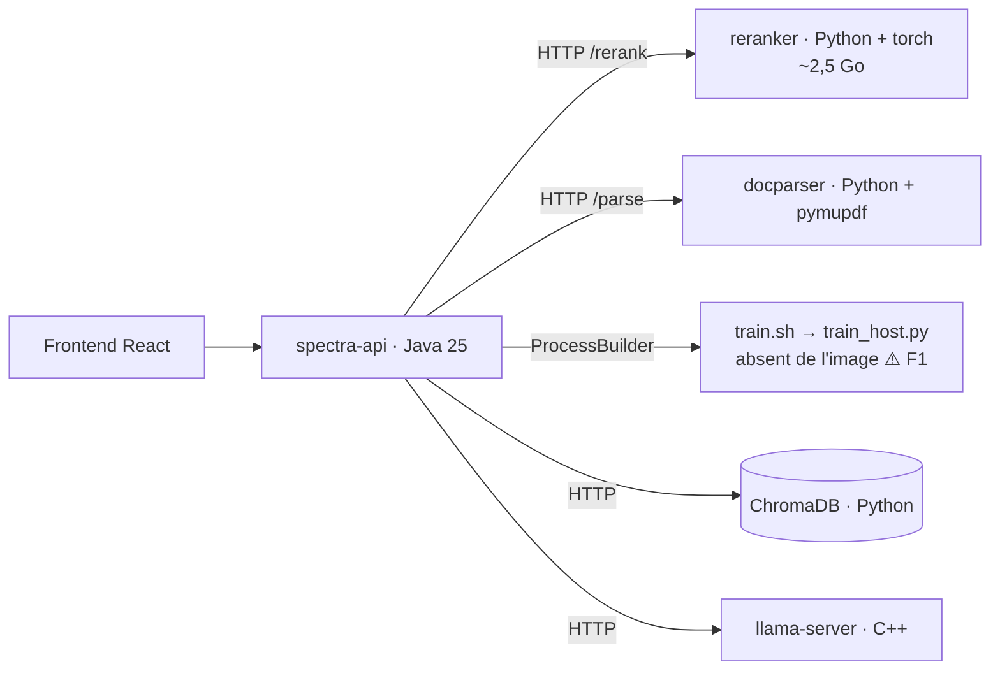
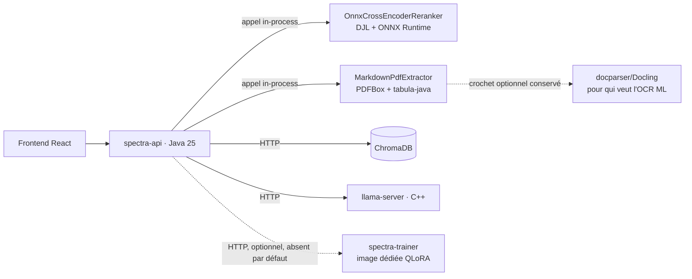

# Audit de la surface Python & plan de migration « full Java »

> **Périmètre.** Tout le code Python du dépôt (18 fichiers, 2 335 lignes) : les deux
> microservices `services/docparser` et `services/reranker`, la chaîne de fine-tuning
> `scripts/*.py`, l'outillage de CI, plus les dépendances Python **indirectes** que la stack
> traîne sans qu'aucune ligne de Python ne soit écrite par le projet (images, healthchecks,
> scripts de conversion téléchargés).
>
> **Cible de migration : le code de production uniquement — 1 284 lignes, dont 222 sur le
> chemin de requête.** Les 1 051 lignes de test sont inventoriées mais hors périmètre
> (décision §0).
>
> **Complète** [`audit-finetuning.fr.md`](audit-finetuning.fr.md) : le présent document ne
> refait pas l'audit de correction de l'entraînement (F3…F11, corrigés), mais il **tranche
> F1** — « le script d'entraînement et Python sont absents de l'image `spectra-api` » —
> resté ouvert parce que c'est une décision d'architecture, exactement celle que pose la
> question « peut-on être full Java ? ».

---

## 0. Révision du 31 juillet 2026 — ce qui a bougé depuis la rédaction

Cet audit a été écrit avant les lots 0 à 2. Une relecture contradictoire contre l'état réel du
dépôt corrige **quatre écarts**, dont deux inversent une conclusion. Ils sont repris à leur
place dans le corps du document ; ce résumé existe pour qu'un lecteur qui connaît la version
précédente sache exactement quoi relire.

| # | Écart constaté | Conséquence |
|---|---|---|
| R1 | **L'audit comptait le code de test avec le code de production.** 1 051 des 2 335 lignes Python (45 %) sont des tests | §2.1 réécrit sur le bon axe ; **décision de périmètre** ci-dessous |
| R2 | **Le support Kubernetes a été entièrement retiré** (commit `3e8355e`) : `deploy/k8s/` n'existe plus | **P3 devient sans objet** ; l'argument de déploiement de l'option A (§8.1) tombe |
| R3 | Le moteur ONNX est livré **sans aucune métrique Micrometer** | §10.6 n'est plus un risque théorique : nouveau constat **P15** |
| R4 | La référence de parité **n'a jamais été capturée** (`backend/src/test/resources/reranker-parity/` absent) ; `engine` défaute toujours sur `http` | le lot 2 est bloqué sur une action opérationnelle, pas sur du code |

### Décision de périmètre — les tests Python sortent du champ de la migration

**Arbitrage retenu :** le code de test Python n'est pas un objet de migration. Un test ne
s'exécute pas en production, n'ajoute aucune image Docker, aucun runtime ML, aucun mode de
panne sur le chemin de requête, et ne pèse sur aucune facture de latence ou de mémoire. Le
langage dans lequel il est écrit est un choix d'outillage, pas une dépendance produit.

Ce que cet arbitrage clarifie, et c'est son intérêt principal : **la cible « full Java » porte
sur 1 284 lignes, pas sur 2 335** — et sur le chemin de requête, sur **222 lignes** (les deux
`app.py`). Le reste est de l'entraînement (1 062 lignes, hors chemin de requête) et du test.

Deux conséquences à assumer explicitement, parce qu'elles ne disparaissent pas avec la
décision :

- **P10 ne se ferme jamais complètement.** Tant que des tests Python subsistent, un job de CI
  les exécute, `scripts/verify.sh` garde sa section `python`, et un contributeur qui veut
  rejouer l'intégralité des contrôles a besoin de `python3` et `pytest`. C'est un coût faible
  et stable — pas la triple toolchain d'origine, qui exigeait aussi `ruff`, `fastapi`, `httpx`
  et deux jeux de `requirements`.
- **L'essentiel des tests part quand même avec son sujet.** Les tests des microservices
  (307 lignes) disparaissent aux lots 2 et 3 avec les services qu'ils testent ; ceux du
  fine-tuning (381 lignes) partent au lot 4 avec `scripts/`. Ce ne sont pas des lots à faire,
  c'est une conséquence mécanique. **Ce qui reste durablement, ce sont les 363 lignes de tests
  d'outillage** (§2.1, bloc 3) — et par la présente décision, elles restent.

**Ce que la révision ne change pas.** Le verdict de fond tient : le chemin de requête est
migrable en Java, l'entraînement QLoRA ne l'est pas.

---

## 1. Résumé exécutif

La surface Python se répartit en blocs de nature **très différente**, et c'est le point
central : « passer en full Java » n'est pas une seule décision, mais quatre — cinq depuis
qu'un bloc nouveau est apparu.

Le tableau ne compte que le **code de production** : les tests sont hors périmètre (§0). Le
volume de test associé figure en dernière colonne, pour mémoire.

| Bloc | Prod. | Substituable en Java ? | Verdict | *(test)* |
|---|---:|---|---|---:|
| ~~**Outillage doc** (`check-doc-links.py`)~~ | ~~41~~ | Oui, à iso-fonctionnalité | ✅ **supprimé** (lot 1) | — |
| **Reranker** (`services/reranker/app.py`) | 73 | Oui, à iso-fonctionnalité, via ONNX Runtime | 🟢 moteur Java livré, bascule bloquée sur la référence de parité | *145* |
| **DocParser** (`services/docparser/app.py`) | 149 | Oui pour `pymupdf4llm`, **non** pour Docling | 🟡 remplaçable avec un compromis de qualité à mesurer | *162* |
| **Fine-tuning QLoRA** (`scripts/*.py`) | 1 062 | **Non** — aucun équivalent Java mature en 2026 | 🔴 pas de Java pur sans régression fonctionnelle | *381* |
| **Total** | **1 284** | | | *1 051* |
| *dont chemin de requête* | ***222*** | | | |

**Conclusion.** Un produit **100 % Java sur le chemin de requête** (ingestion + RAG + API) est
atteignable, et c'est là que se trouve l'essentiel de la valeur : suppression de deux images
Docker (dont une de ~2,5 Go à cause de `torch`), de deux runtimes ML à maintenir, de deux jobs
de CI restants, et de la classe entière de pannes « service Python indisponible → repli
dégradé ».

**Précision apportée par la révision (§0).** Le chemin de requête ne représente que **222
lignes de Python de production** — les deux `app.py`. C'est peu, et c'est exactement le
point : le coût de ces 222 lignes ne se mesure pas en lignes, mais en deux images Docker
(dont une de ~2,5 Go), deux runtimes ML, deux `Dockerfile`, un job de CI matriciel, deux
profils Compose et une classe de pannes. **C'est ce ratio-là qui justifie les lots 2 et 3**,
et non un décompte de fichiers `.py`.

En revanche, **l'entraînement QLoRA ne peut pas devenir du Java** aujourd'hui sans renoncer à
LoRA (§8). La cible réaliste et honnête n'est donc pas « zéro Python dans le dépôt » mais :

> **Java pur pour tout ce qui sert une requête ; Python confiné dans un worker
> d'entraînement optionnel, versionné, appelé par HTTP — jamais exécuté par `ProcessBuilder`
> depuis la JVM.**

Cette cible ferme F1 par construction : le fine-tuning cesse d'être une fonctionnalité qui
échoue à mi-course dans un conteneur sans Python, et devient un service explicitement absent
ou explicitement déployé.

---

## 2. Inventaire exhaustif

### 2.1 Code Python du dépôt

Relevé au 31 juillet 2026 (`find . -name '*.py' | xargs wc -l`). Les écarts avec la version
précédente du tableau sont signalés en dernière colonne.

**Bloc 1 — chemin de requête** (les deux microservices) :

| Fichier | Lignes | Rôle | Appelé par | Optionnel ? |
|---|---:|---|---|:--:|
| `services/reranker/app.py` | 73 | API FastAPI `/rerank` + `/health`, Cross-Encoder `sentence-transformers` | `CrossEncoderRerankerClient` (HTTP) | oui (`spectra.reranker.enabled`, profil `reranker`) |
| `services/reranker/tests/*` | 145 | Tests unitaires (modules ML stubés) | CI | — |
| `services/docparser/app.py` | 149 | API FastAPI `/parse` + `/health`, PDF → Markdown (`pymupdf4llm`, option Docling) | `LayoutParserClient` (HTTP) | oui (`spectra.layout-parser.enabled`, profil `layout-parser`) |
| `services/docparser/tests/*` | 162 | Tests unitaires (modules ML stubés) | CI | — |
| **Sous-total** | **529** | | | |

**Bloc 2 — fine-tuning** (hors chemin de requête, entièrement optionnel) :

| Fichier | Lignes | Rôle | Appelé par | Δ |
|---|---:|---|---|:--:|
| `scripts/train_host.py` | 547 | Moteur d'entraînement SFT/DPO/ORPO, LoRA, packing, masquage du prompt | `scripts/train.sh` ← `FineTuningService` (`ProcessBuilder`) | = |
| `scripts/chat_format.py` | 169 | **Source de vérité** de la mise en forme des conversations d'entraînement | `train_host.py` | = |
| `scripts/export_gguf.py` | 113 | Fusion LoRA → modèle plein → GGUF q8_0 | `FineTuningService` (`pythonBin` + `exportScript`) | −13 |
| `scripts/export_lora_gguf.py` | 83 | Adaptateur LoRA → petit GGUF chargé à chaud par llama-server | manuel (CLI) | −11 |
| `scripts/llama_cpp_convert.py` | 79 | Localisation du convertisseur llama.cpp à révision épinglée | les 2 scripts d'export | **+79** (lot 0) |
| `scripts/base_models.py` | 71 | Chargeur de `base_models.json` (manifeste partagé avec `BaseModelCatalog`) | les 3 scripts ci-dessus | +37 (lot 0) |
| `scripts/tests/test_chat_format.py` | 205 | 19 tests d'invariants de gabarit, sans torch | CI (`training-scripts`) | = |
| `scripts/tests/test_llama_cpp_convert.py` | 98 | Interdit le retour à une branche mobile, vérifie l'alignement sur le tag de l'image | CI | **+98** (lot 0) |
| `scripts/tests/test_base_models.py` | 78 | Fige l'emplacement canonique du manifeste et le mapping alias → repo | CI | **+78** (lot 0) |
| **Sous-total** | **1 443** | | | |

**Bloc 3 — tests d'outillage shell/CI** — *hors périmètre par décision (§0)*, listé pour que
l'inventaire soit complet. Aucun de ces fichiers ne teste du code Python : ils testent du shell
et le YAML de CI, en utilisant Python comme langage de script hôte.

| Fichier | Lignes | Ce qu'il teste | Ajouté par |
|---|---:|---|---|
| `scripts/tests/test_llm_sizing.py` | 166 | `scripts/lib/llm-sizing.sh` — fenêtre de contexte par requête à chaque palier de RAM | `1138c8d` |
| `scripts/tests/test_verify_covers_ci.py` | 110 | Cohérence `.github/workflows/ci.yml` ↔ `scripts/verify.sh` (aucun job sans contrepartie locale) | `7f0e7e2` |
| `scripts/tests/test_windows_scripts_parity.py` | 87 | Parité des options déclarées entre les 6 paires `*.sh` / `*.bat` | `6eade9b` |
| **Sous-total** | **363** | | |

### Récapitulatif sur les deux axes

| | Fichiers | Lignes | Dont production | Dont test |
|---|---:|---:|---:|---:|
| **Total au 31/07/2026** | **18** | **2 335** | **1 284** | **1 051** |
| *Chemin de requête* | 6 | 529 | **222** | 307 |
| *Fine-tuning* | 9 | 1 443 | 1 062 | 381 |
| *Outillage shell/CI* | 3 | 363 | 0 | 363 |

**Lecture.** L'axe qui compte pour un audit « full Java » est la colonne *production*, et à
l'intérieur d'elle, la ligne *chemin de requête* : **222 lignes**. C'est ce que les lots 2 et 3
suppriment, et c'est ce qui coûte deux images Docker et deux runtimes ML.

*Note sur l'évolution.* La version précédente de ce document annonçait 1 745 lignes, dont
1 233 de production. Sur le code de production, l'évolution est de **+51 lignes** : −41
(`check-doc-links.py`, supprimé au lot 1), +79 (`llama_cpp_convert.py`, lot 0), +37
(`base_models.py`, lot 0), −24 (allègement des deux scripts d'export). Les +539 restants sont
du test, hors périmètre.

### 2.2 Dépendances Python indirectes

Souvent oubliées dans ce genre d'inventaire, elles font partie du coût réel :

1. **Image `reranker`** — `torch==2.12.0` + `sentence-transformers==5.5.0` : l'image pèse
   ~2,5 Go pour **73 lignes** de logique métier, et pré-télécharge le modèle au *build*
   (`RUN python -c "…CrossEncoder('${RERANKER_MODEL}')"`), ce qui rend le build dépendant du
   réseau et du Hub HuggingFace.
2. **Healthchecks Docker** — `docker-compose.yml:102` et `:124` exécutent
   `python -c "import urllib.request; …"` : le healthcheck est couplé à la présence d'un
   interpréteur Python dans l'image. Il disparaît avec les services.
3. **Scripts de conversion llama.cpp téléchargés à l'exécution** — `export_gguf.py` et
   `export_lora_gguf.py` récupèrent `convert_hf_to_gguf.py` / `convert_lora_to_gguf.py`
   depuis `raw.githubusercontent.com/…/master/…`. Non épinglé, non reproductible, et en
   contradiction avec la promesse « 100 % local » (déjà F12 de l'audit fine-tuning).
4. **ChromaDB** — image `chromadb/chroma:latest`, serveur écrit en Python. Aucune ligne de
   Python côté Spectra (accès purement HTTP via `ChromaDbClient`), mais la stack n'est pas
   « full Java » au sens strict tant qu'elle en dépend. Hors périmètre de ce plan (§11).
5. **CI** — ~~trois~~ **deux** jobs Python depuis le lot 1 : `training-scripts`
   (`python -m pytest scripts/tests -q`, `ci.yml:68`) et `python-services` (matrice
   docparser × reranker : ruff + pytest + couverture, `ci.yml:167`). `docs-links` est
   supprimé. Restent quatre `requirements*.txt` (80 lignes) et un `ruff.toml` à maintenir,
   plus les deux sections `python` et `services` de `scripts/verify.sh`.
6. **`scripts/verify.sh`** — le script de vérification locale exige `python3`, `pytest`,
   `ruff`, `fastapi` et `httpx` pour ses sections `python` et `services` (`verify.sh:90-125`).
   Il dégrade proprement quand ils manquent (`skip`), mais un contributeur sans Python ne
   rejoue alors que six contrôles sur huit. Ce couplage est **testé depuis Python**
   (`test_verify_covers_ci.py`), ce qui le rend circulaire — cf. P14.

---

## 3. Constats

### P1 — Le bloc entraînement est la **seule** dépendance Python non substituable — *structurant*

C'est le constat qui conditionne tous les autres. Les trois autres blocs ont un chemin Java
crédible aujourd'hui ; l'entraînement QLoRA n'en a pas (§8, avec les vérifications à l'appui).
Toute feuille de route qui promet « zéro Python » sans traiter ce point explicitement se
heurtera au mur en fin de parcours. Il faut donc **décider en premier** ce qu'on fait de
l'entraînement, puis migrer le reste — pas l'inverse.

### P2 — Deux runtimes ML complets pour 222 lignes de logique métier — *élevé*

`services/reranker` (73 lignes) et `services/docparser` (149 lignes) sont, en volume de code,
négligeables. Leur coût est ailleurs : deux images à construire et scanner, deux jeux de
dépendances épinglées (`torch`, `sentence-transformers`, `pymupdf`, `fastapi`, `uvicorn`,
`prometheus-fastapi-instrumentator`), deux `Dockerfile`, deux suites pytest, un `ruff.toml`,
un job de CI matriciel, deux `ServiceMonitor`, deux profils Docker. Le rapport
coût/valeur-de-code est le plus mauvais du dépôt.

### P3 — ~~Aucun manifeste Kubernetes pour `docparser` ni `reranker`~~ — *sans objet depuis le 31/07/2026*

> **Constat clos par disparition de son objet.** Le commit `3e8355e` (« Retirer le support
> Kubernetes et GKE ») a supprimé l'intégralité de `deploy/k8s/`. Il n'y a plus ni
> `ServiceMonitor` orphelin, ni manifeste de base, ni cible Kubernetes. Le seul mode de
> déploiement est Docker Compose. Énoncé d'origine conservé ci-dessous pour la traçabilité.

<details>
<summary>Énoncé d'origine</summary>

`deploy/k8s/monitoring/servicemonitor-python.yaml` déclare deux `ServiceMonitor` (`app:
docparser`, `app: reranker`), mais `deploy/k8s/base/` ne contient **ni Deployment ni Service**
pour eux. Les deux `ServiceMonitor` sont orphelins : ils ne sélectionneront jamais rien.
Autrement dit, **reranking et layout-aware parsing ne sont pas déployables en Kubernetes** —
seulement en Docker Compose via profils. Migrer ces deux briques dans la JVM ne « perd » donc
aucune capacité en K8s : elle en **ajoute** une.

</details>

**Ce que sa disparition emporte ailleurs dans ce document**, et qui compte davantage que le
constat lui-même :

- L'argument de déploiement de l'**option A** (§8.1) — « parfait pour un `Job` Kubernetes, ce
  qu'un `ProcessBuilder` dans un pod d'API ne sera jamais » — n'a plus de support. L'option A
  reste recommandée, mais pour ses autres motifs (§8.1 révisé).
- Le critère « fine-tuning déployable en Kubernetes » de la définition de « full Java » (§9)
  est retiré.
- Le point 6 de §10 (métriques Prometheus, `ServiceMonitor`) perd sa moitié « scraping » ;
  la moitié « les métriques doivent réapparaître sur `/actuator/prometheus` » reste entière,
  et elle est désormais en défaut (P15).

### P4 — Contrats HTTP non typés côté Java — *moyen*

`CrossEncoderRerankerClient.rerank` et `LayoutParserClient.parse` désérialisent en
`Map.class` avec `@SuppressWarnings("unchecked")` et des casts manuels
(`((Number) r.get("index")).intValue()`, `(Map<String, String>) response.getOrDefault(…)`).
Aucun schéma partagé entre le producteur Python (Pydantic) et le consommateur Java : un
renommage de champ côté Python ne casse qu'à l'exécution. C'est le prix habituel d'une
frontière de processus ; il disparaît quand l'appel devient un appel de méthode.

### P5 — Les contrôleurs de statut dépendent de la classe *concrète* — *faible, mais bloquant pour la migration*

`StatusController` et `HealthController` injectent `Optional<CrossEncoderRerankerClient>`, pas
`Optional<RerankerClient>` — alors que `RagService` et `AgenticRagService`, eux, dépendent bien
de l'interface. Une implémentation Java du reranker ne serait donc **pas** visible dans
`/api/status` ni `/api/health` sans toucher aux deux contrôleurs. À corriger *avant* la
migration : remonter `checkHealth()` dans l'interface `RerankerClient` (ou une interface
`HealthReporting` dédiée) est un prérequis, pas un détail.

### P6 — Deux implémentations du format de conversation — *moyen*

`scripts/chat_format.py` est déclaré « source de vérité unique » du format de dialogue —
et il l'est, côté Python. Mais le format est aussi présent côté Java
(`fr.spectra.model.AssistantPersona.SYSTEM_PROMPT`, cité en commentaire dans
`export_gguf.py:106`) et côté service (gabarit Jinja embarqué dans le GGUF, appliqué par
`llama-server`). Trois lieux, un seul testé. Si l'entraînement reste en Python, ce constat
reste ouvert ; s'il passe en Java, il faut un moteur Jinja côté JVM (§8, option C).

### P7 — Chaîne d'export GGUF non reproductible — *moyen* (= F12, toujours ouvert)

Rappel : `export_gguf.py:73` et `export_lora_gguf.py:60` téléchargent du code exécutable
depuis la branche `master` de llama.cpp au moment de l'exécution. Deux exports faits à
quelques semaines d'intervalle n'utilisent pas le même convertisseur, et rien ne le signale.
La migration offre une sortie propre (§8.4 : `llama-export-lora` en C++ + écriture GGUF en
Java), mais en attendant, **épingler par SHA de commit** est un correctif d'une ligne.

### P8 — Couplage de build `backend` → `../scripts` — *faible*

`backend/pom.xml` déclare une `<resource>` pointant sur `../scripts` pour embarquer
`base_models.json` au classpath. Solution correcte tant que les deux mondes coexistent, mais
c'est un module Maven qui lit hors de son propre répertoire. Le manifeste devrait vivre dans
`backend/src/main/resources/` et être *lu* par les scripts (l'inverse du couplage actuel), ou
disparaître avec eux.

### P9 — Heuristiques de nettoyage à porter à l'identique — *moyen (risque de régression)*

`docparser/app.py:41-60` contient trois patterns d'artefacts + une quatrième règle
conditionnelle (`DOCPARSER_STRIP_PAGE_NUMBERS`, bornée à 4 chiffres, avec un commentaire
expliquant précisément pourquoi elle est désactivable : une ligne purement numérique peut être
une donnée légitime). Ce genre de règle se re-perd facilement lors d'un portage. Elle doit
être portée **avec ses tests** et son commutateur, pas réécrite « au mieux ».

### P10 — Coût de la triple toolchain en CI et en développement — *moyen*

Aujourd'hui un contributeur doit disposer de Java 25 + Maven, Node 22, **et** Python 3.11/3.12
avec deux jeux de `requirements` pour faire tourner l'intégralité des tests. La CI porte ~~trois~~
**deux** jobs Python (le lot 1 a supprimé `docs-links`). Après migration des blocs 🟢/🟡 :
~~zéro job Python~~ **un job Python restant** (`training-scripts`), qui ne disparaîtra qu'avec
le lot 4 **et** le traitement de P14 — l'entraînement testé dans son propre dépôt/image (§8).

### P14 — Les tests d'outillage sont écrits en Python — *accepté, hors périmètre*

> **Statut : arbitré, pas un défaut.** La décision de §0 sort le code de test du champ de la
> migration. Ce paragraphe est conservé parce qu'il documente une **limite connue du périmètre**
> — ce qu'un audit doit nommer même quand il ne le corrige pas — et parce qu'il porte une
> conséquence opératoire (point 2 ci-dessous) qui, elle, reste à traiter.

**Le fait.** Trois fichiers Python (`test_llm_sizing.py`, `test_verify_covers_ci.py`,
`test_windows_scripts_parity.py`, 363 lignes) ne testent aucune ligne de Python : ils testent du
**shell** (`llm-sizing.sh`, `verify.sh`, six paires `.sh`/`.bat`) et le **YAML de CI**. Python
n'y est qu'un langage de script hôte — lecture de fichiers, expressions rationnelles,
`subprocess`.

Chacun fige un défaut réel et documenté : une fenêtre de contexte qui rétrécissait quand la
machine grossissait, un `verify.sh` qui annonçait rejouer la CI sans le faire, un `pipeline.bat`
acceptant une option non déclarée. **Ce sont de bons tests**, et les réécrire en JUnit
n'améliorerait aucune propriété du produit — cf. §7 bis pour l'analyse qui a mené à les
conserver.

Trois conséquences, dont une seule appelle une action :

1. **La cible « zéro `.py` » n'est pas atteinte, et ne le sera pas.** Après les lots 2 à 4,
   `find . -name '*.py'` renverra ces trois fichiers. Le plan (§9) l'annonce désormais au lieu
   de promettre l'inverse. Sans conséquence produit : ni image, ni runtime, ni chemin de requête.
2. **`test_verify_covers_ci.py` échouera pendant les lots 3 et 4** — *seule action résiduelle,
   et c'est le test qui fait son travail*. Son `JOB_TO_SECTION` nomme explicitement
   `training-scripts` → `python` et `python-services` → `services`. Supprimer le job
   `python-services` de `ci.yml` (lot 3) et la section `services` de `verify.sh` déclenche
   **trois de ses six tests** :

   | Test | Se déclenche quand |
   |---|---|
   | `test_the_currently_known_jobs_are_all_accounted_for` | le job disparaît de `ci.yml` alors que la table le référence encore |
   | `test_every_mapped_section_actually_exists` | la section disparaît de `SECTIONS=(…)` de `verify.sh` |
   | `test_each_mapped_section_is_implemented_not_just_declared` | le bloc `wanted services` disparaît de `verify.sh` |

   Ce n'est **pas un défaut du test** — c'est précisément le filet qu'il est censé tendre, et
   il est bidirectionnel par construction. Le correctif est d'une ligne (retirer l'entrée du
   dictionnaire dans le même commit), mais il doit être *prévu*, faute de quoi le lot 3 part en
   CI rouge sur un fichier que personne n'associera à la suppression d'un microservice. Noté
   aux critères de sortie des lots 3 et 4.
3. **Le vrai gisement de duplication n'est pas Python.** Ces tests existent parce que le dépôt
   porte ~2 000 lignes de shell dupliquées en batch (`pipeline`, `setup`, `start`, `build`,
   `stop`, `detect-env`). En volume, c'est un sujet plus gros que les deux microservices Python
   réunis — mais c'est un autre sujet, hors de cet audit.

### P15 — Le moteur ONNX est livré sans métriques : le trou d'observabilité annoncé en §10.6 est ouvert — *moyen, nouveau*

Le point 6 de §10 exigeait qu'après migration, les métriques des services Python
« réapparaissent sur `/actuator/prometheus` (compteurs et timers Micrometer dédiés : nombre de
rerank, latence, échecs) ». Vérification faite : **ni `OnnxCrossEncoderReranker` ni
`CrossEncoderRerankerClient` ne référencent `MeterRegistry`**, `Timer` ou `Counter`. Le service
Python, lui, expose bien `/metrics` via `prometheus-fastapi-instrumentator`
(`services/reranker/app.py:24-25`, `services/docparser/app.py:66-67`).

L'endpoint `prometheus` de l'actuator est activé (`application.yml:335`), donc la cible existe :
il ne manque que l'instrumentation. Basculer `spectra.reranker.engine` sur `onnx` en l'état
échangerait un composant observé contre un composant muet — exactement la régression
silencieuse que §10.6 cherchait à prévenir, et elle n'a rien de théorique puisque le moteur est
déjà écrit. À corriger **avant** la bascule du défaut, pas après : une fois le service Python
supprimé, plus personne n'aura de raison de comparer.

---

## 4. Cible proposée

### 4.1 Avant



### 4.2 Après



Les deux flèches en pointillés sont la clé : ce qui reste hors JVM est **optionnel, explicite
et absent du déploiement par défaut**. Le chemin de requête, lui, est intégralement Java.

### 4.3 Trois niveaux de substituabilité

| Niveau | Contenu | Ce qu'on gagne | Ce qu'on perd |
|---|---|---|---|
| **1 — Java pur, iso-fonctionnel** | `check-doc-links.py`, `services/reranker` | 1 image, 2 jobs CI, 1 mode de panne | rien |
| **2 — Java pur, compromis à mesurer** | `services/docparser` (chemin `pymupdf4llm`) | 1 image, 1 job CI, 1 mode de panne | qualité de mise en page sur PDF complexes ; **Docling (OCR/ML) n'a pas d'équivalent Java** |
| **3 — pas de Java pur crédible** | `scripts/*.py` (QLoRA) | — | QLoRA, DPO/ORPO, ou plusieurs mois de travail (§8) |

---

## 5. Lot 1 — `check-doc-links.py` → test JUnit *(effort : trivial)*

Le script parcourt les `.md`, extrait les liens relatifs avec une regex et vérifie leur
existence. Rigoureusement portable en Java, et **mieux placé** comme test :

```java
// backend/src/test/java/fr/spectra/docs/DocumentationLinksTest.java
class DocumentationLinksTest {
    private static final Pattern LINK =
            Pattern.compile("\\[[^\\]]*]\\(([^)#\\s]+)(?:#[^)]*)?\\)");
    private static final Set<String> SKIP_DIRS =
            Set.of(".git", "node_modules", "target", "dist", "build");

    @Test
    void tousLesLiensInternesDeLaDocumentationResolvent() throws IOException {
        Path repo = Path.of("..").toRealPath();   // le module vit dans backend/
        List<String> broken = new ArrayList<>();
        // … walk + match + Files.exists(mdFile.getParent().resolve(target))
        assertThat(broken).as("liens Markdown cassés").isEmpty();
    }
}
```

Bénéfices : le contrôle tourne dans le job `build` existant, il échoue en local avant le push,
et le workflow `docs-links.yml` (avec son `setup-python`) disparaît. Point d'attention : la
résolution de la racine du dépôt depuis `backend/` (`Path.of("..")`), et le fait que le test
doit être *skippé* proprement si le répertoire parent n'est pas un dépôt (build depuis un jar).

**Critère de sortie** : `.github/workflows/docs-links.yml` supprimé, un lien cassé
volontairement fait échouer `mvn test`.

---

## 6. Lot 2 — Reranker en Java *(effort : modéré — le meilleur rapport valeur/risque)*

### 6.1 Ce qu'il faut reproduire

Le contrat est minuscule, ce qui rend le portage sûr. Il faut préserver exactement :

| Comportement actuel | Où | À préserver |
|---|---|---|
| `top_n ≥ 1` sinon HTTP 422 | `app.py:32` (`Field(ge=1)`) | validation côté Java (`@Min(1)` ou garde explicite) |
| `documents` vide → `results: []` | `app.py:47` | même court-circuit |
| `top_n = min(top_n, len(documents))` | `app.py:50` | idem |
| tri décroissant par score, index d'origine | `app.py:59` | idem |
| échec du modèle → 500 → **exception** côté Java → `RagService` retombe sur l'ordre vectoriel avec `rerankApplied=false` | `CrossEncoderRerankerClient:83-91` | **critique** : ne jamais renvoyer un classement identité à score 0, qui faussait benchmarks et ablations |
| `/health` renvoie le nom du modèle | `app.py:71` | via `checkHealth()` (cf. P5) |

### 6.2 Implémentation

Un Cross-Encoder est un BERT à tête de classification : tokenisation de la paire
`(query, document)`, un passage avant, un logit. Rien qui exige Python.

**Chemin recommandé — DJL + ONNX Runtime.** DJL fournit un `EngineProvider` ONNX Runtime qui
permet d'exécuter des modèles ONNX en Java sans Python, et le support explicite des modèles de
*reranking* a été ajouté en **v0.30.0**. La tokenisation passe par
`ai.djl.huggingface:tokenizers`, un binding JNI de la bibliothèque Rust `tokenizers` — même
implémentation que côté Python, donc mêmes `input_ids` (point important : une tokenisation
divergente déplacerait silencieusement les scores).

```xml
<!-- backend/pom.xml -->
<dependencyManagement>
  <dependencies>
    <dependency>
      <groupId>ai.djl</groupId><artifactId>bom</artifactId>
      <version><!-- ≥ 0.30.0 : support reranker --></version>
      <type>pom</type><scope>import</scope>
    </dependency>
  </dependencies>
</dependencyManagement>
<!-- puis : ai.djl:api, ai.djl.huggingface:tokenizers,
     ai.djl.onnxruntime:onnxruntime-engine (runtime) -->
```

```java
@Service
@ConditionalOnProperty(prefix = "spectra.reranker", name = "engine",
                       havingValue = "onnx", matchIfMissing = true)
public class OnnxCrossEncoderReranker implements RerankerClient, AutoCloseable {

    private final ZooModel<StringPair, Float> model;   // chargé une fois
    private final Predictor<StringPair, Float> predictor;

    @Override
    public List<RankedResult> rerank(String query, List<String> documents, int topN) {
        if (documents.isEmpty()) return List.of();
        int n = Math.min(topN, documents.size());
        // batch de paires → scores ; puis tri décroissant + limite à n
        // toute exception remonte : RagService gère déjà le repli (rerankApplied=false)
    }
}
```

### 6.3 bis — Résolu : l'artefact s'exporte hors ligne depuis le cache existant

La question ci-dessous (§6.3) est restée ouverte tant qu'on la posait en termes de
« téléchargement ». Un blocage rencontré en pratique l'a tranchée autrement.

**Le symptôme.** Sur une machine sans accès à `huggingface.co`, le build du service Python
échoue :

```
process "/bin/sh -c python -c \"…CrossEncoder('${RERANKER_MODEL}')\"" … exit code: 1
```

**Le diagnostic.** L'échec est à la dernière ligne du `Dockerfile`, donc après un `pip install`
réussi ; et le code de sortie est 1 (exception Python), pas 137 (tué faute de mémoire). C'est le
**pré-téléchargement du modèle** qui casse, pas l'installation.

**Le levier.** `docker-compose.yml` monte `reranker-model-cache:/root/.cache/huggingface`. Sur
une installation qui a déjà servi, **le modèle est là**. Le build échouait donc en re-téléchargeant
ce que l'installation possédait déjà — et ce même cache permet de produire l'artefact ONNX sans
jamais joindre le Hub :

```bash
# 1. Localiser le modèle dans le volume (préfixe = nom de projet compose, cf. docker volume ls)
docker run --rm -v spectra_reranker-model-cache:/cache alpine \
  find /cache -name config.json | head

# 2. Exporter en ONNX depuis ce chemin local, sans réseau
docker run --rm -v spectra_reranker-model-cache:/cache -v "$PWD/data/models:/out" \
  python:3.11-slim bash -c "pip install -q optimum[exporters] && \
    HF_HUB_OFFLINE=1 optimum-cli export onnx --model /cache/<snapshot> \
      --task text-classification /out/reranker"
```

`model.onnx` et `tokenizer.json` atterrissent dans `./data/models/reranker`, que
`SPECTRA_RERANKER_ONNX_PATH` désigne par défaut. **La question « l'ONNX est-il publié en amont ? »
devient sans objet** : on l'exporte depuis le modèle qu'on a déjà, ce qui garantit en prime que
c'est bien *le même* modèle que celui servi — condition de validité de la comparaison de parité.

**Corrections apportées au passage** (le service Python reste condamné, mais il est sur le chemin
critique de sa propre migration) :

- **Pré-téléchargement rendu non fatal.** Le commentaire du `Dockerfile` le présentait comme une
  optimisation (« so startup is instant ») ; c'était pourtant la seule chose qui rendait l'image
  inconstructible hors ligne. Le modèle est désormais chargé au démarrage depuis le cache si le
  build n'a pas pu le récupérer.
- **Dépendances transitives bornées.** `services/reranker/requirements.txt` épinglait
  `sentence-transformers` et `torch` mais laissait `transformers` et `huggingface-hub` libres —
  or `sentence-transformers` les déclare sans borne supérieure utile. Deux constructions à
  quelques mois d'écart n'installaient donc pas le même code. C'est exactement le défaut corrigé
  par F11 pour `scripts/requirements.txt` ; `services/` ne l'avait jamais reçu. Épinglés aux
  versions en vigueur à la publication de `sentence-transformers 5.5.0`. Même traitement pour
  `docling` côté docparser (seule dépendance non bornée de ce service).
- **Passe-plat `HF_ENDPOINT` / `HF_HUB_OFFLINE` / `HF_TOKEN`**, sous forme sans valeur : une
  variable absente reste absente, là où `${VAR:-}` aurait injecté une chaîne vide que
  `huggingface_hub` prendrait pour une URL d'endpoint.

**Constat nouveau — P11, angle mort de la CI.** `.github/workflows/ci.yml` lance
`docker compose … build` **sans `--profile`** : les images des services profilés
(`reranker`, `docparser`) ne sont **jamais construites en CI**. Une image devenue inconstructible
ne se découvre donc que chez l'utilisateur. Non corrigé ici — construire une image de 2,5 Go
(torch) en CI pour un service destiné à disparaître aux lots 2 et 3 est un coût difficile à
justifier ; à réévaluer si l'échéance de suppression s'éloigne.

### 6.3 Le vrai point de décision : l'approvisionnement du modèle

Le modèle configuré par défaut est **`cross-encoder/mmarco-mMiniLMv2-L12-H384-v1`** — choisi
pour le multilingue, donc pour le français, donc **non négociable à la légère**. Il n'est pas
publié au format ONNX en amont. Trois options, à trancher explicitement :

| Option | Python dans le produit ? | Remarque |
|---|---|---|
| **a.** Export ONNX **une fois, hors ligne** (🤗 Optimum), artefact versionné et monté dans le volume des modèles | non — Python n'est ni dans l'image, ni dans le dépôt, ni dans la CI | recommandée ; à documenter comme étape de release, pas comme dépendance produit |
| **b.** Basculer sur un modèle avec poids ONNX publiés | aucun | **vérifier la qualité en français** avant : c'est un changement de modèle, pas un changement de format |
| **c.** [Jlama](https://github.com/tjake/Jlama) (Java pur, Java 20+, lit **safetensors** nativement, architectures BERT supportées) | aucun, ni hors ligne | zéro conversion — le plus élégant. À valider : la tête *sequence-classification* du cross-encoder n'est pas l'usage principal de Jlama (orienté génération/embedding), et le projet indique LoRA « à faire ». À prototyper avant de s'engager. |

Aucun de ces chemins ne demande Python **dans le produit** ; ce qui change, c'est la présence
ou non d'une étape de conversion hors ligne au moment de la release.

### 6.4 Sécurité du changement

- Conserver `CrossEncoderRerankerClient` derrière `spectra.reranker.engine=http` : les deux
  implémentations satisfont `RerankerClient`, donc bascule et retour arrière sont une
  propriété de configuration.
- Corriger P5 d'abord (contrôleurs → interface).
- **Test de parité** : sur un échantillon fixe de `(query, documents)`, comparer l'**ordre**
  produit par le service Python et par l'implémentation Java (tolérance sur les scores
  flottants, égalité stricte sur l'ordre). Sans ce test, une régression de reranking est
  invisible — elle ne casse rien, elle dégrade juste les réponses. **Livré** : voir §6.5.
- Rejouer le benchmark qualité existant (`spectra.benchmark`) avant/après.
- Mémoire : le modèle est chargé dans le heap/off-heap de la JVM. `-Xmx1024m` par défaut dans
  `docker-compose.yml` — un MiniLM-L12 quantifié tient largement, mais la valeur doit être
  revue et documentée (le conteneur `reranker` avait, lui, son propre budget mémoire).
  Attention toutefois : `mMiniLMv2-L12-H384` étant distillé de XLM-R, sa matrice d'embeddings
  (~250 k entrées × 384) domine la taille du modèle — de l'ordre de 0,5 Go en fp32, à mesurer
  sur l'artefact réel. ONNX Runtime allouant en natif, la contrainte n'est pas `-Xmx` mais la
  limite mémoire du conteneur.

**Critère de sortie** : `services/reranker/` supprimé, service et profil Docker supprimés,
job de CI `python-services` réduit à `docparser`, `ServiceMonitor` `reranker` supprimé,
`/api/status` continue d'afficher l'état du reranker avec le nom du modèle.

### 6.5 Étape 1 — le harnais de parité (livré)

Le harnais existe **avant** l'implémentation Java, c'est tout son intérêt : la référence doit
être prise sur le service Python pendant qu'il est encore la vérité.

**Corpus.** Dérivé du benchmark qualité déjà embarqué (`benchmarks/highway_benchmark.jsonl`,
consommé par `QualityBenchmarkService`) plutôt qu'inventé : les 20 questions deviennent les
requêtes, les 14 réponses de référence forment le vivier de passages candidats — soumis
en entier et dans le même ordre à chaque requête, `topN = 5`. Chaque requête affronte donc un
passage pertinent et treize distracteurs du même domaine, dans le même registre : le cas où un
reranker se distingue d'une recherche vectorielle. Les 6 questions « non répondables » restent
des requêtes sans passage pertinent — le cas où l'ordre est arbitraire mais doit rester
reproductible. Le corpus porte une empreinte SHA-256 : si le benchmark évolue, la référence est
déclarée obsolète au lieu d'être comparée en silence à autre chose.

**Capture** (à faire sur une machine ayant accès au Hub) :

```bash
# Depuis la RACINE du dépôt. Le fichier compose vit dans deploy/docker/ mais la stack
# (data/, scripts/, services/) se résout depuis la racine : d'où --project-directory .
# — même invocation que scripts/start.sh, scripts/start.bat et la CI.
docker compose --project-directory . -f deploy/docker/docker-compose.yml \
  --profile reranker up -d reranker

# Le premier lancement CONSTRUIT l'image : installation de torch (~2,5 Go) et
# pré-téléchargement du modèle depuis HuggingFace. Compter plusieurs minutes.
# (Pas de --profile ici : nommer explicitement un service profilé suffit à le résoudre,
#  Compose ne filtre par profil que la sélection implicite. Vérifié : un nom inconnu
#  échoue côté client sur « no such service », `reranker` non.)
docker compose --project-directory . -f deploy/docker/docker-compose.yml logs -f reranker
curl http://localhost:8002/health        # {"status":"ok","model":"…"} avant de capturer

cd backend && mvn test -Dtest=RerankerParityTest \
  -Dreranker.parity.capture=http://localhost:8002 \
  -Dreranker.parity.scale=sigmoid       # ou logit — voir ci-dessous
```

Sous Windows (`cmd`), même commande sur une seule ligne, sans les `\`. Le dépôt propose aussi
l'alias `spectra-compose` documenté dans [getting-started](../getting-started.en.md).

La référence est écrite dans `backend/src/test/resources/reranker-parity/reference.json` et se
versionne avec le code. Le nom du modèle est lu sur `/health`, donc **celui réellement servi** et
non celui que la configuration annonce — distinction qui n'est pas théorique : `app.py` défaute
sur le modèle *anglais* `ms-marco-MiniLM-L-6-v2` là où le compose et `application.yml` défautent
sur le multilingue (cf. §6.6).

**Vérification** d'une implémentation contre la référence :

```bash
mvn test -Dtest=RerankerParityTest -Dreranker.parity.verify=<url>
mvn test -Dtest=RerankerParityTest -Dreranker.parity.verify=<url> -Dreranker.parity.scores=ignore
```

Ordre et scores sont rapportés **séparément**. Seul l'ordre change ce que le RAG met dans son
contexte ; l'échelle des scores dépend de l'activation. `scores=ignore` permet donc d'assumer un
passage sigmoïde → logit sans renoncer au contrôle de l'ordre — l'inverse (accepter une
permutation parce que « les scores sont proches ») serait une régression invisible. En cas
d'écart d'ordre, le message joint les scores de référence voisins, ce qui rend un ex æquo
immédiatement lisible.

**Ce qui tourne en CI dès maintenant** : le comparateur est testé avec des rerankers factices
(classement identique, classement inversé, dérive de score sous et au-delà de la tolérance,
nombre de résultats différent, aller-retour de sérialisation) — sans quoi il pourrait rendre
« aucun écart » par construction et donner une fausse assurance le jour du portage. Les modes
capture et vérification sont neutralisés (`Assumptions`) tant qu'aucune référence n'est
capturée. Les quatre garde-fous ont été validés de bout en bout contre un service émulant
l'API du reranker : capture, vérification conforme, détection d'une dérive de score, détection
d'une inversion d'ordre même avec `scores=ignore`, et refus d'une référence obsolète.

### 6.6 Étape 2 — le moteur ONNX (livré, non validé sur modèle réel)

**Ce qui est en place.** `OnnxCrossEncoderReranker` implémente `RerankerClient` et s'active par
`spectra.reranker.engine=onnx`. `CrossEncoderRerankerClient` reste derrière `engine=http`, qui
**demeure le défaut** : le moteur ONNX exige un artefact local, et l'imposer casserait toute
installation existante ayant `SPECTRA_RERANKER_ENABLED=true`. La bascule et le retour arrière
sont une propriété de configuration, comme prévu en §6.4.

**ONNX Runtime est appelé directement, sans l'abstraction DJL** — inflexion par rapport à §6.2.
Le barème des scores, la stratégie de troncature de la paire et le choix des entrées fournies au
graphe sont exactement les réglages qui déplacent un classement sans lever d'erreur ; les confier
à une couche de conventions rendrait la comparaison à la référence ininterprétable. DJL n'est
conservé que pour `ai.djl.huggingface:tokenizers`, le binding JNI de la bibliothèque Rust
`tokenizers` — donc la **même implémentation** que côté Python, condition pour obtenir les mêmes
`input_ids`. Vérifié : la bibliothèque native est **extraite du jar**, sans téléchargement à
l'exécution.

Trois détails d'implémentation méritent d'être signalés, parce qu'ils sont silencieux :

- **Entrées du graphe filtrées.** Les modèles de la famille XLM-R — dont `mMiniLMv2`, le
  multilingue configuré par défaut — n'exposent pas toujours `token_type_ids`. Le moteur lit
  `session.getInputNames()` et ne fournit que les entrées déclarées ; en passer une inconnue fait
  échouer la session.
- **Rembourrage au plus long du lot**, pas à `maxLength`, avec masque d'attention à 0 sur le
  rembourrage. Sans ce masque, le score d'un passage dépendrait des autres passages du lot.
- **Sortie contrôlée.** `[lot, 1]` et `[lot]` sont acceptés ; toute autre forme est rejetée
  explicitement. Un modèle à plusieurs étiquettes n'est pas un reranker, et le réduire
  silencieusement donnerait un classement plausible mais faux.

**Ce qui n'est pas vérifié, et pourquoi.** L'appel `OrtSession.run` demande un artefact réel
(~0,5 Go) et un accès au Hub, indisponibles ici. Tout le reste l'est : barème et classement
(`CrossEncoderScoringTest`, 16 tests — dont la propriété centrale « le barème ne change jamais
l'ordre »), encodage et rembourrage sur un tokenizer WordPiece écrit à la main
(`PairBatchEncoderTest`, `HuggingFaceTokenizerSmokeTest`, 8 tests), configuration et dégradation
(`OnnxCrossEncoderRerankerTest`, 9 tests). Le harnais de parité sait désormais viser le moteur
local :

```bash
mvn test -Dtest=RerankerParityTest -Dreranker.parity.verify=onnx:./data/models/reranker
```

C'est **ce lancement-là** qui validera le portage, une fois la référence capturée (§6.5). Tant
qu'il n'a pas tourné sur le vrai modèle, le moteur est du code livré, pas du code prouvé.

### 6.7 Deux constats collatéraux, trouvés en construisant le harnais

- **Le reranker n'avait aucun test.** `CrossEncoderRerankerClientContractTest` (12 tests,
  `MockWebServer`) fige désormais le contrat que l'implémentation Java devra reproduire : forme
  de la requête, ordre des documents transmis, préservation de l'ordre du service, scores
  négatifs acceptés (un logit brut l'est presque toujours), score entier converti sans erreur,
  et surtout — réponse vide alors que des documents ont été soumis → **exception**, jamais un
  classement identité à scores nuls.
- **Trois défauts de modèle incohérents.** `services/reranker/app.py:15`, le `Dockerfile` et
  `SpectraProperties.effectiveModel()` défautent sur `cross-encoder/ms-marco-MiniLM-L-6-v2`
  (**anglais**), tandis que `docker-compose.yml` et `application.yml` défautent sur
  `cross-encoder/mmarco-mMiniLMv2-L12-H384-v1` (**multilingue**). Par la stack compose il n'y a
  pas de piège : le compose passe le modèle multilingue en `ARG` de build *et* en variable
  d'environnement. Le défaut anglais ne mord que hors compose — `docker build` du service seul,
  `uvicorn app:app` en local, ou un manifeste Kubernetes écrit à la main (et il n'y en a pas,
  cf. P3). Il sert alors un reranker anglais sur un corpus français pendant que `/api/status`
  affiche le nom du modèle multilingue. Le lot 2 supprime la double source par construction ;
  d'ici là, la capture enregistre le modèle servi, pas le modèle annoncé.

---

## 7. Lot 3 — DocParser en Java *(effort : élevé — le lot où il faut accepter un compromis)*

### 7.1 Ce que fait réellement le service

`pymupdf4llm.to_markdown()` produit un Markdown structuré (titres `#`/`##`, tables `| col |`,
blocs de code) à partir de l'analyse de mise en page de PyMuPDF, puis `clean_markdown()`
supprime les artefacts. Docling (option `USE_DOCLING=true`, ~500 Mo de modèles) fait la même
chose avec des modèles ML de compréhension de mise en page, plus précis.

### 7.2 Chemin Java

Le backend a déjà `PdfExtractor` (PDFBox, texte brut). La brique manquante est l'analyse de
mise en page :

- **Titres** : sous-classer `PDFTextStripper` et surcharger `writeString(String,
  List<TextPosition>)` pour capter taille de police, graisse et position. Une police
  sensiblement plus grande que la médiane du document → `#`/`##` selon le rang de taille.
  C'est l'heuristique de `pymupdf4llm` elle-même.
- **Colonnes** : regroupement des `TextPosition` par abscisse (clustering 1D sur `getX()`)
  pour détecter deux blocs verticaux et les lire dans l'ordre — sans quoi un PDF sur deux
  colonnes est extrait en texte entrelacé, ce qui détruit les chunks.
- **Tableaux** : [`tabula-java`](https://github.com/tabulapdf/tabula-java) — bibliothèque
  d'extraction de tableaux **bâtie sur PDFBox**, modes *lattice* (bordures visibles) et
  *stream* (positions du texte), et qui **sait déjà exporter en Markdown**. C'est la pièce qui
  rend ce lot réaliste plutôt qu'aventureux.
- **Nettoyage** : portage littéral de `_ARTIFACT_PATTERNS` et de `clean_markdown`, avec le
  commutateur `DOCPARSER_STRIP_PAGE_NUMBERS` (cf. P9) devenu
  `spectra.pdf.strip-page-numbers`.
- **Métadonnées** : déjà couvertes par `PdfExtractor.extractMetadata` (`title`, `author`,
  `subject`, `creationDate`) — mêmes clés que le service Python.

```java
@Component
@ConditionalOnProperty(prefix = "spectra.pdf", name = "layout-aware",
                       havingValue = "true", matchIfMissing = true)
public class MarkdownPdfExtractor implements DocumentExtractor {
    // PDFBox : titres par taille de police, colonnes par clustering d'abscisses
    // tabula-java : tableaux → Markdown
    // metadata.put("parser", "pdfbox-markdown");  ← même champ que le service Python
}
```

### 7.3 Le compromis, énoncé sans détour

**Docling n'a pas d'équivalent Java** : ni OCR de documents scannés, ni modèle ML de
compréhension de mise en page. Sur un PDF propre et texte, PDFBox + tabula-java est
comparable à `pymupdf4llm`. Sur un scan, un formulaire, ou une mise en page complexe, la
qualité sera **inférieure** à Docling.

Proposition : **inverser les défauts au lieu de supprimer la capacité.**

- `MarkdownPdfExtractor` (Java) devient le chemin par défaut ;
- le crochet HTTP `spectra.layout-parser.enabled` et `LayoutParserClient` sont **conservés**
  pour qui veut brancher Docling — mais `services/docparser` n'est plus livré ni maintenu dans
  le dépôt : la documentation pointe vers `docling-serve` en amont, dont l'API est compatible
  avec le contrat `/parse` ou le devient via un adaptateur.

Le produit devient full Java par défaut, sans amputer les utilisateurs qui ont besoin d'OCR.

### 7.4 Validation obligatoire

Ce lot ne doit pas être fusionné sur la seule foi de tests unitaires :

1. **Corpus de référence** : un jeu de PDF (1 colonne, 2 colonnes, avec tableaux, avec
   en-têtes/pieds répétés, scanné) et des fichiers Markdown attendus versionnés.
2. **Comparaison A/B** : sortie Java vs sortie docparser actuelle sur ce corpus, écart
   documenté fichier par fichier.
3. **Impact retrieval** : rejouer le benchmark qualité — c'est la seule mesure qui compte, la
   fidélité du Markdown n'étant qu'un proxy.

**Critère de sortie** : `services/docparser/` supprimé du dépôt, `services/` entièrement
supprimé (donc `requirements-test.txt`, `ruff.toml`, job `python-services` ; le
`servicemonitor-python.yaml` a déjà disparu avec le support Kubernetes, cf. P3), extraction PDF
par défaut layout-aware **dans la JVM**, écart de qualité mesuré et publié.

---

## 7 bis. Les tests d'outillage shell/CI restent en Python *(décision — pas de lot)*

Un lot de portage de ces 363 lignes vers JUnit a été envisagé puis **écarté**. La décision est
consignée ici avec ce qui la motive, pour qu'elle ne soit pas rouverte par réflexe au premier
`find . -name '*.py'`.

**Ce qu'un portage aurait coûté et rapporté.** Deux des trois tests sont du portage mécanique,
du même ordre que `DocumentationLinksTest` au lot 1 : `test_verify_covers_ci.py` compare deux
ensembles de chaînes extraites par regex, `test_windows_scripts_parity.py` extrait les options
des lignes « Usage » de 12 fichiers. Aucune difficulté technique — mais aucun gain non plus :
même contrôle, même couverture, dans un autre langage.

**Le troisième est un argument à lui seul.** `test_llm_sizing.py` **exécute réellement
`llm-sizing.sh` sous `bash`** pour vérifier l'arithmétique servie, plutôt que sa transcription.
C'est ce qui fait sa valeur : un test qui ré-implémenterait la formule en Java validerait la
ré-implémentation, pas le script exécuté en production. Le porter en JUnit reste faisable
(`ProcessBuilder` sur `bash`), mais introduirait une dépendance à `bash` dans la suite Maven —
donc un test qui échoue ou se saute sur un poste Windows sans WSL. On échangerait un test qui
tourne partout contre un test conditionnel, pour ne rien gagner.

**Trois raisons de fond de ne pas les migrer :**

1. **Ils testent du shell.** Un test au plus près de son sujet est plus lisible et plus durable
   qu'un test qui traverse une frontière de langage pour l'atteindre. `verify.sh`,
   `llm-sizing.sh` et les `.bat` ne sont pas près de devenir du Java ; leurs tests n'ont pas de
   raison de le devenir avant eux.
2. **Ils ne coûtent rien au produit.** Pas d'image, pas de dépendance à l'exécution, pas de
   chemin de requête, pas de mode de panne. Leur seul coût est un job de CI et `pytest` sur le
   poste d'un contributeur qui veut rejouer `verify.sh` en entier.
3. **La cause est ailleurs.** Ces tests existent parce que ~2 000 lignes de shell sont
   dupliquées en batch. Réécrire les tests ne réduit pas la duplication — seul un lanceur
   unifié le ferait, et c'est un sujet d'ergonomie Windows, pas de migration Python→Java.

**Ce qui reste à faire, en revanche** : `test_verify_covers_ci.py` doit être mis à jour dans le
même commit que la suppression du job `python-services` (lot 3) et du job `training-scripts`
(lot 4), sous peine de CI rouge — cf. P14, point 2.

---

## 8. Lot 4 — L'entraînement : trois options, une recommandation

C'est le cœur du sujet, et l'endroit où il faut résister à la tentation de promettre du Java
pur. État des lieux vérifié :

### 8.1 Option A — Worker Python isolé `spectra-trainer` *(recommandée)*

Le Python d'entraînement quitte le dépôt applicatif et devient une **image dédiée**, appelée
par HTTP. Côté Java, on introduit l'abstraction qui manque aujourd'hui :

```java
public interface TrainingRunner {
    TrainingHandle start(TrainingSpec spec);      // dataset, base, LoRA, epochs, DPO/ORPO…
    void cancel(String jobId);
    Flux<String> logs(String jobId);              // alimente TrainingLogBroadcaster
}
// ProcessTrainingRunner  → ProcessBuilder (mode hôte actuel, conservé pour le dev)
// HttpTrainingRunner     → spectra-trainer (mode conteneur / K8s Job)
```

- `FineTuningService` cesse de connaître `python3`, `train.sh` et les arguments positionnels
  (F10 au passage).
- **F1 est fermé** : en l'absence de runner configuré, la soumission renvoie un 503
  actionnable au lieu de laisser chaque job échouer à mi-course sur une `IOException`.
- Zéro Python dans `spectra-api`, zéro Python dans la CI applicative, zéro régression
  fonctionnelle : QLoRA, DPO, ORPO, packing, NEFTune restent disponibles.
- `chat_format.py` et ses 19 tests d'invariants restent au bon endroit — dans le composant qui
  entraîne.

C'est le meilleur compromis : **le produit devient full Java ; l'entraînement redevient ce
qu'il est réellement, un travail ML batch, optionnel, à l'ordonnancement séparé.**

> **Révision (P3).** Cette section s'appuyait aussi sur un argument de déploiement — « parfait
> pour un `Job` Kubernetes, ce qu'un `ProcessBuilder` dans un pod d'API ne sera jamais ». Le
> support Kubernetes ayant été retiré du dépôt (`3e8355e`), cet argument tombe : il n'y a plus
> de `Job` à viser. L'option A **reste recommandée**, mais il faut être clair sur ce qui la
> porte encore, une fois cet argument retiré :
>
> - `FineTuningService` cesse de connaître `python3`, `train.sh` et des arguments positionnels
>   (F10) — vrai indépendamment du mode de déploiement ;
> - F1 se ferme par un 503 actionnable au lieu d'un échec à mi-course — idem ;
> - QLoRA, DPO, ORPO, packing et NEFTune restent disponibles sans régression — idem ;
> - `spectra-api` et sa CI n'ont plus de Python — idem.
>
> Ce qui change, c'est le **gain marginal** : sans cible Kubernetes, `HttpTrainingRunner` sert
> un seul scénario réel (conteneur `spectra-trainer` en Compose, profil dédié) au lieu de deux.
> `ProcessTrainingRunner` reste le mode hôte. L'abstraction `TrainingRunner` conserve tout son
> intérêt — c'est elle qui ferme F1, pas le transport HTTP — mais l'urgence de livrer le second
> runner baisse. **Conséquence pratique** : le lot 4 peut être scindé, l'abstraction et le 503
> actionnable d'abord (effort faible, ferme F1), le worker HTTP ensuite si le besoin se
> manifeste.

### 8.2 Option B — `llama-finetune` de llama.cpp *(zéro Python, mais régression)*

Vérifié dans le dépôt llama.cpp : l'outil `llama-finetune` (`examples/training`) fait du
**full finetuning uniquement — aucune mention de LoRA**, est documenté « very much WIP »,
« technically functional (for FP32 models and limited hardware setups) », et testé sur Stories
260K et Llama 3.2 1B avec 24 Go de mémoire. Sortie directement en GGUF, CPU et CUDA.

Conséquence : basculer dessus, c'est perdre LoRA, QLoRA, DPO et ORPO, et se limiter à de très
petits modèles en FP32. Le gain (zéro Python) ne paie pas la perte. **À réévaluer** quand
`llama-finetune` gagnera LoRA — l'attrait serait alors réel : entraînement GGUF-natif, plus
aucune conversion.

### 8.3 Option C — Java pur : DJL/libtorch ou ONNX Runtime Training *(long terme)*

Techniquement non fermé, mais coûteux :

- `OrtTrainingSession` **existe** dans l'API Java d'ONNX Runtime. Mais les artefacts
  d'entraînement (graphe forward/backward, graphe d'optimiseur) se génèrent avec l'outillage
  Python `onnxruntime-training` : Python revient, en amont et hors ligne, une fois par modèle
  de base.
- DJL avec le moteur PyTorch (libtorch, natif, sans Python) sait entraîner, mais **LoRA serait
  à implémenter** en blocs DJL, et le chargement de poids HuggingFace passe par une conversion
  (TorchScript/ONNX) — donc là encore un outillage amont.
- Un moteur Jinja côté JVM (`jinjava`, Pebble) serait nécessaire pour rendre les
  `chat_template` HuggingFace, sous peine de recréer exactement le bug F3 (gabarit en dur,
  faux pour 3 bases sur 4).

À garder comme cible d'opportunité, pas comme plan.

### 8.4 Sortir Python de la chaîne GGUF *(indépendant, et faisable dès maintenant)*

Deux gains immédiats, quelle que soit l'option retenue :

- **Fusion LoRA → GGUF** : `llama-export-lora`, binaire C++ livré avec llama.cpp, fusionne un
  GGUF d'adaptateur dans un GGUF de base. Aucun Python.
- **Écriture GGUF en Java** : le format est documenté et simple (en-tête + clés/valeurs
  typées + index de tenseurs + données). Des bibliothèques Java existent déjà —
  [`gguf4j`](https://github.com/ilopezluna/gguf4j) (lecture GGUF v1–v3, tous types GGML,
  parsing en flux) et `com.llama4j:gguf` (lecture **et écriture**, Java 11+, sans
  dépendances). Un convertisseur `safetensors LoRA → GGUF` en Java est un chantier borné, et
  il supprimerait le téléchargement de `convert_lora_to_gguf.py` (P7/F12).
- **Correctif d'attente, une ligne** : épingler les deux URL de `raw.githubusercontent.com`
  sur un SHA de commit au lieu de `master`.

### 8.5 Comparaison

| | A. Worker isolé | B. `llama-finetune` | C. Java pur |
|---|:--:|:--:|:--:|
| Python dans `spectra-api` | non | non | non |
| Python dans le dépôt | dans un composant séparé | non | outillage amont hors ligne |
| QLoRA / LoRA | ✅ | ❌ | à implémenter |
| DPO / ORPO | ✅ | ❌ | à implémenter |
| Ferme F1 | ✅ | ✅ | ✅ |
| Effort | faible-moyen | moyen | très élevé |
| Risque fonctionnel | faible | **régression assumée** | élevé |

---

## 9. Plan d'exécution

| Lot | Contenu | Prérequis | Critère de sortie | Effort | Statut |
|---|---|---|---|---|---|
| **0** | P5 (contrôleurs → interface `RerankerClient`), P7 (épinglage des scripts llama.cpp), P8 (déplacer `base_models.json`) | — | 3 correctifs isolés, aucun changement de comportement | trivial | ✅ livré |
| **1** | `check-doc-links.py` → `DocumentationLinksTest` | — | `docs-links.yml` supprimé | trivial | ✅ livré |
| **2** | Reranker Java (ONNX Runtime) + test de parité d'ordre | Lot 0, décision §6.3 | `services/reranker/` supprimé ; benchmark qualité stable | modéré | ⚠️ **bloqué sur une action opérationnelle** — voir ci-dessous |
| **2 bis** | Métriques Micrometer sur `RerankerClient` (P15) | — | `/actuator/prometheus` publie nombre de rerank, latence, échecs | trivial | 🔴 à faire **avant** la bascule du lot 2 |
| **3** | `MarkdownPdfExtractor` (PDFBox + tabula-java) + corpus de référence | Lot 2 (rodage du schéma de bascule) | `services/` supprimé ; écart de qualité mesuré et publié ; **`JOB_TO_SECTION` mis à jour dans le même commit** (P14.2) | élevé | à faire |
| **4a** | `TrainingRunner` + `ProcessTrainingRunner` + 503 actionnable | décision §8 | F1 clos ; `FineTuningService` ne connaît plus `python3` | faible | à faire |
| **4b** | `HttpTrainingRunner` + image `spectra-trainer` (option A) | Lot 4a | Python de production absent du dépôt applicatif ; **`JOB_TO_SECTION` mis à jour** (P14.2) | modéré | à faire (moins urgent depuis P3) |

Ordre volontairement croissant en risque : chaque lot livre une valeur autonome et est
réversible par configuration.

**État final visé, énoncé sans ambiguïté.** Après les lots 2 à 4 : **0 ligne de Python de
production** dans le dépôt applicatif, et **363 lignes de tests d'outillage** conservées par
décision (§0, §7 bis), exécutées par un job de CI. `find . -name '*.py'` renverra donc trois
fichiers, tous sous `scripts/tests/`, et c'est le résultat attendu — pas un reliquat.

### Le lot 2 n'est pas bloqué par du code

Distinction qui mérite d'être explicite, parce qu'elle change qui doit agir. Sont **livrés** :
le harnais de parité (§6.5), le moteur ONNX (§6.6), six classes de test côté Java
(`CrossEncoderScoringTest`, `PairBatchEncoderTest`, `OnnxCrossEncoderRerankerTest`,
`CrossEncoderRerankerClientContractTest`, `RerankerHealthReportingTest`, `RerankerParityTest`)
et leurs trois classes de support (`RerankerParityCorpus`, `RerankerParityReference`,
`RerankerParityCheck`). Il **manque trois choses, dont aucune n'est du développement** :

1. **Capturer la référence de parité** — `backend/src/test/resources/reranker-parity/` n'existe
   pas. Tant qu'il est absent, `RerankerParityTest` se neutralise par `Assumptions` : la suite
   est verte sans rien avoir comparé. Exige une machine avec accès au Hub HuggingFace (§6.5).
2. **Exporter l'artefact ONNX** et lancer
   `mvn test -Dtest=RerankerParityTest -Dreranker.parity.verify=onnx:./data/models/reranker`.
   C'est ce lancement qui transforme « code livré » en « code prouvé » (§6.6).
3. **Basculer le défaut** — `application.yml:140` porte toujours
   `engine: ${SPECTRA_RERANKER_ENGINE:http}`.

Tant que (1) et (2) n'ont pas eu lieu, l'affichage « lot 2 livré » serait faux : le moteur
n'a jamais exécuté `OrtSession.run` sur un modèle réel.

### Lots 0 et 1 — ce qui a été livré

**Lot 0**

- `RerankerClient` porte désormais `checkHealth()`, et `StatusController` / `HealthController`
  injectent l'interface. `RerankerHealthReportingTest` (3 tests) fige le découplage en
  publiant l'état d'une implémentation *in-process* fictive : c'est exactement le scénario qui
  échouait en silence auparavant.
- Nouveau module partagé `scripts/llama_cpp_convert.py` : les deux scripts d'export y délèguent
  la localisation du convertisseur, à **révision épinglée** (`b9828`, alignée sur
  `LLAMA_CPP_IMAGE_TAG` du compose) et surchargeable par `LLAMA_CPP_REVISION`. Le fichier mis en
  cache porte la révision dans son nom : une copie de `master` laissée par l'ancienne version ne
  gèle plus la conversion. `test_llama_cpp_convert.py` (9 tests, sans réseau) interdit le retour
  à une branche mobile et **vérifie que la révision reste alignée sur le tag de l'image servie** —
  sans quoi les deux valeurs auraient dérivé sans bruit.
- `base_models.json` vit dans `backend/src/main/resources/` ; la `<resource>` pointant sur
  `../scripts` a disparu du `pom.xml`. Le couplage est inversé : `scripts/base_models.py` va
  chercher le manifeste dans le backend (avec repli sur un fichier voisin et surcharge
  `SPECTRA_BASE_MODELS_MANIFEST`, pour rester utilisable copié seul sur une machine
  d'entraînement). `test_base_models.py` (6 tests) fige l'emplacement canonique et le mapping
  alias → repo, en miroir de `BaseModelCatalogTest`.

**Lot 1**

- `DocumentationLinksTest` (4 tests) remplace `check-doc-links.py` : même expression rationnelle,
  mêmes répertoires élagués, mêmes URL ignorées, et l'élagage se fait à la descente plutôt
  qu'après coup. Vérifié en provoquant une vraie rupture de lien : le test échoue en donnant
  `fichier:ligne -> cible`.
- `scripts/check-doc-links.py` et `.github/workflows/docs-links.yml` supprimés ;
  `CONTRIBUTING.md` mis à jour. Le contrôle tourne maintenant dans le job de build et échoue
  **avant** le push.

Net sur la surface Python : 13 fichiers → 13 (−1 script, +1 module partagé, +2 fichiers de
tests), et **un job de CI Python sur trois supprimé**. Aucun changement de comportement
fonctionnel.

### Définition de « full Java », mesurable

Mesuré au 31 juillet 2026. **Le critère porte sur le code de production** : les tests sont hors
périmètre par décision (§0), et la dernière ligne mesure ce qu'ils laissent derrière eux.

- [ ] **0 ligne de Python de production** dans `backend/`, `services/`, `scripts/` — *1 284 lignes (222 chemin de requête + 1 062 fine-tuning)*
- [ ] `spectra-api` sert une requête sans qu'aucun processus Python ne tourne — *déjà vrai si les deux profils sont éteints ; le sera inconditionnellement après les lots 2 et 3*
- [ ] 0 image Docker Python construite par le dépôt — *2 restantes (`docparser`, `reranker`), ChromaDB restant une dépendance amont*
- [ ] `docker compose up` sans profil = pile complète, reranking et layout-aware inclus — *reranking : défauts basculés sur `enabled=true` / `engine=onnx` (décision D1, option b), effectif dès la publication de l'artefact ONNX ; layout-aware : encore derrière le profil `layout-parser` (lot 3)*
- [ ] fine-tuning explicitement signalé indisponible quand aucun runner n'est configuré, au lieu d'échouer à mi-course — *F1, lot 4a*
- [x] ~~fine-tuning déployable en Kubernetes (`Job`)~~ — *critère retiré : le support Kubernetes n'existe plus (P3)*
- [x] **Coût résiduel accepté** : 1 job de CI (`pytest` sur `scripts/tests`), 1 section `python` dans `verify.sh`, 363 lignes de tests d'outillage — *décision §0, à ne pas compter comme un échec des critères ci-dessus*

Le deuxième critère est celui qui compte pour l'utilisateur, et il est **plus proche que le
premier ne le laisse croire** : 1 062 des 1 284 lignes de production (83 %) sont dans
l'entraînement, hors du chemin de requête. Le chemin de requête, lui, tient en **222 lignes**.

---

## 10. Ce que la migration ne doit pas casser

Inventaire des comportements observables aujourd'hui, à couvrir par des tests **avant** de
toucher au code :

1. `top_n < 1` → rejet (aujourd'hui 422 côté Python) ; `documents` vide → résultat vide.
2. Échec du reranker → **exception**, jamais un classement identité : `RagService` doit
   continuer à produire `rerankApplied=false` (sinon benchmarks et ablations sont faussés).
3. PDF non-PDF → 400 ; fichier vide → 400.
4. Clés de métadonnées PDF : `title`, `author`, `subject`, `creationDate` ; `page_count` ;
   `format=PDF`, `layoutAware=true`, `parser=<nom>` (consommés par `LayoutAwarePdfExtractor`).
5. `/api/status` et `/api/health` continuent de rapporter reranker et docparser — sous une
   forme adaptée (composant in-process au lieu de service distant), pas en disparaissant.
6. **Métriques Prometheus** : les deux services exposent `/metrics` via
   `prometheus-fastapi-instrumentator`. ~~et sont scrapés par `servicemonitor-python.yaml`~~
   (les `ServiceMonitor` ont disparu avec le support Kubernetes, cf. P3 — il n'y a donc plus
   rien à supprimer de ce côté). Après migration, ces métriques doivent réapparaître sur
   `/actuator/prometheus` (compteurs et timers Micrometer dédiés : nombre de rerank, latence,
   échecs). Sans ce point, la migration crée un trou d'observabilité silencieux — **et il est
   aujourd'hui ouvert : le moteur ONNX livré n'a aucune métrique** (P15, lot 2 bis).
7. Le repli `LayoutAwarePdfExtractor` → `PdfExtractor` (texte brut) doit rester, ou être
   remplacé par un repli équivalent au sein de `MarkdownPdfExtractor`.

---

## 11. Hors périmètre

- **ChromaDB** (serveur Python) : remplaçable par une base vectorielle accessible depuis la
  JVM (pgvector, index Lucene/OpenSearch, ou une implémentation embarquée), mais c'est un
  changement de persistance — migration de données, compatibilité des collections,
  performances de recherche — qui mérite son propre document. Aucun Python n'est écrit par
  Spectra pour l'utiliser.
- **`llama-server`** : C++, pas Python. Aucun impact.
- **Frontend** : hors sujet, aucune dépendance Python.

---

## 12. Synthèse

| # | Constat | Gravité | Traité par | Statut |
|---|---|---|---|---|
| P1 | L'entraînement QLoRA est la seule dépendance Python non substituable | Structurant | §8 (option A) | décision à prendre |
| P2 | Deux runtimes ML pour 222 lignes de logique métier | Élevé | Lots 2 et 3 | ouvert |
| P3 | ~~`docparser`/`reranker` non déployables en Kubernetes (`ServiceMonitor` orphelins)~~ | ~~Élevé~~ | — | ⚫ **sans objet** (support K8s retiré, `3e8355e`) |
| P4 | Contrats HTTP non typés (`Map` + casts) | Moyen | Lots 2 et 3 (disparaît) | ouvert |
| P5 | Contrôleurs couplés à la classe concrète du reranker | Faible → **bloquant** | Lot 0 | ✅ corrigé |
| P6 | Deux implémentations du format de conversation | Moyen | §8 (reste en A ; traité en C) | ouvert |
| P7 | Chaîne GGUF non reproductible (`master` téléchargé à l'exécution) | Moyen | Lot 0 (épinglage), §8.4 (suppression) | ✅ épinglé |
| P8 | `backend/pom.xml` lit `../scripts` | Faible | Lot 0 | ✅ corrigé |
| P9 | Heuristiques de nettoyage docparser à porter à l'identique | Moyen (régression) | Lot 3 | ouvert |
| P10 | Trois toolchains en CI et en développement | Moyen | Lots 1 à 4 | ⚠️ partiel, et **partiel par décision** : 1 job Python sur 3 supprimé ; le job `python-services` part au lot 3 ; `training-scripts` subsiste pour les tests d'outillage (§0) |
| P11 | La CI ne construit jamais les images des services profilés — une image inconstructible ne se découvre que chez l'utilisateur | Moyen | §6.3 bis | ouvert (arbitrage assumé) |
| P12 | Dépendances transitives non bornées dans `services/` (`transformers`, `huggingface-hub`, `docling`) | Moyen | §6.3 bis | ✅ corrigé |
| P13 | Le pré-téléchargement du modèle au build rendait l'image inconstructible hors ligne | Élevé (bloquant en pratique) | §6.3 bis | ✅ corrigé |
| **P14** | **363 lignes de tests Python ne testent que du shell et de la CI** | — | §0, §7 bis | ⚪ **accepté, hors périmètre** — reste la mise à jour de `JOB_TO_SECTION` aux lots 3 et 4 (P14.2) |
| **P15** | **Le moteur ONNX livré n'a aucune métrique Micrometer — le trou d'observabilité de §10.6 est ouvert** | **Moyen** | **Lot 2 bis** | 🆕 ouvert |

**Réponse en une phrase.** Oui, Spectra peut devenir full Java sur tout ce qui sert une
requête — reranking et extraction PDF compris — pour un effort modéré et sans perte
fonctionnelle notable ; non, l'entraînement QLoRA ne peut pas l'être aujourd'hui, et la bonne
réponse n'est pas de le réécrire en Java mais de le sortir du produit.

**Ce que la révision de juillet 2026 ajoute à cette réponse.** Une fois les tests sortis du
périmètre (§0), la cible se lit en trois nombres au lieu d'un :

| | Lignes | Traité par |
|---|---:|---|
| **Python sur le chemin de requête** | **222** | Lots 2 (+2 bis) et 3 |
| Python d'entraînement (hors chemin de requête) | 1 062 | Lot 4 |
| Tests d'outillage — *hors périmètre, conservés* | 363 | — (décision §0) |

**222 lignes.** C'est toute la surface Python que traverse une requête utilisateur, et c'est
elle qui coûte deux images Docker, deux runtimes ML, deux `Dockerfile`, un job de CI matriciel
et une classe de pannes. Le rapport entre ce que ce code pèse et ce qu'il coûte est le meilleur
argument de la migration — bien meilleur qu'un décompte de fichiers `.py`, indicateur qui
mélange trois natures de code et dont le lot 2, à lui seul, ne bougerait presque pas.

Corollaire pratique : **le lot 2 n'attend plus de développement**, mais une capture de référence
de parité et une validation sur modèle réel (§9). C'est l'action la plus rentable du plan, et
elle n'est pas d'ordre technique.

---

## Références

- llama.cpp — [`examples/training/README.md`](https://github.com/ggml-org/llama.cpp/blob/master/examples/training/README.md) (état de `llama-finetune`)
- DJL — [moteur ONNX Runtime](https://github.com/deepjavalibrary/djl/blob/master/engines/onnxruntime/onnxruntime-engine/README.md), [notes de version](https://github.com/deepjavalibrary/djl/releases) (support reranker en v0.30.0)
- [Jlama](https://github.com/tjake/Jlama) — moteur d'inférence LLM en Java pur (safetensors, BERT, Java 20+)
- [tabula-java](https://github.com/tabulapdf/tabula-java) — extraction de tableaux PDF sur PDFBox, export Markdown
- [gguf4j](https://github.com/ilopezluna/gguf4j) — lecture GGUF v1–v3 en Java
- ONNX Runtime — [API Java](https://onnxruntime.ai/docs/get-started/with-java.html), [entraînement embarqué](https://onnxruntime.ai/docs/get-started/training-on-device.html)
- Audit interne — [`audit-finetuning.fr.md`](audit-finetuning.fr.md) (F1, F12 notamment)

---

**Documentation :** [index](../README.md) · [Architecture](../architecture.en.md) · [Configuration](../configuration.en.md) · [Audit fine-tuning](audit-finetuning.fr.md)
