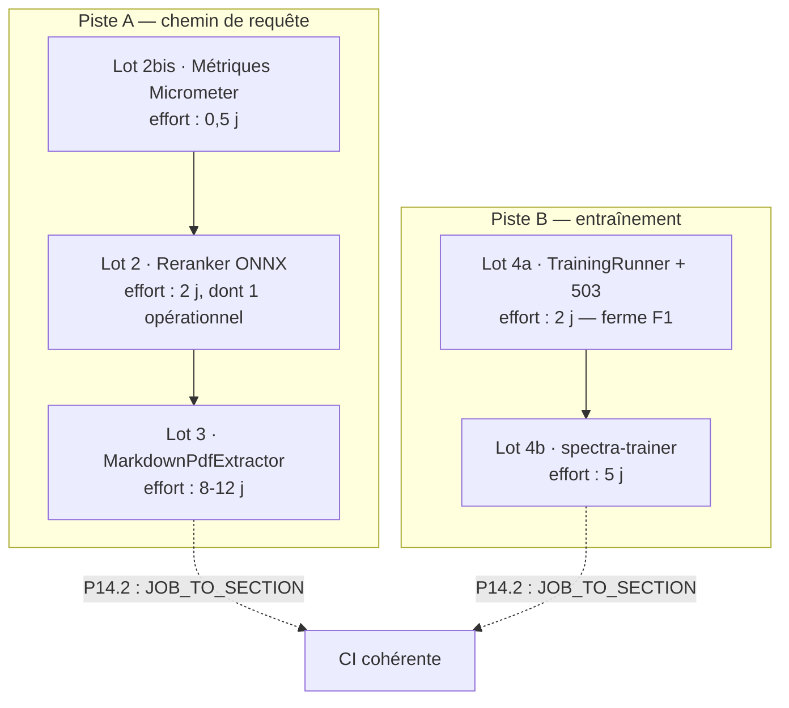

# Plan de migration — sortir Python du chemin de requête

> **Ce document est un plan d'exécution, pas un audit.** L'analyse, les alternatives écartées et
> les justifications techniques vivent dans [`audit-python-java.fr.md`](audit-python-java.fr.md).
> Ici : quoi faire, dans quel ordre, avec quel critère d'arrêt et quel retour arrière.
>
> **Périmètre : le code Python de production.** Les 1 051 lignes de test sont hors périmètre par
> décision (audit §0). La cible est donc **1 284 lignes**, dont **222 sur le chemin de requête**.

---

## 1. Objectif

| | Aujourd'hui | Après le plan |
|---|---|---|
| Python traversé par une requête utilisateur | 222 lignes, 2 conteneurs | **0** |
| Images Docker Python construites par le dépôt | 2 (`docparser`, `reranker`) | **0** |
| Jobs Python en CI | 2 | 1 (tests d'outillage, conservé) |
| Fine-tuning sans runner configuré | échoue à mi-course (`IOException`) | 503 actionnable (**F1 clos**) |
| Python de production dans le dépôt | 1 284 lignes | **0** |

**Ce que le plan ne fait pas** : supprimer les tests d'outillage Python (363 lignes, décision
audit §0), remplacer ChromaDB (hors périmètre, audit §11), ni réécrire l'entraînement QLoRA en
Java (impossible sans régression, audit §8).

---

## 2. Principes directeurs

Quatre règles qui expliquent la forme de chaque lot. Les enfreindre, c'est transformer une
migration réversible en pari.

1. **La bascule est une propriété de configuration, jamais un remplacement de code.** Chaque
   composant migré coexiste avec son prédécesseur derrière une clé (`spectra.reranker.engine`,
   `spectra.pdf.layout-aware`). On bascule le défaut *après* validation, on supprime l'ancien
   *après* une version de coexistence. Retour arrière = une variable d'environnement.
2. **Aucune bascule sans mesure de parité prise sur l'implémentation sortante.** La référence
   doit être capturée pendant que le Python est encore la vérité. Une régression de reranking ou
   d'extraction ne casse rien — elle dégrade silencieusement les réponses. C'est le mode de
   panne le plus coûteux du projet et le seul qu'aucun test unitaire n'attrape.
3. **L'observabilité précède la bascule.** Un composant migré doit être mesurable *avant* de
   devenir le défaut, sinon la comparaison avant/après est impossible et la régression
   invisible (cf. P15).
4. **Un lot livre une valeur autonome.** Chaque lot est mergeable et déployable seul. Aucun
   « grand merge » en fin de parcours.

---

## 3. Séquence

Deux pistes **indépendantes**, exécutables en parallèle par deux personnes différentes.



**Ordre recommandé si une seule personne** : 2bis → 4a → 2 → 3 → 4b.

Le lot 4a est placé tôt malgré son appartenance à la piste B : c'est **2 jours qui ferment F1**,
le seul défaut de cet audit qui casse une fonctionnalité pour un utilisateur aujourd'hui. Les
lots 2 et 3, eux, améliorent une architecture qui fonctionne.

---

## 4. Lot 2 bis — Métriques Micrometer sur le reranking

**Pourquoi d'abord.** P15 : le moteur ONNX est livré sans aucune métrique, alors que le service
Python expose `/metrics`. Basculer en l'état échangerait un composant observé contre un
composant muet — et supprimerait au passage toute possibilité de comparer les deux.

**Prérequis** : aucun. **Effort** : 0,5 j. **Risque** : nul (ajout pur).

### Tâches

1. Créer `backend/src/main/java/fr/spectra/service/reranker/MeteredRerankerClient.java` —
   décorateur `@Primary` implémentant `RerankerClient`, qui enveloppe le bean actif quel qu'il
   soit.

   > **Pourquoi un décorateur plutôt qu'instrumenter les deux implémentations.** C'est ce qui
   > garantit des métriques *identiques* sur les deux moteurs — condition pour que la comparaison
   > avant/après la bascule ait un sens. Instrumenter séparément, c'est risquer deux définitions
   > de « latence » qu'on comparerait sans le savoir.

2. Métriques exposées (nommage Micrometer, tag `engine` = `http` | `onnx`) :

   | Métrique | Type | Tags | Ce qu'elle sert à voir |
   |---|---|---|---|
   | `spectra.reranker.requests` | `Counter` | `engine`, `outcome` (`success`/`failure`) | le taux d'échec, donc la fréquence du repli `rerankApplied=false` |
   | `spectra.reranker.latency` | `Timer` | `engine` | la comparaison de latence entre HTTP et in-process — l'argument chiffré de la migration |
   | `spectra.reranker.documents` | `DistributionSummary` | `engine` | la taille des lots réellement soumis, qui conditionne la latence |

3. Test : `MeteredRerankerClientTest` — vérifie que le compteur `failure` s'incrémente **et que
   l'exception est propagée**. Une métrique qui avalerait l'exception transformerait le repli en
   panne silencieuse, exactement ce que §10.2 interdit.

### Critère de sortie

`curl localhost:8080/actuator/prometheus | grep spectra_reranker` renvoie les trois métriques,
avec le bon tag `engine`, sur chacun des deux moteurs.

### Retour arrière

Retirer le bean décorateur. Aucun appelant ne le référence (il satisfait `RerankerClient`).

---

## 5. Lot 2 — Reranker ONNX dans la JVM

**État réel : le code est écrit.** Sont livrés le moteur (`OnnxCrossEncoderReranker`), le
harnais de parité, six classes de test et trois de support. **Ce lot n'est pas un lot de
développement — c'est un lot de validation et de retrait.**

**Prérequis** : lot 2 bis + une machine avec accès à `huggingface.co`.
**Effort** : 2 j, dont ~1 j d'attente machine. **Risque** : moyen, entièrement couvert par la
mesure de parité.

### Étape 1 — Capturer la référence *(bloquant, non technique)*

`backend/src/test/resources/reranker-parity/` n'existe pas. Tant qu'il est absent,
`RerankerParityTest` **se neutralise par `Assumptions`** : la suite est verte sans avoir rien
comparé. C'est le point le plus important de ce lot.

```bash
# Depuis la RACINE du dépôt.
docker compose --project-directory . -f deploy/docker/docker-compose.yml \
  --profile reranker up -d reranker
curl http://localhost:8002/health          # attendre {"status":"ok","model":"…"}

cd backend && mvn test -Dtest=RerankerParityTest \
  -Dreranker.parity.capture=http://localhost:8002 \
  -Dreranker.parity.scale=sigmoid
```

Le fichier produit **se versionne avec le code**. Le nom du modèle est lu sur `/health` — donc
celui réellement servi, pas celui que la configuration annonce (cf. audit §6.7, trois défauts de
modèle incohérents).

### Étape 2 — Produire l'artefact ONNX

Depuis le cache HuggingFace du volume Compose, **sans accès réseau** (procédure détaillée en
audit §6.3 bis) :

```bash
docker run --rm -v spectra_reranker-model-cache:/cache alpine \
  find /cache -name config.json | head
docker run --rm -v spectra_reranker-model-cache:/cache -v "$PWD/data/models:/out" \
  python:3.11-slim bash -c "pip install -q optimum[exporters] && \
    HF_HUB_OFFLINE=1 optimum-cli export onnx --model /cache/<snapshot> \
      --task text-classification /out/reranker"
```

Exporter depuis le modèle **déjà servi** garantit que la comparaison de parité porte sur le même
modèle — condition de sa validité.

### Étape 3 — Vérifier

```bash
mvn test -Dtest=RerankerParityTest -Dreranker.parity.verify=onnx:./data/models/reranker
```

C'est **ce lancement** qui transforme « code livré » en « code prouvé » : tant qu'il n'a pas
tourné, `OrtSession.run` n'a jamais vu un modèle réel.

- Écart d'**ordre** → bloquant. Diagnostiquer avant d'aller plus loin.
- Écart de **score** seul → acceptable si l'activation diffère ; relancer avec
  `-Dreranker.parity.scores=ignore` pour l'assumer explicitement. L'inverse — accepter une
  permutation parce que « les scores sont proches » — est une régression invisible.

### Étape 4 — Mesurer

Rejouer le benchmark qualité (`spectra.benchmark`) et relever `spectra.reranker.latency` (lot
2 bis) sur les deux moteurs. **Publier l'écart dans la PR** : c'est la justification chiffrée de
la migration, et la seule trace qui survivra à la suppression du service Python.

### Étape 5 — Basculer et retirer

| Fichier | Action |
|---|---|
| `backend/src/main/resources/application.yml:140` | `engine: ${SPECTRA_RERANKER_ENGINE:onnx}` |
| `deploy/docker/docker-compose.yml` | supprimer le service `reranker`, le profil, le volume `reranker-model-cache`, `SPECTRA_RERANKER_URL` |
| `services/reranker/` | supprimer (73 lignes prod + 145 test) |
| `.github/workflows/ci.yml:172` | matrice `[docparser, reranker]` → `[docparser]` |
| ~~`scripts/setup.sh` / `.bat`~~ | ✅ **fait** — `--download-reranker` livré (D1) |
| `docs/configuration.en.md` | documenter `SPECTRA_RERANKER_ONNX_PATH` / `_URL` et le provisionnement |
| Release | publier l'artefact ONNX en asset et renseigner son URL (D1, reste à faire) |

`CrossEncoderRerankerClient` **reste** derrière `engine=http` pendant une version : c'est le
retour arrière.

> **P14.2 ne s'applique pas ici** : le job `python-services` existe toujours (matrice réduite à
> `docparser`), donc `JOB_TO_SECTION` est inchangé. Il s'appliquera au lot 3.

### Critère de sortie

- [ ] `reranker-parity/reference.json` versionné
- [ ] parité d'ordre vérifiée sur modèle réel, écart publié
- [ ] `services/reranker/` supprimé, aucune image reranker construite
- [ ] `/api/status` affiche toujours l'état du reranker avec le nom du modèle
- [ ] benchmark qualité stable, latence documentée

### Retour arrière

`SPECTRA_RERANKER_ENGINE=http` + réactiver le profil Compose. Tant que la version de
coexistence n'est pas passée, aucun code n'est perdu.

---

## 6. Lot 3 — Extraction PDF layout-aware dans la JVM

Le lot le plus lourd, et le seul qui accepte un **compromis de qualité assumé** : Docling
(OCR/ML) n'a pas d'équivalent Java. La stratégie n'est pas de supprimer la capacité mais
**d'inverser les défauts** (audit §7.3).

**Prérequis** : lot 2 (rodage du schéma de bascule). **Effort** : 8-12 j. **Risque** : élevé.

### Tâches

1. **`MarkdownPdfExtractor`** (`backend/.../extraction/`), implémentant `DocumentExtractor`.
   Aucune modification de `DocumentExtractorFactory` n'est nécessaire — elle construit sa table
   depuis `List<DocumentExtractor>` injectée par Spring, sans liste codée en dur. Déclarer le
   bean suffit.
2. **Titres** : sous-classer `PDFTextStripper`, surcharger `writeString(String, List<TextPosition>)`,
   comparer la taille de police à la médiane du document → `#`/`##`.
3. **Colonnes** : clustering 1D des `TextPosition` par abscisse. **Sans cela, un PDF sur deux
   colonnes est extrait entrelacé** — ce qui ne lève aucune erreur et détruit tous les chunks en
   aval. C'est le risque n°1 du lot.
4. **Tableaux** : ajouter `tabula-java` (bâti sur PDFBox, déjà présent en `pom.xml:96`), modes
   *lattice* et *stream*, export Markdown natif.
5. **Nettoyage** : portage **littéral** de `_ARTIFACT_PATTERNS` et `clean_markdown`
   (`services/docparser/app.py:41-60`), avec le commutateur `DOCPARSER_STRIP_PAGE_NUMBERS` →
   `spectra.pdf.strip-page-numbers`. Porter **les tests avec** (P9) : la règle « ligne purement
   numérique bornée à 4 chiffres » est désactivable pour une raison documentée, et se reperd
   typiquement lors d'un portage.
6. **Métadonnées** : réutiliser `PdfExtractor.extractMetadata` — mêmes clés que le service Python
   (`title`, `author`, `subject`, `creationDate`), plus `format=PDF`, `layoutAware=true`,
   `parser=pdfbox-markdown`.

### Validation — obligatoire, pas optionnelle

Ce lot **ne doit pas être fusionné sur la seule foi de tests unitaires**.

1. **Corpus versionné** dans `backend/src/test/resources/pdf-corpus/` : 1 colonne, 2 colonnes,
   avec tableaux, avec en-têtes/pieds répétés, scanné.
2. **A/B** : sortie Java vs sortie `docparser` actuelle, **écart documenté fichier par fichier**.
3. **Impact retrieval** : rejouer le benchmark qualité. C'est la seule mesure qui compte — la
   fidélité du Markdown n'est qu'un proxy.

### Retrait

| Fichier | Action |
|---|---|
| `services/docparser/`, `services/requirements-test.txt`, `services/ruff.toml` | supprimer — `services/` disparaît |
| `deploy/docker/docker-compose.yml` | supprimer le service `docparser` et le profil `layout-parser` |
| `.github/workflows/ci.yml` | **supprimer le job `python-services`** |
| `.github/workflows/ci.yml:195` | `codecov` : retirer `python-services` de `needs:` |
| `scripts/verify.sh` | retirer `services` de `SECTIONS=(…)` et son bloc `wanted services` |
| `scripts/tests/test_verify_covers_ci.py` | **retirer l'entrée `"python-services": "services"`** — cf. ci-dessous |

> ### ⚠️ P14.2 — trois tests échouent si ce retrait est partiel
>
> `test_verify_covers_ci.py` tend un filet **bidirectionnel**. Supprimer le job sans mettre à
> jour le dictionnaire déclenche :
>
> | Test | Se déclenche quand |
> |---|---|
> | `test_the_currently_known_jobs_are_all_accounted_for` | le job disparaît de `ci.yml` en restant référencé |
> | `test_every_mapped_section_actually_exists` | la section disparaît de `SECTIONS=(…)` |
> | `test_each_mapped_section_is_implemented_not_just_declared` | le bloc `wanted services` disparaît |
>
> **Ce n'est pas un défaut du test** — c'est exactement le filet qu'il doit tendre. Le correctif
> est d'une ligne, mais il doit partir **dans le même commit**, sinon le lot 3 sort en CI rouge
> sur un fichier que personne n'associera à la suppression d'un microservice.

**Ce qui est conservé** : `LayoutParserClient` et `spectra.layout-parser.enabled`. Le crochet
HTTP survit pour qui veut brancher `docling-serve` en amont — le produit devient full Java par
défaut **sans amputer** les utilisateurs qui ont besoin d'OCR.

### Critère de sortie

- [ ] `services/` supprimé du dépôt
- [ ] extraction PDF layout-aware par défaut **dans la JVM**
- [ ] écart de qualité A/B mesuré et **publié**
- [ ] benchmark qualité stable
- [ ] crochet `docling-serve` documenté
- [ ] `pytest scripts/tests` vert (P14.2 traité)

---

## 7. Lot 4a — `TrainingRunner` : fermer F1

**Le meilleur rapport effort/valeur du plan** : 2 jours pour transformer une fonctionnalité qui
échoue à mi-course en une fonctionnalité explicitement indisponible.

**Prérequis** : aucun — indépendant des lots 2 et 3. **Effort** : 2 j. **Risque** : faible.

### Le défaut, concrètement

`FineTuningService` lance `./scripts/train.sh` par `ProcessBuilder` (ligne 567) avec douze
arguments **positionnels** (ligne 537), et `python3` pour l'export GGUF (ligne 609). L'image
`spectra-api` est un `eclipse-temurin:25-jre` : **ni Python, ni `scripts/`**. Chaque job soumis
en Docker échoue donc sur une `IOException` après avoir été accepté, généré son dataset et créé
son répertoire de travail.

### Tâches

1. Introduire l'abstraction absente :

   ```java
   public interface TrainingRunner {
       boolean isAvailable();
       TrainingHandle start(TrainingSpec spec);   // dataset, base, LoRA, epochs, DPO/ORPO…
       void cancel(String jobId);
   }
   ```

   `TrainingSpec` remplace les douze arguments positionnels — au passage, **F10** (audit
   fine-tuning) disparaît : un argument inséré au mauvais rang ne peut plus décaler
   silencieusement tous les suivants.

2. `ProcessTrainingRunner` : extraire `runProcess` / `runTrainingProcess` de `FineTuningService`.
   `isAvailable()` teste la présence de `trainingScript` **et** de `pythonBin`.
3. `FineTuningService` cesse de connaître `python3`, `train.sh` et les arguments positionnels.
4. **La soumission renvoie 503 quand aucun runner n'est disponible**, avec un message actionnable
   — au lieu d'accepter le job puis d'échouer.
5. Même traitement pour l'export GGUF (`exportGgufAndRegister`, ligne 609).

### Critère de sortie

- [ ] `grep -rn "python3\|train.sh" FineTuningService.java` ne renvoie rien
- [ ] test : soumission sans runner → 503 + message nommant la cause, **aucun job créé**
- [ ] test : soumission avec `ProcessTrainingRunner` → comportement inchangé (non-régression)
- [ ] F1 clos dans `audit-finetuning.fr.md`

---

## 8. Lot 4b — `spectra-trainer` : sortir Python du dépôt applicatif

**Prérequis** : lot 4a. **Effort** : 5 j. **Risque** : faible (aucune régression fonctionnelle —
QLoRA, DPO, ORPO, packing, NEFTune restent disponibles).

> **Moins urgent qu'annoncé initialement.** L'argument de déploiement de ce lot était le `Job`
> Kubernetes ; le support K8s a été retiré du dépôt (audit P3). `HttpTrainingRunner` ne sert donc
> plus qu'un scénario réel — un conteneur `spectra-trainer` en Compose. À programmer quand le
> besoin se manifeste, **pas** comme suite obligée du lot 4a, qui apporte l'essentiel de la
> valeur à lui seul.

### Tâches

1. `HttpTrainingRunner` implémentant `TrainingRunner`, alimentant `TrainingLogBroadcaster` par
   flux de logs.
2. Image `spectra-trainer` : `scripts/*.py` + `requirements.txt` + une API HTTP minimale.
   Profil Compose dédié, **absent par défaut**.
3. Retrait du dépôt applicatif : `scripts/train_host.py`, `chat_format.py`, `export_gguf.py`,
   `export_lora_gguf.py`, `base_models.py`, `llama_cpp_convert.py`, `scripts/requirements.txt`,
   et leurs trois fichiers de test (`test_chat_format`, `test_base_models`,
   `test_llama_cpp_convert`).
4. **`base_models.json` reste dans `backend/src/main/resources/`** (lot 0, P8). Le trainer le lit
   par HTTP ou reçoit les valeurs résolues dans `TrainingSpec` — ne pas réintroduire le couplage
   inverse.
5. **⚠️ P14.2, deuxième occurrence.** `scripts/tests/` conserve les trois tests d'outillage. Le
   job `training-scripts` **subsiste donc**, mais son nom devient trompeur. Le renommer
   (`tooling-tests`) impose de mettre à jour `JOB_TO_SECTION` **dans le même commit**, sinon
   `test_the_currently_known_jobs_are_all_accounted_for` échoue.

### Critère de sortie

- [ ] `find . -name '*.py' -not -path './scripts/tests/*'` ne renvoie rien
- [ ] fine-tuning fonctionnel via `spectra-trainer` (profil dédié) **et** en mode hôte
- [ ] les 19 tests d'invariants de `chat_format` tournent dans le dépôt du trainer
- [ ] `pytest scripts/tests` vert (P14.2 traité)

---

## 9. Décisions à trancher

Trois questions qui ne relèvent pas de l'exécution et bloqueront un lot si elles ne sont pas
tranchées avant.

### D1 — Comment une installation neuve obtient-elle l'artefact ONNX ? — ✅ **tranchée : option (a)**

`spectra.reranker.enabled` défaute à **`false`** : le reranking est éteint sur une installation
neuve. La bascule `engine=onnx` **ne casse donc rien par défaut** — elle ne concerne que les
installations ayant explicitement activé le reranking, qui devront provisionner
`./data/models/reranker`.

| Option | Effet | Retenue |
|---|---|---|
| **a.** `--download-reranker` dans `setup.sh`/`.bat`, `enabled` reste `false` | l'utilisateur choisit ; aucune régression | ✅ **oui** |
| **b.** idem + `enabled: true` par défaut | atteindrait le critère « pile complète » | reportée (cf. ci-dessous) |
| **c.** ne rien provisionner | critère non atteint | non |

#### Ce qui est livré

- **`setup.sh --download-reranker` / `setup.bat --download-reranker`** — nouvelle étape 7 (sh)
  et 6 (bat), récupérant `model.onnx` et `tokenizer.json` dans `data/models/reranker/`.
- **Quatre comportements distincts**, parce qu'un artefact optionnel absent n'est pas une
  erreur — mais l'est s'il est réclamé par la configuration :

  | Situation | Comportement |
  |---|---|
  | artefact présent | `[OK]` avec sa taille, idempotent |
  | absent, reranking désactivé (défaut) | `[OK] non requis`, **ne compte pas comme erreur** |
  | absent, `ENABLED=true` **et** `ENGINE=onnx` | `[AVERT]` nommant la conséquence (repli sur l'ordre vectoriel, `rerankApplied=false`) et le correctif |
  | `--download-reranker` sans URL | `[ERREUR]` renvoyant à l'export hors ligne (audit §6.3 bis) |

- **`SPECTRA_RERANKER_ONNX_URL`** — URL de *base* du répertoire distant. Aucune valeur par
  défaut, **et c'est délibéré** : le modèle multilingue par défaut n'est pas publié au format
  ONNX en amont, donc toute URL codée en dur pourrirait en silence. La variable accepte un asset
  de release, un miroir interne, ou un artefact produit hors ligne.
- **`.env.example`** documente enfin le reranking — les quatre variables (`ENABLED`, `ENGINE`,
  `ONNX_PATH`, `ONNX_URL`) en étaient **totalement absentes**, ce qui rendait la fonctionnalité
  indécouvrable autrement qu'en lisant `application.yml`.
- `curl --fail` + suppression du fichier partiel : une 404 ne laisse jamais une page HTML nommée
  `model.onnx`, qu'ONNX Runtime ne rejetterait qu'au premier rerank, longtemps après le setup.

#### Corrigé au passage — `read_env_var` interrompait `setup.sh` sans message

Sous `set -euo pipefail`, `grep` sans correspondance fait échouer le pipeline de `read_env_var` ;
l'affectation `VAR="$(read_env_var CLE_ABSENTE)"` **terminait alors le script silencieusement**,
résumé final compris. Le défaut était latent tant que la seule clé lue (`LLM_CHAT_MODEL_FILE`)
figurait dans `.env.example` — il ne se manifestait que sur un `.env` édité à la main. Lire des
clés optionnelles le rendait systématique. Corrigé (`|| true`), vérifié sur les trois cas : clé
absente, clé présente, `.env` absent.

#### Reste à faire — une étape de *release*, pas de développement

Publier l'artefact ONNX comme asset de release et renseigner son URL dans la documentation
d'installation. Tant que ce n'est pas fait, `--download-reranker` exige que l'opérateur
fournisse lui-même l'URL — comportement correct et explicite, mais pas encore « clé en main ».

#### Option (b) — reportée, avec son critère de réévaluation

Passer `enabled: true` par défaut atteindrait le critère *« `docker compose up` = pile complète,
reranking inclus »*, au prix de ~0,5 Go au premier lancement. **À réévaluer après mesure de
l'empreinte mémoire réelle** : `mMiniLMv2-L12-H384` étant distillé de XLM-R, sa matrice
d'embeddings (~250 k × 384) domine sa taille, et ONNX Runtime alloue **en natif** — la contrainte
n'est donc pas `-Xmx` mais la limite mémoire du conteneur. Décider avant d'avoir mesuré serait
un pari sur le poste le plus modeste du parc.

### D2 — Quel écart de qualité PDF est acceptable ? *(bloque lot 3, fusion)*

À fixer **avant** de lancer le lot, sinon la mesure A/B sera interprétée après coup en fonction
du travail déjà investi. Proposition : régression du benchmark qualité **≤ 2 points**, et aucune
régression sur les PDF à une colonne (le cas majoritaire). Au-delà, le crochet `docling-serve`
devient la recommandation documentée pour les corpus concernés, plutôt qu'un repli honteux.

### D3 — Le lot 4b est-il seulement souhaité ? *(bloque lot 4b)*

Depuis le retrait de Kubernetes, sa valeur se réduit à « plus de Python dans le dépôt
applicatif ». C'est un objectif d'hygiène légitime, mais **le lot 4a apporte l'essentiel de la
valeur fonctionnelle**. À décider explicitement plutôt qu'à enchaîner par inertie.

---

## 10. Filet de sécurité — ce que la migration ne doit pas casser

À vérifier à chaque lot (détail et justification : audit §10) :

1. `topN < 1` → rejet ; `documents` vide → résultat vide.
2. **Échec du reranker → exception, jamais un classement identité à score 0.** `RagService` doit
   continuer à produire `rerankApplied=false`. Un classement identité fausse silencieusement
   benchmarks et ablations.
3. Fichier non-PDF → 400 ; fichier vide → 400.
4. Clés de métadonnées : `title`, `author`, `subject`, `creationDate`, `page_count`,
   `format=PDF`, `layoutAware=true`, `parser=<nom>`.
5. `/api/status` et `/api/health` continuent de rapporter reranker et docparser — sous une forme
   adaptée (composant in-process), **pas en disparaissant**.
6. Métriques : ce que les services Python exposaient sur `/metrics` réapparaît sur
   `/actuator/prometheus` (lot 2 bis).
7. Le repli extraction layout-aware → texte brut reste, ou est remplacé par un repli équivalent
   au sein de `MarkdownPdfExtractor`.

---

## 11. Suivi

| Lot | Effort | Piste | Bloqué par | Statut |
|---|---|---|---|---|
| 2 bis · Métriques Micrometer | 0,5 j | A | — | ⬜ à faire |
| 2 · Reranker ONNX | 2 j | A | 2 bis, accès Hub | ⬜ code livré, validation à faire — ~~D1~~ ✅ tranchée |
| 3 · MarkdownPdfExtractor | 8-12 j | A | Lot 2, **D2** | ⬜ à faire |
| 4a · `TrainingRunner` + 503 | 2 j | B | — | ⬜ à faire |
| 4b · `spectra-trainer` | 5 j | B | Lot 4a, **D3** | ⬜ à décider |

**Total ≈ 18-22 jours**, dont **2,5 j** (lots 2 bis + 4a) pour fermer F1 et ouvrir la voie à la
bascule du reranker.

### Mesure de l'avancement

Compter les fichiers `.py` restants est un **mauvais indicateur** : il mélange trois natures de
code, et le lot 2 — le plus rentable — ne le bougerait presque pas. Suivre plutôt :

```bash
# Python de production sur le chemin de requête — la seule ligne qui compte (cible : 0)
wc -l services/*/app.py 2>/dev/null | tail -1

# Python de production total (cible : 0)
find . -name '*.py' -not -name 'test_*' -not -name 'conftest.py' \
  -not -path '*/node_modules/*' | xargs wc -l | tail -1

# Images Python construites par le dépôt (cible : 0)
grep -c "context: ./services" deploy/docker/docker-compose.yml
```

| Jalon | Chemin de requête | Production totale | Images |
|---|---:|---:|---:|
| Aujourd'hui | 222 | 1 284 | 2 |
| Après lot 2 | 149 | 1 211 | 1 |
| Après lot 3 | **0** | 1 062 | **0** |
| Après lot 4b | 0 | **0** | 0 |

---

**Documentation :** [index](../README.md) · [Audit Python→Java](audit-python-java.fr.md) ·
[Audit fine-tuning](audit-finetuning.fr.md) · [Architecture](../architecture.en.md) ·
[Configuration](../configuration.en.md)
