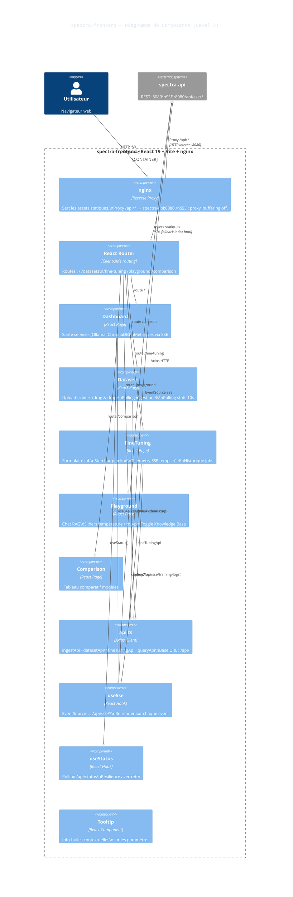

# Spectra — C4 Level 3 · Components

## spectra-api (Spring Boot)

### Scope
Composants internes du backend : couche **Controllers** (REST/SSE), couche **Services** (pipeline métier), et couche **Clients** (WebClient vers Ollama et ChromaDB). Les flèches indiquent les dépendances d'injection.

```mermaid
%%{init: {
  "theme": "base",
  "themeVariables": {
    "primaryColor": "#1e1b4b",
    "primaryTextColor": "#e2e8f0",
    "primaryBorderColor": "#4f46e5",
    "lineColor": "#6366f1",
    "secondaryColor": "#0f172a",
    "tertiaryColor": "#1e293b",
    "background": "#0a0a0f",
    "mainBkg": "#1e1b4b",
    "nodeBorder": "#4f46e5",
    "clusterBkg": "#0f172a",
    "titleColor": "#a5b4fc",
    "edgeLabelBackground": "#0f172a",
    "fontFamily": "Courier New, monospace"
  }
}}%%
C4Component
    title spectra-api — Diagramme de Composants (Level 3)

    Container_Boundary(api, "spectra-api  ·  Spring Boot 4 / Java 25") {

        Component(ingestCtrl, "IngestController", "REST @RestController", "POST /api/ingest\nGET /api/ingest/{taskId}")
        Component(datasetCtrl, "DatasetController", "REST @RestController", "POST /api/dataset/generate\nGET /api/dataset/stats\nPOST /api/dataset/export")
        Component(ftCtrl, "FineTuningController", "REST @RestController", "POST /api/fine-tuning\nGET /api/fine-tuning/{jobId}\nGET /api/fine-tuning/models")
        Component(queryCtrl, "QueryController", "REST @RestController", "POST /api/query")
        Component(sseCtrl, "SseController", "SSE @RestController", "GET /api/sse/training-logs\nGET /api/sse/system-load")
        Component(configCtrl, "ConfigController", "REST @RestController", "GET/POST /api/config/model")
        Component(statusCtrl, "StatusController", "REST @RestController", "GET /api/status")

        Component(ingestSvc, "IngestionService", "@Service + @Async", "Orchestre : extraction → nettoyage\n→ chunking → embedding → ChromaDB")
        Component(textCleaner, "TextCleanerService", "@Service", "Normalisation Unicode (8 étapes)\nOCR, en-têtes, tableaux")
        Component(chunking, "ChunkingService", "@Service", "512 tokens max\nOverlap 64 tokens")
        Component(embedding, "EmbeddingService", "@Service", "Batch 10, retry exponentiel\nVia nomic-embed-text")
        Component(datasetGen, "DatasetGeneratorService", "@Service @Async", "Génère Q&A, résumés, classifications\nExemples négatifs (30%)\nmaxChunks configurable")
        Component(ftSvc, "FineTuningService", "@Service @Async", "EXPORT → TRAINING → IMPORT\nSelf-injection @Lazy pour @Async")
        Component(broadcaster, "TrainingLogBroadcaster", "@Service Reactor", "Sinks.Many multicast (buffer 500)\nPublie logs train.sh en SSE")
        Component(ragSvc, "RagService", "@Service", "Embedding question → ChromaDB search\n→ Ollama chat avec contexte")
        Component(batchSvc, "BatchService", "@Service @Async", "Mode batch : ingest → dataset\n→ fine-tuning en séquence")

        Component(ollamaClient, "OllamaClient", "WebClient @Service", "POST /api/embeddings\nPOST /api/generate\nPOST /api/create (v0.6+ API)")
        Component(chromaClient, "ChromaDbClient", "WebClient @Service", "REST API v2\nBuffer 16 Mo (ExchangeStrategies)\nCollection spectra_documents")
    }

    System_Ext(ollama, "spectra-ollama", "Ollama :11434")
    SystemDb_Ext(chroma, "spectra-chromadb", "ChromaDB :8000")
    System_Ext(scripts, "Scripts", "train.sh · train_host.py")

    Rel(ingestCtrl, ingestSvc, "délègue")
    Rel(datasetCtrl, datasetGen, "soumet tâche")
    Rel(ftCtrl, ftSvc, "soumet job")
    Rel(queryCtrl, ragSvc, "query()")
    Rel(sseCtrl, broadcaster, "stream() Flux")
    Rel(configCtrl, ollamaClient, "getModels()")
    Rel(statusCtrl, ollamaClient, "isAvailable()")
    Rel(statusCtrl, chromaClient, "isAvailable()")

    Rel(ingestSvc, textCleaner, "clean()")
    Rel(ingestSvc, chunking, "chunk()")
    Rel(ingestSvc, embedding, "embed()")
    Rel(ingestSvc, chromaClient, "add()")

    Rel(datasetGen, ollamaClient, "chat() × 3–4 / chunk")
    Rel(datasetGen, chromaClient, "getAllDocuments()")

    Rel(ftSvc, datasetGen, "getAllPairs()")
    Rel(ftSvc, ollamaClient, "createModel()")
    Rel(ftSvc, broadcaster, "publish(level, msg)")
    Rel(ftSvc, scripts, "ProcessBuilder")

    Rel(ragSvc, embedding, "embed(question)")
    Rel(ragSvc, chromaClient, "query(vector, k)")
    Rel(ragSvc, ollamaClient, "chat(system, question)")

    Rel(embedding, ollamaClient, "embed(batch)")

    Rel(ollamaClient, ollama, "HTTP REST")
    Rel(chromaClient, chroma, "HTTP REST v2")
```

### Layers

#### Couche Controllers (7)
*   **IngestController** — upload multipart
*   **DatasetController** — génération + stats
*   **FineTuningController** — jobs + modèles
*   **QueryController** — RAG
*   **SseController** — flux temps réel
*   **ConfigController** — modèle actif
*   **StatusController** — santé services

#### Couche Services (9)
*   **IngestionService** — pipeline ingestion
*   **TextCleanerService** — nettoyage texte
*   **ChunkingService** — découpage sémantique
*   **EmbeddingService** — vecteurs nomic
*   **DatasetGeneratorService** — @Async Q&A
*   **FineTuningService** — @Async pipeline
*   **TrainingLogBroadcaster** — Reactor SSE
*   **RagService** — recherche + génération
*   **BatchService** — mode batch complet

#### Couche Clients (2) + Patterns
*   **OllamaClient** — WebClient Reactor
*   **ChromaDbClient** — WebClient 16 Mo
*   @Async via self-injection @Lazy
*   Retry exponentiel 1s/2s/4s
*   Sink multicast buffer 500 msg
*   ProcessBuilder pour scripts

---

## spectra-frontend (React 19 / nginx)

### Scope
Composants internes du frontend : pages React, services API, hooks réactifs et configuration nginx. Les données circulent de l'API vers les pages via les hooks et le client Axios.

### Layers

#### Pages React (5)
*   **Dashboard** — santé + métriques
*   **Datasets** — ingestion + génération
*   **FineTuning** — jobs + telemetry
*   **Playground** — chat RAG
*   **Comparison** — tableau modèles

#### Hooks & Services
*   **api.ts** — client Axios /api/*
*   **useSse** — EventSource réactif
*   **useStatus** — polling /api/status
*   Polling ingest : setInterval 3s
*   Polling génération : setInterval 5s
*   Polling fine-tuning : setInterval 4s
*   Polling stats : setInterval 10s

#### Infrastructure nginx
*   client_max_body_size 100m
*   proxy_read_timeout 300s
*   SSE : proxy_buffering off
*   SSE : proxy_cache off
*   SSE : proxy_read_timeout 3600s
*   SPA : try_files $uri /index.html
