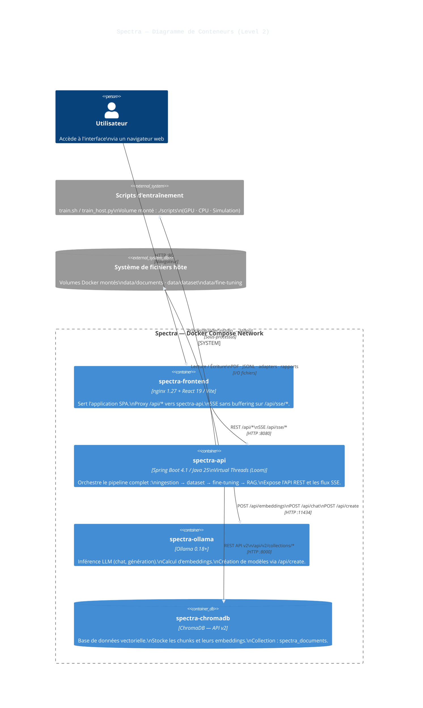

# Spectra — C4 Level 2 · Containers

Vue des **conteneurs applicatifs** composant Spectra : leurs technologies, responsabilités et interactions réseau. Chaque conteneur correspond à un service Docker Compose.

