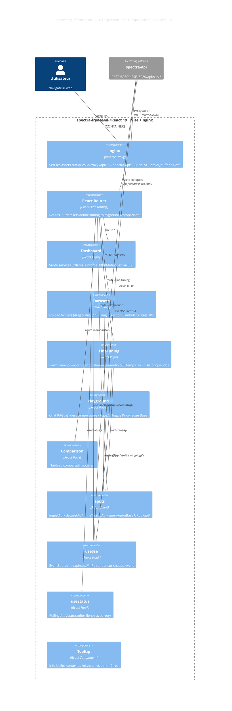

# Spectra — C4 Level 3 · Components

Ce document présente l'architecture détaillée des composants internes pour le backend (`spectra-api`) et le frontend (`spectra-frontend`).

## spectra-api (Spring Boot / Java 25)

Périmètre : architecture interne de l'application backend. Les requêtes entrent par les Controllers, sont orchestrées par les Services, et atteignent les dépendances via les Clients ou ProcessBuilder.

```mermaid
%%{init: {
  "theme": "base",
  "themeVariables": {
    "primaryColor": "#1e1b4b",
    "primaryTextColor": "#e2e8f0",
    "primaryBorderColor": "#4f46e5",
    "lineColor": "#6366f1",
    "secondaryColor": "#0f172a",
    "tertiaryColor": "#1e293b",
    "background": "#0a0a0f",
    "mainBkg": "#1e1b4b",
    "nodeBorder": "#4f46e5",
    "clusterBkg": "#0f172a",
    "titleColor": "#a5b4fc",
    "edgeLabelBackground": "#0f172a",
    "fontFamily": "Courier New, monospace"
  }
}}%%
C4Component
    title spectra-api — Diagramme de Composants (Level 3)

    Person(user, "Frontend (Client)", "SPA via navigateur")

    Container_Boundary(api, "spectra-api  ·  Spring Boot 4.1") {

        Component(ingestCtrl, "IngestController", "@RestController", "POST /api/ingest\nAccepte MultipartFile")
        Component(datasetCtrl, "DatasetController", "@RestController", "POST /api/dataset/generate\nGET /api/dataset/stats")
        Component(ftCtrl, "FineTuningController", "@RestController", "POST /api/finetune/start\nGET /api/finetune/jobs")
        Component(queryCtrl, "QueryController", "@RestController", "POST /api/query (RAG)")
        Component(sseCtrl, "SseController", "@RestController", "Flux SSE temps réel\n/api/sse/system-load\n/api/sse/training-logs")
        Component(configCtrl, "ConfigController", "@RestController", "GET/POST /api/config")
        Component(statusCtrl, "StatusController", "@RestController", "GET /api/status")

        Component(ingestSvc, "IngestionService", "@Service", "Orchestre le pipeline\nNettoyage → Chunking → Embedding → ChromaDB")
        Component(textCleaner, "TextCleanerService", "@Service", "Normalisation (accents, espaces)")
        Component(chunking, "ChunkingService", "@Service", "Découpage (256 tokens, overlap 64)")
        Component(embedding, "EmbeddingService", "@Service", "Batch via Ollama (nomic-embed-text)")
        Component(datasetGen, "DatasetGeneratorService", "@Service @Async", "Génération Q&A synthétique\n3–4 questions/réponses par chunk\nTâche de fond")
        Component(ftSvc, "FineTuningService", "@Service", "Orchestre le script Python train.sh\nDATASET → TRAINING → IMPORT\nSelf-injection @Lazy pour @Async")
        Component(broadcaster, "TrainingLogBroadcaster", "@Service Reactor", "Sinks.Many multicast (buffer 500)\nPublie logs train.sh en SSE")
        Component(ragSvc, "RagService", "@Service", "Embedding question → ChromaDB search\n→ Ollama chat avec contexte")
        Component(batchSvc, "BatchService", "@Service @Async", "Mode batch : ingest → dataset\n→ fine-tuning en séquence")

        Component(ollamaClient, "OllamaClient", "WebClient @Service", "POST /api/embeddings\nPOST /api/generate\nPOST /api/create (v0.6+ API)")
        Component(chromaClient, "ChromaDbClient", "WebClient @Service", "REST API v2\nBuffer 16 Mo (ExchangeStrategies)\nCollection spectra_documents")
    }

    System_Ext(ollama, "spectra-ollama", "Ollama :11434")
    SystemDb_Ext(chroma, "spectra-chromadb", "ChromaDB :8000")
    System_Ext(scripts, "Scripts", "train.sh · train_host.py")

    Rel(user, ingestCtrl, "HTTP Request", "JSON/Multipart")
    Rel(ingestCtrl, ingestSvc, "délègue")
    Rel(datasetCtrl, datasetGen, "soumet tâche")
    Rel(ftCtrl, ftSvc, "soumet job")
    Rel(queryCtrl, ragSvc, "query()")
    Rel(sseCtrl, broadcaster, "stream() Flux")
    Rel(configCtrl, ollamaClient, "getModels()")
    Rel(statusCtrl, ollamaClient, "isAvailable()")
    Rel(statusCtrl, chromaClient, "isAvailable()")

    Rel(ingestSvc, textCleaner, "clean()")
    Rel(ingestSvc, chunking, "chunk()")
    Rel(ingestSvc, embedding, "embed()")
    Rel(ingestSvc, chromaClient, "add()")

    Rel(datasetGen, ollamaClient, "chat() × 3–4 / chunk")
    Rel(datasetGen, chromaClient, "getAllDocuments()")

    Rel(ftSvc, datasetGen, "getAllPairs()")
    Rel(ftSvc, ollamaClient, "createModel()")
    Rel(ftSvc, broadcaster, "publish(level, msg)")
    Rel(ftSvc, scripts, "ProcessBuilder")

    Rel(ragSvc, embedding, "embed(question)")
    Rel(ragSvc, chromaClient, "query(vector, k)")
    Rel(ragSvc, ollamaClient, "chat(system, question)")

    Rel(embedding, ollamaClient, "embed(batch)")

    Rel(ollamaClient, ollama, "HTTP REST")
    Rel(chromaClient, chroma, "HTTP REST v2")
```

## spectra-frontend (React 19 / nginx)

Périmètre : composants internes du frontend (pages React, services API, hooks réactifs et configuration nginx).

