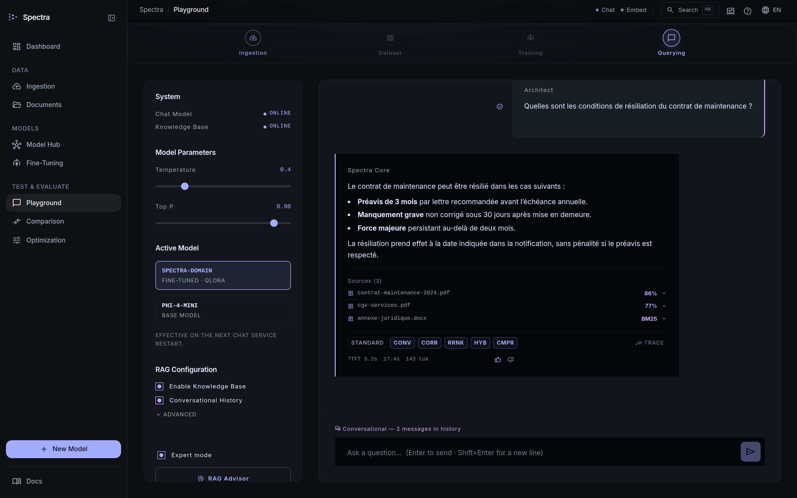
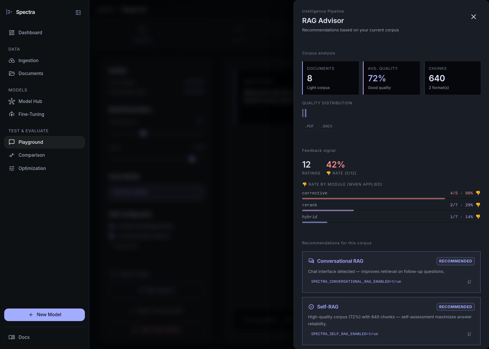
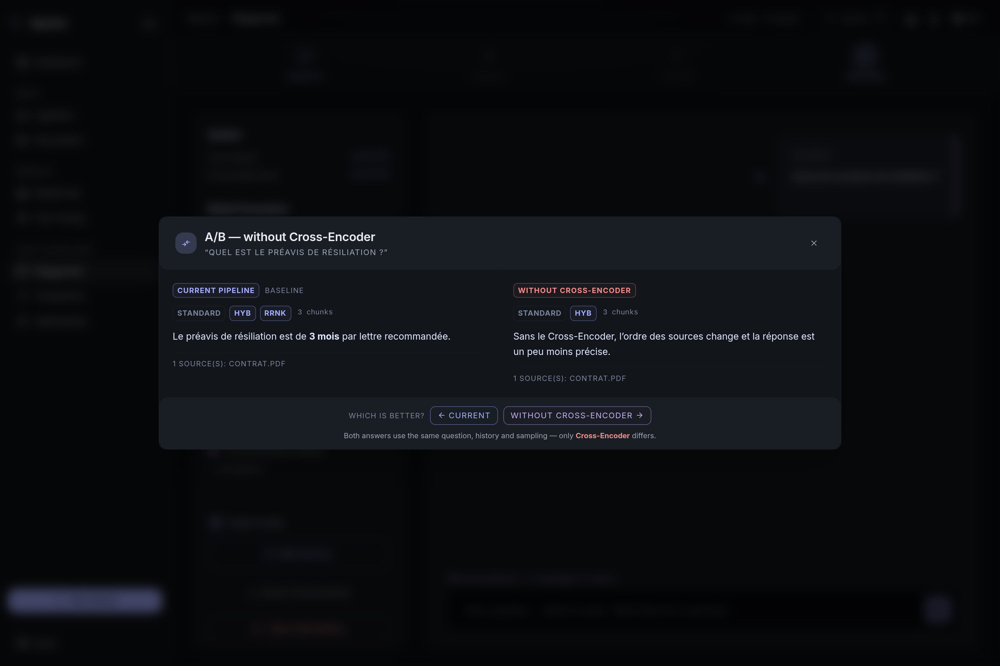

# User Manual: Spectra (Domain LLM Builder)

Spectra lets you build your own AI assistant specialized in **your business domain**, from your own documents. The assistant runs **entirely locally** — no data ever leaves your machine.

LLM inference is handled by [llama-cpp-turboquant](https://github.com/TheTom/llama-cpp-turboquant), a fork of llama.cpp optimized for quantization. Models are in the **GGUF** format, the de-facto standard for local inference.

> 🌍 Version française : **[user-manual.fr.md](user-manual.fr.md)**.

---

## 1. Prerequisites

Before the first launch, make sure you have installed:

- **Docker Desktop** (version 4.x or newer) — started and running

You need two **GGUF** files placed in `data/models/`:

| Variable | Default file | Role |
|----------|--------------|------|
| `LLM_CHAT_MODEL_FILE` | `Qwen2.5-7B-Instruct-Q4_K_M.gguf` | Answers questions, generates the dataset |
| `LLM_EMBED_MODEL_FILE` | `embed.gguf` | Converts text into vectors for search |

If a file is missing at startup, the stack does not stop: the LLM servers wait for it, logging `EN ATTENTE: modèle introuvable`, and start serving as soon as the file appears. You can add it while the stack is running.

### Download the models

```bash
# Chat model (~1.1 GB) — Phi-4-mini by default
huggingface-cli download bartowski/Qwen2.5-7B-Instruct-GGUF \
  Qwen2.5-7B-Instruct-Q4_K_M.gguf --local-dir data/models/

# Embedding model (~81 MB) — nomic-embed-text by default
huggingface-cli download nomic-ai/nomic-embed-text-v1.5-GGUF \
  nomic-embed-text-v1.5.Q4_0.gguf \
  --local-dir data/models/ --filename embed.gguf
```

> **No GPU required** for ingestion, RAG and querying. Fine-tuning with real LoRA weights is optional and needs Python + CUDA.

---

## 2. Startup

```bash
docker compose --project-directory . -f deploy/docker/docker-compose.yml up -d
```

This command launches the core services at once:

| Service | Role |
|---------|------|
| `spectra-frontend` | Web interface (port **80**) |
| `spectra-api` | Backend API (port 8080) |
| `spectra-llama-chat` | Chat inference server (llama.cpp, internal) |
| `spectra-llama-embed` | Embedding server (llama.cpp, internal) |
| `spectra-chromadb` | Vector database (internal) |
| `spectra-browserless` | Headless Chrome for rendering dynamic web pages (internal) |
| `spectra-reranker` | Cross-Encoder re-ranking (port **8002**, optional — see §4 Querying) |
| `spectra-docparser` | Layout-aware PDF parsing (port **8003**, optional — see §1 Ingestion) |

The `llama-chat` and `llama-embed` services are **not reachable from your browser** — they are reserved for internal communication between `spectra-api` and the llama.cpp servers.

On the first startup, the llama.cpp servers load their GGUF model into memory, which takes **30 to 60 seconds**. Wait until `docker compose ps` shows `(healthy)` for every service before opening the interface.

```bash
docker compose ps          # status of each container
curl http://localhost:8080/api/status   # service health
```

The `/api/status` response lists three services:

| `name` | What it monitors | Useful field |
|--------|------------------|--------------|
| `llama-cpp` | Chat server | `details.activeModel`, `details.activeModelLoaded` |
| `llm-embed` | Embedding server | `details.activeModel`, `details.serverStatus` |
| `chromadb` | Vector database | `available`, `version` |

Example summarized response:
```json
{
  "services": [
    {"name": "llama-cpp",       "available": true,  "details": {"activeModel": "spectra-domain", "activeModelLoaded": true}},
    {"name": "llm-embed", "available": true,  "details": {"activeModel": "nomic-embed-text", "serverStatus": "ok"}},
    {"name": "chromadb",        "available": true}
  ]
}
```

---

## 3. The 4-Step Pipeline

Here is the complete path to build your specialized AI assistant:

```
[1. INGEST] ──→ [2. GENERATE] ──→ [3. FINE-TUNE] ──→ [4. QUERY]
 Your documents   Q/A pairs         GGUF model         RAG answers
                       │
                  (optional)
                  [2b. DPO]                [2c. COMMENTS]
               Rejected pairs           Manual or AI annotations
               → preference             Rating → DPO pairs
                 training               → preference fine-tuning
```

---

### Step 1 — Document ingestion

**Goal**: turn your documents (local files or web pages) into vectors stored in ChromaDB.

Spectra accepts two kinds of sources: **files** uploaded from your machine, and **URLs** pointing to web pages or remote files.

---

#### 1a — Ingesting local files

##### Via the interface (recommended)

1. Click **Dataset Pipelines** in the left menu.
2. Locate the pipeline indicator at the top: `[1 INGEST] ── [2 GENERATE] ── [3 READY]`.
3. Drag your files into the dashed area, or click **Browse Files**.
4. Each file appears in the **Live Ingestion Stream** panel with its status:
   - `UPLOADING` → upload in progress
   - `PROCESSING` → extraction + vectorization
   - `COMPLETED` + number of chunks created → success
   - `FAILED` + error message → issue to fix

##### Via the API

```bash
curl -X POST http://localhost:8080/api/ingest \
  -F "files=@technical-manual.pdf" \
  -F "files=@domain-glossary.docx"
# → {"taskId": "abc-123", "status": "PENDING"}

# Track progress
curl http://localhost:8080/api/ingest/abc-123
# → {"status": "COMPLETED", "chunksCreated": 42}
```

**Supported formats:** PDF, DOCX (Word 2007+), DOC (Word 97-2003), HTML, Markdown (`.md`), CSV, JSON, XML, Avro, TXT — and ZIP archives combining them. Reference table: [technical-doc (FR)](../tech/technical-doc.fr.md#31-extraction).

> Scans without OCR (images with no selectable text) will not produce useful chunks.

**Improving PDF extraction quality (tables, headings, hierarchy):**

By default, PDFs are processed with simple text extraction. For technical documents with tables or hierarchical headings, enable layout-aware parsing:

```bash
SPECTRA_LAYOUT_PARSER_ENABLED=true docker compose --project-directory . -f deploy/docker/docker-compose.yml up -d
```

The `spectra-docparser` service starts and converts each PDF into structured Markdown before ingestion:
- Headings become `# Heading`, `## Subheading` (preserved in the chunks)
- Tables become `| column A | column B |` (readable by the LLM)
- Multi-column layouts are correctly linearized

If the parsing service is unavailable during an ingestion, Spectra automatically falls back to standard PDFBox extraction.

> **Advanced option:** for maximum accuracy on complex tables, enable Docling (IBM AI models): `USE_DOCLING=true SPECTRA_LAYOUT_PARSER_ENABLED=true docker compose up --build docparser`. The docparser image grows by about 500 MB.

---

#### 1b — Ingesting from URLs

Spectra can directly ingest web pages or files reachable over HTTP/HTTPS — without you having to download them manually.

**Two cases are handled automatically:**

| Page type | Processing |
|---|---|
| **Static HTML page** (no JavaScript required) | Direct HTTP download + jsoup extraction |
| **Dynamic HTML page** (JavaScript, SPA, web app) | Rendered via `browserless/chrome` (headless Chrome) before extraction |
| **Remote PDF or TXT file** | Direct download, same pipeline as local files |

Spectra detects the content type with a `HEAD` request before deciding how to process it.

##### Via the interface

In **Dataset Pipelines**, find the URL bar below the file drop zone. Paste the URL and press Enter or click **Ingest URL**. Progress appears immediately in the **Live Ingestion Stream**, just like a file.

##### Via the API

```bash
# Ingest a single URL
curl -X POST http://localhost:8080/api/ingest/url \
  -H "Content-Type: application/json" \
  -d '{"urls": ["https://example.com/notice.pdf"]}'
# → {"taskId": "xyz-456", "status": "PENDING"}

# Ingest several URLs in a single call (max 20)
curl -X POST http://localhost:8080/api/ingest/url \
  -H "Content-Type: application/json" \
  -d '{"urls": [
    "https://example.com/product-page",
    "https://intranet/wiki/procedures",
    "https://example.com/doc.pdf"
  ]}'

# Tracking (same endpoint as files)
curl http://localhost:8080/api/ingest/xyz-456
# → {"status": "PROCESSING", "chunksCreated": 0}
# → {"status": "COMPLETED", "chunksCreated": 18}
```

> **Limit:** maximum 20 URLs per request. For a larger volume, make several calls or upload the pre-downloaded files.

> **Protected pages:** Spectra does not handle authentication (session, cookie, token). For pages behind a login, download the content manually and upload it as a file.

> **Browserless fallback:** if the `browserless` service is stopped or unreachable, Spectra still attempts a direct HTTP download. Pages requiring JavaScript won't render correctly, but static pages will work.

---

#### What Spectra does for each source

Whether it's a file or a URL, the behind-the-scenes processing is identical:

1. **Type detection**: file extension (files) or HEAD request + content-type (URLs)
2. **Text extraction**: pdftotext (PDF), Apache POI (DOCX), jsoup (HTML), Jackson (JSON/XML)
3. **Cleaning**: unicode normalization, header/footer removal, punctuation harmonization
4. **Chunking**: splitting into ~512-token segments with a 64-token overlap
5. **Vectorization**: computing embeddings with `nomic-embed-text` (llm-embed)
6. **Storage**: indexing in ChromaDB

> **SHA-256 deduplication:** if the same file is submitted twice (same content, same hash), Spectra silently skips it. Use `?force=true` to **replace** a document: the old chunks are purged from the indexes (vector + BM25) before re-indexing — no duplicates in the answers, and the GED sheet's version is incremented. URLs follow the same rule: the download does happen on each submission, but unchanged content (same hash) is not re-indexed.
>
> **Per-file errors:** a failed file (unsupported format, file too large, corrupted document) does not stop the batch — its error appears directly in the **Live Ingestion Stream**: the file's line switches to a "N chunks · partial" warning with the error detail below it, a toast signals the partial task completion, and the global task panel (activity icon in the header) also shows these failures. A task where **all** files fail ends `FAILED` with the details, instead of a fake success at 0 chunks.

> **Changing the embedding model:** if you replace `embed.gguf` with another model, you must re-ingest **all** your documents. The vectors stored in ChromaDB are specific to a model and are not interchangeable. Use `?force=true`:
> ```bash
> curl -X POST "http://localhost:8080/api/ingest?force=true" -F "files=@file.pdf"
> ```

---

#### Step 1c — Streaming ingestion from Kafka (optional, living data)

**Goal**: enrich the RAG **continuously** from a Kafka stream, rather than through one-off uploads. Each message updates the index in seconds, without retraining the model — ideal for **changing data** (statuses, records, tickets).

**Principle.** The message **key** identifies the data: a new version for the same key **replaces** the old one in the index (*upsert*). A message with a **null value** deletes the data. Replays have no effect (idempotency).

**Startup** — the broker is provided via an optional Docker profile (single-node, for testing):

```bash
# Start the stack + a Kafka broker, with the consumer enabled on the "orders" topic
SPECTRA_KAFKA_ENABLED=true SPECTRA_KAFKA_TOPICS=orders \
  docker compose --profile kafka up -d
```

For an **existing cluster**, don't run the profile: simply point Spectra at it.

```bash
SPECTRA_KAFKA_ENABLED=true
SPECTRA_KAFKA_BOOTSTRAP_SERVERS=broker1:9092,broker2:9092
SPECTRA_KAFKA_TOPICS=orders,tickets
# Security (if needed):
SPECTRA_KAFKA_SECURITY_PROTOCOL=SASL_SSL
SPECTRA_KAFKA_SASL_MECHANISM=SCRAM-SHA-512
SPECTRA_KAFKA_SASL_JAAS_CONFIG=org.apache.kafka.common.security.scram.ScramLoginModule required username="u" password="p";
```

**Publish a test message** (from the host; the profile's broker listens on `localhost:9092`):

```bash
# key = business identity ; value = current state (JSON by default)
echo '4271:{"status":"closed","customer":"ACME"}' | \
  docker exec -i spectra-kafka /opt/kafka/bin/kafka-console-producer.sh \
  --bootstrap-server localhost:9092 --topic orders --property "parse.key=true" --property "key.separator=:"
```

Then ask your usual question in the Playground: the answer reflects the **current** state of order 4271.

**Useful options**

| Variable | Effect |
|---|---|
| `SPECTRA_KAFKA_FORMAT` | Payload format: `json` (default), `txt`, `xml`, `avro` |
| `SPECTRA_KAFKA_CONTENT_FIELD` | Index only one JSON field (e.g. `body` or `/data/text`) instead of the whole message |
| `SPECTRA_KAFKA_METADATA_FIELDS` | JSON fields copied into metadata (e.g. `status,author`) |
| `SPECTRA_KAFKA_COLLECTION` | Dedicated collection for the stream (default `spectra_stream`, isolated from the static corpus) |
| `SPECTRA_KAFKA_RETENTION_TTL_DAYS` | Auto-purge of data not updated for N days (0 = never) |

> **Monitoring:** the `spectra.kafka.messages` counters and the `spectra.kafka.processing` timer are exposed at `http://localhost:8080/actuator/prometheus`. Unreadable messages are routed to a `<topic>.DLT` topic without blocking the stream.

> **Tip:** a Kafka message is often a small structured event. If a single field carries the useful text, set `SPECTRA_KAFKA_CONTENT_FIELD` to avoid indexing technical ids/timestamps and keep search relevant.

---

### Step 1d — Automatic document classification (optional)

**Goal**: assign each document the categories that characterize its content, so you know what your corpus actually holds — and can filter it by theme.

As long as a document is identifiable only by its file name, a collection of several hundred pieces stays opaque: you cannot see that half of it is about maintenance while regulation is represented by three documents. That is precisely what you need to know before generating a dataset: **an unbalanced corpus produces an unbalanced model**.

The model does the classifying itself. Spectra shows it representative excerpts of the document — sampled across its whole length, since the opening pages are often a cover sheet or a table of contents that characterize the substance poorly — along with a labelling prompt, and asks for strict JSON back. The model used is the active chat model: after a first fine-tuning cycle it is **your** specialized model labelling your documents, and it does so better than a generic classifier. The model name is kept on each record, so a reclassification after a new training run stays comparable to the previous one.

#### Defining your taxonomy

This is the one setting that really matters: replace the default list with your domain's own nomenclature.

```yaml
# backend/src/main/resources/application.yml
spectra:
  classification:
    taxonomy:
      - procedures
      - evenements
      - nomenclatures
      - reglementation
      - securite
      # … your own categories
```

Categories proposed by the model are reduced to a canonical form: case, accents and punctuation are ignored ("Procédures" does resolve to `procedures`). In closed mode — the default — any label outside the taxonomy is dropped. To explore a collection whose nomenclature you do not know yet, set `SPECTRA_CLASSIFICATION_OPEN_TAXONOMY=true`: the model will propose its own categories, which you can then freeze into the taxonomy.

| Variable | Purpose | Default |
|---|---|---|
| `SPECTRA_CLASSIFICATION_ENABLED` | Enables the service | `true` |
| `SPECTRA_CLASSIFICATION_AUTO` | Classifies each document as soon as its ingestion completes | `false` |
| `SPECTRA_CLASSIFICATION_OPEN_TAXONOMY` | Allows categories outside the taxonomy | `false` |
| `SPECTRA_CLASSIFICATION_MAX_CATEGORIES` | Categories kept per document | `3` |
| `SPECTRA_CLASSIFICATION_MIN_CONFIDENCE` | Minimum confidence to keep a category | `0.5` |
| `SPECTRA_CLASSIFICATION_MAX_CHUNKS` | Excerpts sampled from the document | `8` |
| `SPECTRA_CLASSIFICATION_MAX_EXCERPT_CHARS` | Character budget submitted to the model (upper bound) | `6000` |

> **This budget is an upper bound, not a promise.** It must fit the PER-REQUEST window, that is `LLM_CONTEXT / LLM_PARALLEL` — not `LLM_CONTEXT` alone. Count ~3.5 characters per token in French: a 6000-character excerpt ≈ 1715 tokens, plus the prompt (~350), the header (~40) and the answer (~120) — about 2225. That is comfortable from 4096 tokens per request upwards, the automatic sizing of a 16 GB machine.
>
> **On a smaller machine the excerpt is automatically reduced to what fits**, and a warning reports it at startup and again on the first affected classification. You therefore have nothing to adjust for classification to work: it will simply be based on less text. To make use of the configured value, raise `LLM_CONTEXT` (bearing in mind that it is divided by `LLM_PARALLEL`).
>
> Without that clamp, going over would produce no error at all: llama.cpp truncates the **start** of the request — the "answer only in JSON" instructions and the taxonomy — and the model replies in prose, so classification fails systematically, on every document.

> `auto-classify` is off by default on purpose: importing 500 files would chain 500 LLM calls. For a corpus that is already in place, prefer the batch classification below; turn `auto-classify` on for a continuous arrival stream.

#### Through the interface

1. **Documents** page, **Category** section of the filter bar.
2. **Classify unclassified** starts a background batch over every document still without a category; a progress bar tracks it and the batch can be cancelled.
3. The category chips filter the list by theme; **Unclassified** isolates the queue.
4. In a document's record, the **Automatic classification** section shows the categories with their confidence, the generated summary, the model and the date. **Reclassify** runs the model again on an already-labelled document.

On each list row, model-assigned categories are displayed distinctly from manual tags (prefixed with `#`): a reclassification never touches your human annotation, and the gap between the two tells you what the classifier is worth.

#### Through the API

```bash
# Effective taxonomy and the model that will classify
curl http://localhost:8080/api/ged/classification

# Classify one document (force=true to re-label an already classified document)
curl -X POST "http://localhost:8080/api/ged/documents/{sha256}/classify"
# → {"categories":["procedures","securite"],"scores":{"procedures":0.92,"securite":0.68},
#    "summary":"Intervention procedure for high-voltage substations.","model":"qwen2.5-7b-instruct"}

# Classify the whole unclassified corpus (empty body), in the background
curl -X POST http://localhost:8080/api/ged/documents/bulk/classify
# → {"taskId":"c1a2…","status":"PENDING"}

# Follow — or cancel — the batch
curl http://localhost:8080/api/ged/classification/tasks/c1a2…
# → {"status":"PROCESSING","processed":37,"total":210,"succeeded":35,"failed":2}
curl -X DELETE http://localhost:8080/api/ged/classification/tasks/c1a2…
```

#### Steering the composition of your corpus

This is where classification pays off. `GET /api/ged/stats` returns coverage and the per-category breakdown:

```bash
curl http://localhost:8080/api/ged/stats
# → "classification": {"classified": 187, "unclassified": 23, "coverage": 0.89,
#                      "topCategories": [{"category":"maintenance","count":94}, …]}
```

One theme at 94 documents against another at 3: the imbalance is visible before training, not after. The `category` filter then lets you work theme by theme:

```bash
# Documents of an under-represented category
curl "http://localhost:8080/api/ged/documents?category=reglementation&size=100"

# Those still waiting to be classified
curl "http://localhost:8080/api/ged/documents?classified=false"
```

> Re-ingesting a document (`?force=true`) reclassifies it automatically: its content changed, so the old classification no longer describes it.

---

### Step 2 — Generating the training dataset

**Goal**: generate question/answer pairs from your documents, to train the model.

#### Via the interface

1. Still in **Dataset Pipelines**, scroll down to the **Dataset Generation** section.
2. Set the **Max Chunks** slider:
   - Value `0` (or `ALL`) = process all documents (several hours on CPU)
   - Value `5–20` = quick test to verify the pipeline works (~10–30 min on CPU)
3. Click **Initialize Pipeline**.
4. Progress is displayed in real time: number of chunks processed, pairs generated.

> **What `Max Chunks` samples.** If your documents are classified (step 1d), chunks are drawn **round-robin across categories** rather than from the head of the collection. A 20-chunk trial therefore covers the thematic range of your corpus instead of seeing only the first documents ingested. A category that runs out yields its quota to the others, so the requested budget is always met. Without classification, the behaviour stays a plain truncation.

> **One taxonomy.** When a document is classified, the classification pair produced reuses its verdict instead of querying the LLM again: generation is about a third faster (one call in three saved) and a pair can no longer contradict its own document's record.

#### Composing a balanced corpus

`GET /api/dataset/stats` returns `byDocumentCategory` — the breakdown of pairs **by source theme**, not to be confused with `byCategory` which describes the nature of the pairs (q/a, summary, refusal):

```bash
curl http://localhost:8080/api/dataset/stats
# → "byCategory":         {"qa": 210, "summary": 210, "negative": 70}
#   "byDocumentCategory": {"maintenance": 380, "reglementation": 12, "(non classé)": 98}
```

Here regulation accounts for 12 pairs out of 490: the model will be weak on it. Two levers before launching the fine-tuning — ingest more documents on that theme, or set the dominant one aside:

```bash
# Excludes from SFT every pair coming from "contractuel" documents.
# The filter looks at three fields of each pair: the source document's category,
# the nature of the pair (qa, summary, negative) and its type (refusal, summarization…).
SPECTRA_SFT_EXCLUDED_CATEGORIES=contractuel
```

A document that is not classified is never excluded by this filter: nothing would justify asserting it belongs to the excluded theme.

#### Via the API

```bash
# Start generation (limited to 10 chunks for a test)
curl -X POST "http://localhost:8080/api/dataset/generate?maxChunks=10"
# → {"taskId": "def-456", "status": "PENDING"}

# Track progress (every 30 seconds)
curl http://localhost:8080/api/dataset/generate/def-456
# → {"status": "PROCESSING", "chunksProcessed": 3, "totalChunks": 10, "pairsGenerated": 9}

# Final statistics
curl http://localhost:8080/api/dataset/stats
```

**What Spectra generates for each document passage:**
- A **Question / Answer pair** verified by a second LLM call (self-correction)
- A **technical summary** of the key points
- A **classification** of the content (procedures / events / nomenclatures / regulations)
- In 30% of cases, a **"trap" question** with an honest answer ("this information is not in my documents") — to limit hallucinations

> **Estimated duration:** 30–120 seconds per chunk on CPU (depending on chunk size and model). On GPU, 5–10× faster.
> Tip: test first with `maxChunks=5` before running on the whole set.

---

### Step 2b — DPO generation (optional — preference alignment)

**Goal**: generate (correct answer / incorrect answer) pairs to fine-tune the model through DPO alignment rather than classic SFT.

DPO alignment explicitly teaches the model to reject your domain's common hallucinations, by showing it examples of what it must not answer.

#### Via the API

```bash
# Generate DPO pairs (maxPairs=0 = all available SFT pairs)
curl -X POST "http://localhost:8080/api/dataset/dpo/generate?maxPairs=50"
# → {"taskId": "dpo-123", "status": "PENDING"}

# Tracking
curl http://localhost:8080/api/dataset/dpo/generate/dpo-123
# → {"status": "COMPLETED", "pairsGenerated": 47}

# DPO dataset statistics
curl http://localhost:8080/api/dataset/dpo/stats
```

> Run DPO generation **after** SFT generation (step 2). It builds on the already-generated pairs to create the rejected answers.

---

### Step 2c — Article comments (optional — RAG + DPO feedback loop)

**Goal**: annotate each ingested document with analytical comments, generated by the AI via RAG or written manually, then export the ratings as DPO pairs for the next fine-tuning cycle.

This step creates a **human feedback loop**: you read the generated comments, approve the relevant ones, reject the irrelevant ones — and these preferences become training data.

#### The document sheet (lifecycle, tags, versions)

Every ingested document has a GED sheet: SHA-256 hash, format, quality score (0–1), version (incremented on each `force` re-ingestion), free-form tags, collection, ingestion date and — for archived documents — the **archival date** (`archivedAt`, the basis of the retention purge).

The **lifecycle** progresses as follows: `INGESTED` (at ingestion, or automatically `QUALIFIED` if the score exceeds `SPECTRA_GED_AUTO_QUALIFY_THRESHOLD`) → `QUALIFIED` (validated for training) → `TRAINED` → `ARCHIVED`. Two automations:

- **End of fine-tuning**: documents whose dataset pairs were used are automatically moved to `TRAINED`, with a `TRAINED_ON` link to the trained model — visible on the sheet and via `GET /api/ged/models/{modelName}/documents`.
- **Retention**: depending on the configuration, old `INGESTED` documents are archived every night, and `ARCHIVED` ones are purged N days after their archival (sheet **and** indexed chunks — the document disappears from the RAG answers).

Every action (transition, tag, re-ingestion, deletion…) is recorded in the **audit trail** available at the bottom of the sheet.

#### Via the interface

1. Click **Database** in the left menu (GED Documents page).
2. Click a document in the list to open its sheet.
3. On the sheet, scroll down to the **Comments** section.
4. Three tabs are available:

   - **List** — shows all existing comments (human and AI).
   - **+ Manual** — a text area to add your own annotation.
   - **✦ AI** — automatic generation via RAG.

#### Generate an AI comment

1. Click the **✦ AI** tab.
2. (Optional) Enter an analysis angle in the field, for example:
   - `emergency procedures and contacts`
   - `regulatory points to watch`
   - Leave empty for a general summary of the document.
3. Click **✦ Generate via RAG**.
4. Spectra automatically retrieves the 6 most relevant passages from the document (via ChromaDB), then the LLM writes an analytical comment grounded in that content.
5. The comment appears in the **List** tab with the `✦ AI` badge.

#### Rate the AI comments

Under each AI comment, three rating buttons are visible:

| Button | Meaning | Effect |
|---|---|---|
| 👍 | APPROVED | This comment is good — it becomes a positive (chosen) example in the DPO dataset |
| 👎 | REJECTED | This comment is bad — it becomes a negative (rejected) example in the DPO dataset |
| — | NONE | No rating (default) |

> **Tip**: rate at least 10–20 comments before exporting. The quality of DPO fine-tuning depends directly on the quantity and consistency of the ratings.

#### Automatic retraining (auto-trigger)

Spectra can start a fine-tuning job **automatically** whenever an approval threshold is reached. This mechanism is driven by the `SPECTRA_GED_AUTO_RETRAIN_THRESHOLD` variable (default: **5**).

**How it works, step by step:**

```
[1] You approve an AI comment (👍 APPROVED)
          ↓
[2] Spectra counts the AI comments approved since the start
    approvedCount = 5  →  5 % 5 == 0  ✓ threshold reached
          ↓ (in the background, without blocking the UI)
[3] Automatic export of the DPO pairs → data/dataset/comments_dpo.jsonl
          ↓
[4] Automatic submission of a fine-tuning job
    job name: auto-dpo-1718200000000  (timestamp)
          ↓
[5] Job visible in Fine-Tuning → Training History
    status: QUEUED → EXPORT → TRAINING → IMPORT → COMPLETE
```

**Visualize progress toward the next trigger:**

In the **Dashboard**, the "Personalization Cycle" section shows:
- The number of approved comments
- The progress bar toward the next threshold
- The number of fine-tunings already triggered automatically

```bash
# Detailed state via the API
curl http://localhost:8080/api/metrics/personalization
# → {"approvedComments": 7, "nextTriggerIn": 3, "autoRetrainThreshold": 5,
#    "completedCycles": 1, "completedFineTuningJobs": 1, "latestEvalScore": 7.4, ...}
```

**Adjust the threshold:**

```bash
# Trigger every 20 approvals (recommended in production)
SPECTRA_GED_AUTO_RETRAIN_THRESHOLD=20 docker compose --project-directory . -f deploy/docker/docker-compose.yml up -d

# Disable the auto-trigger
SPECTRA_GED_AUTO_RETRAIN_THRESHOLD=0 docker compose --project-directory . -f deploy/docker/docker-compose.yml up -d
```

> **Tip:** in development, keep the threshold at 5 to test the mechanism quickly. In production, use 20–50 to avoid launching training on every handful of ratings.

> **Quality guard on DPO pairs:** before accepting a `(chosen answer, rejected answer)` pair, Spectra checks that the two texts are sufficiently different. If their Jaccard similarity exceeds 85%, the pair is skipped and a warning is shown in the logs — a too-similar pair does not contribute to learning.

#### Export the DPO pairs manually

Once your ratings are entered, click the **DPO↓** button (at the top of the Comments section).

A notification confirms the number of exported pairs. The `data/dataset/comments_dpo.jsonl` file is created or updated.

> If an approved comment has no rejected version for the same focus, Spectra automatically generates a synthetic incorrect version via the LLM to complete the pair.

#### Via the API

```bash
# Add a human comment
curl -X POST http://localhost:8080/api/ged/documents/{sha256}/comments \
  -H 'Content-Type: application/json' \
  -d '{"content": "This document covers procedure R23 of the operational protocol.", "generate": false}'

# Generate an AI comment (the "content" field is the retrieval focus)
curl -X POST http://localhost:8080/api/ged/documents/{sha256}/comments \
  -H 'Content-Type: application/json' \
  -d '{"content": "safety and emergency contacts", "generate": true}'
# → {"id": 42, "type": "AI_GENERATED", "content": "...", "rating": "NONE", ...}

# Approve the comment
curl -X PATCH "http://localhost:8080/api/ged/documents/{sha256}/comments/42/rating?rating=APPROVED"

# Reject another comment
curl -X PATCH "http://localhost:8080/api/ged/documents/{sha256}/comments/43/rating?rating=REJECTED"

# Export the DPO pairs
curl -X POST http://localhost:8080/api/ged/documents/export/comments-dpo
# → {"pairs": 8, "file": "./data/dataset/comments_dpo.jsonl", "exportedAt": "..."}
```

#### Use the DPO pairs in fine-tuning

The `comments_dpo.jsonl` file is in the same format as `dpo_pairs.jsonl`. To combine them before training:

```bash
cat data/dataset/dpo_pairs.jsonl data/dataset/comments_dpo.jsonl > data/dataset/all_dpo.jsonl
```

Then, when launching fine-tuning (step 3), check **DPO Alignment** so the trainer uses these pairs.

---

### Step 3 — Fine-Tuning (creating the specialized model)

**Goal**: fine-tune the model's weights on your dataset so it masters your domain.

> **Container prerequisite.** The `spectra-api` image is a JRE: it contains neither Python nor the
> training scripts. A submission is therefore refused with an explicit **503**, rather than accepted
> and failed halfway through. Start the stack with the training service:
>
> ```bash
> ./scripts/start.sh --trainer          # scripts\start.bat --trainer on Windows
> ```
>
> The trainer image weighs several GB (PyTorch): it is only built on request, hence this flag
> rather than starting it by default.

#### Via the interface (recommended)

1. Click **Fine-Tuning Command** in the left menu.
2. Click **New Training Job** (top-right button).
3. (Optional) Select a **predefined recipe** at the top of the form:
   - **CPU Fast**: TinyLlama, LoRA rank 8, 1 epoch, multipacking on — ideal for a first test
   - **GPU Quality**: Phi-4-mini, LoRA rank 64, 3 epochs — for a production model
   - **DPO Alignment**: DPO alignment, rank 32, 2 epochs — to reduce hallucinations
   - **ORPO Alignment**: ORPO alignment (SFT + preference in one pass, no reference model) — a simpler/lighter alternative to DPO
4. Fill in (or adjust) the form:
   - **Model Name**: name of the model to create in the local registry (e.g. `spectra-domain`)
   - **Base Model**: base model (e.g. `phi3`, `mistral`)
   - **Epochs**: number of training passes (3 by default)
   - **LoRA Rank**: fine-tuning precision (64 = good quality/speed balance)
   - **Min Confidence**: quality threshold for the pairs used (0.8 by default)
   - **Validation split**: fraction of the dataset held out to measure `eval_loss` (0.1 by default, 0 to disable). Without it only the training loss is measured — it decreases by construction and says nothing about overfitting
   - **Multipacking**: check to concatenate short examples — speeds up training by 20–30%
   - **DPO Alignment**: check if you generated DPO pairs (step 2b) — trains by preference rather than SFT
   - **ORPO Alignment**: a single-pass alternative to DPO, with no reference model (same preference pairs). The two checkboxes are mutually exclusive: ticking one unticks the other
   - **Export GGUF & register**: after training, merges the adapter, converts to GGUF and registers the model — this is what makes it deployable with no manual step
   - **Evaluate after**: chains an LLM-as-a-judge evaluation as soon as the model is registered, and links the report back to the job. The checkbox is only available with GGUF export: without registration the model cannot be served, and therefore cannot be evaluated
5. Click **Launch Training**.
6. Track progress with the **step bar**:

```
[QUEUED] ──→ [EXPORT] ──→ [TRAINING] ──→ [IMPORT] ──→ [COMPLETE]
```

   The progress bar advances continuously (epoch fractions), the loss chart plots one point per
   logged step, and the telemetry stream shows the trainer's output live. The log and the curve are
   **kept on disk** (`data/fine-tuning/<jobId>/`): reloading the page, or coming back to a finished
   job, brings them back — the live stream itself replays nothing.

7. To stop a running job, click **Stop** at the top right of the monitor and confirm. Progress is
   lost — a job never resumes from a previous adapter. The same button is available from the
   activity centre in the header, on any page.
8. (Optional) Click **Export** to save the current configuration as a reusable YAML file.

#### Via the API

```bash
# Classic SFT
curl -X POST http://localhost:8080/api/fine-tuning \
  -H "Content-Type: application/json" \
  -d '{"modelName": "spectra-domain", "baseModel": "phi3", "epochs": 3}'

# With multipacking (faster on CPU/GPU)
curl -X POST http://localhost:8080/api/fine-tuning \
  -H "Content-Type: application/json" \
  -d '{"modelName": "spectra-domain", "baseModel": "phi3", "epochs": 3, "packingEnabled": true}'

# With DPO (requires prior DPO generation)
curl -X POST http://localhost:8080/api/fine-tuning \
  -H "Content-Type: application/json" \
  -d '{"modelName": "spectra-aligned", "baseModel": "phi3", "dpoEnabled": true}'

# With ORPO (same preference pairs; one pass, no reference model)
curl -X POST http://localhost:8080/api/fine-tuning \
  -H "Content-Type: application/json" \
  -d '{"modelName": "spectra-orpo", "baseModel": "phi3", "orpoEnabled": true}'

# Tracking
curl http://localhost:8080/api/fine-tuning/ghi-789
# → {"status": "COMPLETED", "modelName": "spectra-domain", ...}
```

#### YAML recipes

To reuse a configuration or share it:

```bash
# List the available recipes
curl http://localhost:8080/api/fine-tuning/recipes

# Load a recipe (values to inject into the form)
curl http://localhost:8080/api/fine-tuning/recipes/cpu-rapide

# Export the current configuration
curl -X POST http://localhost:8080/api/fine-tuning/recipe/export \
  -H "Content-Type: application/json" \
  -d '{"modelName": "my-model", "baseModel": "phi3", "epochs": 2, "loraRank": 16, "packingEnabled": true}' \
  -o my-recipe.yml
```

#### Advanced settings (CLI `pipeline.sh` / environment variables)

The off-API pipeline exposes extra levers via environment variables:

```bash
# Also target the MLP layers (more capacity), NEFTune, ratio-based warm-up, validation split
LORA_TARGET=all NEFTUNE_ALPHA=5 WARMUP_RATIO=0.05 VAL_SPLIT=0.1 \
  EPOCHS=3 LORA_RANK=32 LORA_ALPHA=64 \
  ./pipeline.sh data/documents phi3 my-model

# ORPO alignment (alternative to --dpo)
./pipeline.sh data/documents phi3 my-model-orpo --orpo
```

| Lever | Effect | Default |
|---|---|---|
| `LORA_TARGET` | `attention` or `all` (adds the MLP projections) | `attention` |
| `NEFTUNE_ALPHA` | NEFTune noise on the embeddings (0 = off, 5 common) | `0` |
| `WARMUP_RATIO` | fraction of steps in warm-up | `0.03` |
| `VAL_SPLIT` | fraction held out for `eval_loss` | `0` |
| `MAX_CHUNKS` | cap the chunks used for dataset generation (`0` = whole corpus) — handy for a quick trial run | `0` |

> **API authentication:** if `SPECTRA_API_KEY` is set (environment or `.env`), the pipeline picks it up automatically and sends it as `X-API-Key` on every `/api/**` call — no extra flag needed. A partially-failed ingestion (some files erroring) is reported but does not abort the run.
>
> **Backpressure:** if the server rejects the ingestion submission with `429` (too many active ingestions, `spectra.pipeline.max-active-ingestions`), `pipeline.sh` honors the `Retry-After` header and retries — up to `INGEST_MAX_RETRIES` times (default `5`) — instead of failing.

**Server config** (`application.yml`):
- `spectra.dataset.refusal-every-n` — frequency of "I don't know" refusal examples (anti-hallucination).
- `spectra.fine-tuning.sft-excluded-categories` — categories/types excluded from SFT (volatile facts left to RAG, e.g. `events,nomenclatures`).

#### Measuring quality (accuracy + hallucination)

Evaluate on the **held-out reference set** (never trained on), and compare base vs fine-tuned:

```bash
# Quality benchmark of the active model (or ?model=<name>)
curl -X POST "http://localhost:8080/api/quality-benchmark"
# → { "avgScore": 8.1, "hallucinationRate": 0.05, "refusalAccuracy": 0.95, ... }

# Compare two models (before/after fine-tuning)
curl -X POST "http://localhost:8080/api/quality-benchmark/compare?baseline=phi3&candidate=spectra-domain"
```

#### Measuring the gain of each enhancement (A/B ablation)

`/api/quality-benchmark` evaluates the **raw model**. To measure what the enhancements bring *end to end* — RAG **and** fine-tuning — use **ablation** (`/api/ablation`): each benchmark question goes through the **full RAG pipeline**, and several configurations (**arms**) are compared on the same held-out set. Three families of metrics per arm:

- **Generation**: `avgScore` (LLM-judge accuracy /10), `hallucinationRate`, `refusalAccuracy`.
- **Retrieval** (deterministic, no LLM): `hitRate` (Hit@k), `mrr`, `recallAtK`.
- **Cost**: `avgLatencyMs`, `p50LatencyMs`.

Golden rule: **one change per arm**, to read the marginal gain (delta) of each enhancement.

> **Dedicated screen**: all of this is driven without `curl` from the **Optimization** page of the interface
> (presets "RAG gain", "Cumulative ablation", "Leave-one-out", "Fine-tuning gain"),
> with a colored delta table, validation of the modules actually triggered, and a pedagogical legend.

```bash
# Default matrix: LLM only (no RAG) vs RAG, on the active model → raw RAG gain
curl -X POST "http://localhost:8080/api/ablation"

# Explicit matrix: isolate the RAG gain then the fine-tuning gain
curl -X POST "http://localhost:8080/api/ablation" -H "Content-Type: application/json" -d '{
  "maxContextChunks": 5,
  "arms": [
    {"label": "base no rag",    "model": "phi3",           "useRag": false},
    {"label": "base + rag",     "model": "phi3",           "useRag": true},
    {"label": "fine-tuned + rag","model": "spectra-domain", "useRag": true}
  ]
}'
# → arms[].quality.avgScore, arms[].retrieval.hitRate, arms[].p50LatencyMs …
```

**Module-by-module ablation.** Each arm can override the RAG optimization modules via `overrides` (tri-state: `true` forces on *if available*, `false` forces off, absent = deployment default). This measures the marginal contribution of each option (rerank, hybrid, multi-query, corrective, compression, self-RAG, adaptive, conversational) by changing only one at a time:

```bash
# Cumulative ablation: bare RAG, then +hybrid, then +rerank…
curl -X POST "http://localhost:8080/api/ablation" -H "Content-Type: application/json" -d '{
  "arms": [
    {"label": "bare rag",    "useRag": true, "overrides": {"hybrid": false, "rerank": false, "multiQuery": false, "corrective": false, "compression": false, "selfRag": false}},
    {"label": "+ hybrid",    "useRag": true, "overrides": {"hybrid": true,  "rerank": false, "multiQuery": false, "corrective": false, "compression": false, "selfRag": false}},
    {"label": "+ rerank",    "useRag": true, "overrides": {"hybrid": true,  "rerank": true,  "multiQuery": false, "corrective": false, "compression": false, "selfRag": false}}
  ]
}'
# Each arm also returns appliedCounts (number of queries where each module actually acted).
```

**Making the deltas reliable (`runs`).** On a small benchmark, a +0.3/10 gap can be noise. Pass `"runs": 3` (1–10) to repeat each arm: the scalar fields become **averages**, `stdDev` gives the **standard deviation** per metric, and the screen greys out the **non-significant** deltas (≤ combined σ). Each arm also returns `avgContextTokens` — a **deterministic token cost** (unlike latency, which is noisy on shared hardware) to weigh against the quality gain.

> **Retrieval metrics**: `hitRate`/`mrr`/`recallAtK` are only computed for benchmark questions annotated with an `expectedSources` field — the list of expected source files (a match = `sourceFile` contains the label, case-insensitive). The bundled `highway_benchmark.jsonl` benchmark is **already annotated** and aligned with the `examples/highway/` corpus: ingest this corpus (see `examples/README.md`) to enable these metrics with no configuration. Example JSONL line:
>
> ```json
> {"question": "...", "reference": "...", "category": "procedures", "answerable": true, "expectedSources": ["safety_guide", "intervention_procedure.pdf"]}
> ```
>
> Without annotation, only the generation and latency metrics are reported (`evaluatedQuestions = 0`).

#### Serving the adapter hot (without merging)

Instead of merging+quantizing (`export_gguf.py`), export the adapter alone and load it on top of the base model:

```bash
python scripts/export_lora_gguf.py --adapter data/fine-tuning/adapter \
  --output data/fine-tuning/adapter-lora.gguf --base-model phi3

# When launching llama-server (see scripts/llm-chat-entrypoint.sh)
LLAMA_LORA=data/fine-tuning/adapter-lora.gguf LLAMA_LORA_SCALE=1.0 ...
```

Benefit: no duplication of the base model, and hot adapter swapping via the `/lora-adapters` endpoint (scale 0→1) without a restart.

**What Spectra does depending on your hardware:**

| Hardware | Mode | Result |
|----------|------|--------|
| No GPU (Docker only) | Simulation + system-prompt | Logical profile recorded in the local registry |
| CPU + Python installed | HuggingFace PEFT | CPU LoRA adapter (slow but real) |
| NVIDIA GPU + Python | Unsloth QLoRA 4-bit | High-quality GGUF adapter in `data/fine-tuning/merged/model.gguf` |

After fine-tuning, the model is automatically registered in `data/models/registry.json`. As soon as you **activate** it (Playground or `POST /api/config/model`), the `llm-chat` supervisor detects the change via the `data/models/active-chat-model` pointer and reloads `llama-server` automatically within seconds — no manual restart needed.

---

### Step 4 — Querying with RAG

**Goal**: ask questions of your specialized assistant.

#### Via the Playground interface

1. Click **Playground** in the left menu.
2. In the left panel, adjust the parameters:
   - **Temperature** (0–2): lower = more deterministic answers, higher = more creative
   - **Top P** (0–1): vocabulary diversity
   - **Enable Knowledge Base**: enable/disable RAG (search in your documents)
3. Type your question in the input box and press Enter.

#### Via the API

```bash
curl -X POST http://localhost:8080/api/query \
  -H "Content-Type: application/json; charset=utf-8" \
  --data-binary '{"question": "What is the procedure described in document X?", "maxContextChunks": 2}'
```

Response:
```json
{
  "answer": "According to the document, the procedure is to...",
  "sources": [
    {"text": "excerpt from the source document...", "sourceFile": "manual.pdf", "distance": 0.42, "rerankScore": 0.91}
  ],
  "durationMs": 28500,
  "rerankApplied": false
}
```

> **`maxContextChunks` parameter**: controls the number of excerpts injected into the LLM context. Default: 5. If you get a context-exceeded error, reduce it to 2 or 3. The standard fine-tuned model has a maximum context of **2048 tokens**, which limits the number of usable chunks per request.

> **`topCandidates` parameter**: used only if re-ranking is enabled. Controls how many candidates are retrieved from ChromaDB before the Cross-Encoder re-ranks them to keep only `maxContextChunks`. Default: 20. The higher this value, the wider the net, but the re-ranking service takes a bit longer.

**What RAG does:**
1. *(If Long-Context RAG enabled)* If the corpus is small (≤ configured threshold), all chunks are loaded directly — steps 2 to 5 are skipped
2. *(If Multi-Query enabled)* N variants of the question are generated, retrieval runs for each, and the results are merged by removing exact duplicates
3. Your question is converted into a vector by `nomic-embed-text` (llm-embed)
4. The `topCandidates` semantically closest excerpts are retrieved from ChromaDB
5. *(If hybrid search enabled)* A parallel BM25 search retrieves the excerpts best matching the exact keywords of the question; the two lists are merged via RRF
6. *(If re-ranking enabled)* A Cross-Encoder model scores each `(question, excerpt)` pair and re-ranks the candidates by actual relevance — the top N are kept
7. *(If semantic deduplication enabled)* Near-identical excerpts are removed (word-based Jaccard similarity) — with no extra API call
8. *(If Corrective RAG enabled)* An LLM assesses each chunk's relevance; chunks judged IRRELEVANT are removed
9. *(If Context Compression enabled)* For each kept chunk, only the sentences directly useful to the question are extracted — the context is denser, less noisy
10. *(If Agentic RAG enabled)* The LLM analyzes the available context; if it deems the information insufficient, it formulates a complementary search query (up to 3 rounds by default) before answering
11. The relevant excerpts are injected into the prompt as "context"
12. The specialized model formulates a precise, sourced answer (llm-chat)

**Enable hybrid search (BM25 + vectors):**

Hybrid search recovers the exact technical terms (codes, numbers, acronyms) that embeddings can dilute. No extra service is required — the BM25 index is in memory.

```bash
SPECTRA_HYBRID_SEARCH_ENABLED=true docker compose --project-directory . -f deploy/docker/docker-compose.yml up -d
```

At startup, Spectra automatically rebuilds the BM25 index from ChromaDB in the background. The first queries may be vector-only if the index isn't ready yet.

**Enable re-ranking:**

Re-ranking significantly improves the precision of the returned sources, at the cost of a slight extra latency (~100–300 ms on CPU). It is disabled by default.

```bash
SPECTRA_RERANKER_ENABLED=true docker compose --project-directory . -f deploy/docker/docker-compose.yml up -d

# Change the model (multilingual, better for French)
RERANKER_MODEL=cross-encoder/mmarco-mMiniLMv2-L12-H384-v1 SPECTRA_RERANKER_ENABLED=true docker compose --project-directory . -f deploy/docker/docker-compose.yml up -d
```

**Enable both (best precision):**

```bash
SPECTRA_HYBRID_SEARCH_ENABLED=true SPECTRA_RERANKER_ENABLED=true docker compose --project-directory . -f deploy/docker/docker-compose.yml up -d
```

Full pipeline: `BM25 + Vectors → RRF → Cross-Encoder → LLM`

**Enable Agentic RAG (multi-step reasoning):**

When the initial context is insufficient to answer with certainty, the LLM can formulate new search queries and enrich its context before answering. This ReAct loop can run up to 3 search rounds by default.

> **Prerequisite:** your model must have a context window ≥ 4096 tokens. Agentic RAG consumes several LLM calls per request — expect 2–4× longer than a standard RAG request.

```bash
SPECTRA_AGENTIC_RAG_ENABLED=true docker compose --project-directory . -f deploy/docker/docker-compose.yml up -d

# Increase the number of rounds if the questions are very complex
SPECTRA_AGENTIC_RAG_ENABLED=true SPECTRA_AGENTIC_MAX_ITERATIONS=5 docker compose --project-directory . -f deploy/docker/docker-compose.yml up -d

# Optimal combination (hybrid search + re-ranking + agentic reasoning)
SPECTRA_HYBRID_SEARCH_ENABLED=true SPECTRA_RERANKER_ENABLED=true SPECTRA_AGENTIC_RAG_ENABLED=true docker compose --project-directory . -f deploy/docker/docker-compose.yml up -d
```

Full pipeline: `BM25 + Vectors → RRF → Cross-Encoder → ReAct loop → LLM`

**Enable Multi-Query RAG (better recall):**

Generates N variants of the question before retrieval to cover synonyms and alternative phrasings.

```bash
SPECTRA_MULTI_QUERY_ENABLED=true docker compose --project-directory . -f deploy/docker/docker-compose.yml up -d

# Increase the number of variants for a very heterogeneous vocabulary
SPECTRA_MULTI_QUERY_ENABLED=true SPECTRA_MULTI_QUERY_COUNT=3 docker compose --project-directory . -f deploy/docker/docker-compose.yml up -d
```

> **Latency:** adds 1 LLM call + N embedding calls per request. With `MULTI_QUERY_COUNT=2` and a fast model, expect +500–800 ms.

**Enable semantic deduplication:**

Removes near-identical chunks after reranking. No extra service — pure Java.

```bash
SPECTRA_SEMANTIC_DEDUP_ENABLED=true docker compose --project-directory . -f deploy/docker/docker-compose.yml up -d

# Stricter threshold (0.70) for very redundant corpora
SPECTRA_SEMANTIC_DEDUP_ENABLED=true SPECTRA_SEMANTIC_DEDUP_THRESHOLD=0.70 docker compose --project-directory . -f deploy/docker/docker-compose.yml up -d
```

**Enable context compression:**

Extracts only the relevant sentences from each chunk before generation. Reduces noise, improves precision.

```bash
SPECTRA_CONTEXT_COMPRESSION_ENABLED=true docker compose --project-directory . -f deploy/docker/docker-compose.yml up -d
```

> **Latency:** adds 1 LLM call per retrieved chunk. With 5 chunks, expect +2–5 s extra.

**Enable Long-Context RAG bypass (small corpora):**

If your corpus fits entirely within the model's window, loads all documents directly without vector search.

```bash
SPECTRA_LONG_CONTEXT_RAG_ENABLED=true docker compose --project-directory . -f deploy/docker/docker-compose.yml up -d

# Adjust the threshold (default: 100 chunks ≈ 25 medium-sized documents)
SPECTRA_LONG_CONTEXT_RAG_ENABLED=true SPECTRA_LONG_CONTEXT_MAX_CHUNKS=50 docker compose --project-directory . -f deploy/docker/docker-compose.yml up -d
```

Once enabled, the fields `hybridSearchApplied`, `rerankApplied`, `agenticApplied`, `agenticIterations`, `multiQueryApplied`, `compressionApplied`, `semanticDedupApplied` and `longContextApplied` appear in the API responses.

> **Response time:** on CPU, expect 20–60 seconds depending on the answer length. On GPU, 2–5 seconds.

---

## 4. Interface Guide

### Dashboard

The dashboard shows, in real time, three health cards and the personalization cycle.

**Service health cards:**

| Card | Monitored service | Displayed info |
|-------|------------------|----------------|
| **Chat** | `llm-chat` | Online/Offline · active model name |
| **Embed** | `llm-embed` | Online/Offline · embedding model name |
| **ChromaDB** | `chromadb` | Online/Offline · number of indexed chunks |

Below: knowledge-base statistics (chunks, training pairs, average confidence score, number of categories).

**"Personalization Cycle" section:**

This section shows the state of the human feedback loop in 4 indicators:

| Indicator | Meaning |
|-----------|---------|
| **Approved** | Total number of AI comments approved since startup |
| **DPO Pairs** | Number of training pairs in the current dataset |
| **Fine-Tunings** | Number of completed jobs (automatic + manual) |
| **Eval Score** | Average score of the last LLM-as-Judge evaluation (out of 10) |

A **progress bar** shows progress toward the next automatic trigger.

**Example reading:**
```
Approved: 7/10       ██████████░░░░░░  70%  →  3 approvals before next training
DPO Pairs: 42
Completed Fine-Tunings: 1
Eval Score: 7.4/10
```

> If the indicator shows `–` for the score, no evaluation has been run yet. Use **Model Comparison → New Evaluation** to get a baseline measurement.

### Dataset Pipelines (Steps 1 and 2)

The pipeline indicator in the top right shows overall progress:
- **Grey** circle = step not started
- **Animated blue** circle = step in progress
- **Green** circle = step completed

**"Document Ingestion" section:**
- **Drop zone** (files): drag and drop or click to select
- **URL bar** (below the drop zone): paste a URL and press Enter or click **Ingest URL** — dynamic HTML pages are automatically rendered via headless Chrome
- **Live Ingestion Stream**: tracking of each source (file or URL) with its status, updated every 3 seconds
- **History**: click the "History" button (at the top of the tracking panel) to see the history of all documents ingested since startup

### Fine-Tuning Command (Step 3)

- **Recipe selector** (top of the form): 3 preset buttons (CPU Fast · GPU Quality · DPO Alignment). Clicking a preset pre-fills all the technical fields while keeping the model name you entered.
- **New Training Job**: opens the configuration form
- **Multipacking**: checkbox — concatenates short examples to reduce padding and speed up training by 20–30%
- **DPO Alignment**: checkbox — enables preference training (requires a DPO generation via Dataset Pipelines)
- **Export**: downloads the current job configuration in YAML format
- **Step bar**: visually indicates where the job is (EXPORT → TRAINING → IMPORT → COMPLETE)
- **Telemetry Stream**: real-time logs from the training script (Server-Sent Events)
- **Training History**: click a row in the history to display its details

### Playground (Step 4)

The Playground is the conversation workbench: you ask a question, the model answers **as a stream** from your documents, and the interface makes visible **how** the answer was built.



#### Side panel (left column)

- **System**: live status of the services (Chat Model, Knowledge Base). An unavailable service is flagged in red and sending is blocked rather than failing on a timeout.
- **Model selector** ("Active Model" section): lists all registered chat models. Click a model to activate it.

  > **Note:** activation updates the registry, then the `llm-chat` supervisor automatically reloads the new model within seconds (watch interval: `LLM_CHAT_WATCH_INTERVAL`, default 10 s). The healthcheck (`activeModelLoaded` in `/api/status`) confirms convergence. An alias unknown to the registry is rejected with the list of registered models.

- **Temperature and Top P**: adjust the generation behavior (deterministic ↔ creative).
- **Enable Knowledge Base**: enable/disable RAG — handy to compare answers with and without documentary context.
- **Conversational History**: sends the conversation history so your question can be rewritten before retrieval (useful for follow-ups such as "and for him?").
- **Advanced → Top Candidates**: number of candidates sent to the re-ranker (higher = better coverage, slower).
- **Advanced → Pipeline Modules**: one switch per optimization module (Hybrid Search, Cross-Encoder, Multi-Query, Corrective, Compression, Self-RAG, Adaptive routing). **Unchecking forces the module OFF for your queries**, with no redeployment — handy to isolate a module's effect. The interface queries the **actual server state** (`GET /api/config/rag`): a module that is not deployed appears **greyed out and marked "OFF"**, and its switch is locked (it cannot be enabled per request; only its environment variable can do that). The setting is remembered in the browser.
- **Expert mode**: additionally shows raw vector distances, re-ranking/BM25 scores and latency metrics (TTFT, duration, tokens).
- **RAG Advisor**: recommends which RAG strategies to enable based on the state of your corpus (volume, quality, formats) and a **feedback signal** — the overall 👎 rate and the per-module rate ("when this module acted"), aggregated from your votes. You can read directly whether a module (e.g. Corrective) correlates with more unsatisfactory answers on your corpus.

  
- **Export Conversation**: downloads the discussion as Markdown or JSON.

#### Pipeline steps, visible live

During generation, below the answer cursor, the interface shows the **current pipeline step**: "Searching the knowledge base…", "Grading retrieved chunks…", "Self-evaluating the answer…", or for a complex question "Agentic search #2: '…'" (one line per follow-up search the model decides to run). You therefore watch the reasoning unfold, including on long questions.

#### Under each answer

- **Pipeline badges**: every answer shows the steps actually applied (CONV, CORR, SELF, RRNK, HYB, MQ, CMPR, DEDUP, FULL) and the strategy chosen (DIRECT / STANDARD / AGENTIC). A **Trace** button opens the details (see below).
- **Inline citations**: when the answer cites its sources with `[1]`, `[2]`, … markers, these are rendered as **clickable chips** — a click expands and scrolls to the matching source. The source list is numbered and the sources **actually cited** are highlighted ("N cited").
- **Sources**: expand each source to see the retrieved passage and its **relevance percentage**. An excerpt found by keyword only is labelled **BM25** (instead of a misleading "0 %"). In expert mode: distance, re-ranking score and BM25 score.
- **👍/👎 feedback**: rates the answer (a preference signal reused for DPO fine-tuning).
- **Copy**, **Regenerate** (with "more factual" / "more creative" variants), **Edit** (re-edit your question).
- **Compare**: replays the **same question without a module that actually acted** (e.g. "without Cross-Encoder"). The reference answer and the variant are shown **side by side** with their badges and sources — the module's contribution becomes visible on your question, not just in theory. A **"Which is better?"** vote records your preference as a **DPO pair** (chosen/rejected): your exploration feeds the fine-tuning dataset directly.

  

#### Trace panel ("Trace" button)

Details the execution of the selected answer:

- **Strategy Applied**: the strategy chosen, the number of context chunks, and — in agentic mode — the number of iterations and the loop's stop reason.
- **Pipeline Timeline**: a timeline **measured server-side** (actual duration per step: routing, retrieval, grading, compression, agentic loop, generation, reflection) with the counters (retrieval: N chunks; grading: `before→after (−N discarded)`; etc.). Answers "where did the time go?".
- **Retrieval Funnel**: the chunk funnel — `Retrieved → after Corrective → after Compression → final context` — with the number removed by each filtering step. Answers "where and by what were chunks discarded?".
- **Token Budget**: a bar showing **retrieved context (input) vs generated answer (output)**, estimated at ~3.5 characters per token — the same rate the backend uses. Answers "how much of the budget went into context rather than into the answer?".
- **Query Rewriting**: the standalone question actually used for retrieval, when the history was used to rewrite it.
- **Optimizations Triggered**: which optimizations fired, with an explanation of each.
- **Final Context**: previews of the sources actually sent to the model.

### Model Comparison

Dashboard for **LLM-as-a-judge** evaluations and **multi-model comparison**: after one or more fine-tunings, objectively measure quality — and compare the gains from one model to another.

**How an evaluation works:**
1. Spectra samples 5% of the dataset as a test set (min 5, max 50 pairs), or a fixed size via `testSetSize`.
2. The **target model** is loaded (the active model is switched for the duration of the evaluation, then restored) and generates one answer per pair.
3. An **LLM judge** scores each answer from 1 to 10 with justification. By default the model judges itself; configure a **neutral judge** (see below) for impartial scoring.
4. The results are aggregated by category, with the average generation **latency** and an **estimated throughput** (tokens/s).

**Run an evaluation:**
- Click **New Evaluation** in the interface
- Or via the API: `POST /api/evaluation` with `{"modelName": "spectra-domain", "testSetSize": 20}`

**Compare several models** *(**Compare** button)*
Check at least two **completed** evaluations, then **Compare**. Spectra shows a leaderboard table with, for each model: the overall score, the **gap (Δ) vs a baseline** (adjustable), the latency, the throughput, and the number of documents that trained/evaluated it. A **superimposed radar** and a **per-category gain matrix** complete the picture. Each gap is marked **`sig`** (statistically significant, ≈ 95%) or **`ns`** (within sampling noise).
- API: `GET /api/evaluation/compare?evalIds=id1,id2&baseline=id1`

**Evaluate several models in a batch** *(**Batch evaluate** button)*
Select several models: they are evaluated **sequentially on the same test set** (fair comparison), then pre-selected for the comparison.
- API: `POST /api/evaluation/batch` with `{"modelNames": ["v1","v2"], "testSetSize": 20}`

**Direct A/B comparison** *(**A/B head-to-head** button)*
Choose two models: for each pair, a judge sees both answers **side by side** (order randomized, to neutralize position bias) and picks the better one. You get a **win rate** A vs B and the pair-by-pair verdict — more robust than a difference of means.
- API: `POST /api/evaluation/ab` with `{"modelA":"v1","modelB":"v2","testSetSize":20}`

**Neutral judge (recommended for comparing).** By default the evaluated model judges itself (self-serving bias). Set a third-party judge, identical for all, in `.env`:
```
SPECTRA_EVALUATION_JUDGE_MODEL=qwen2.5-7b-instruct
```
Evaluation then happens in two phases: generating all answers with the evaluated model, then scoring with the judge (a single model switch, to avoid reloading the server for every pair).

> **Interpreting the scores:** a score ≥ 7 means the model answers correctly and precisely. A score between 4 and 6 suggests partial or too-vague answers. Below 4, the model hallucinates or is off-topic. **Do not promote a gap marked `ns`**: widen the test set (`testSetSize`) or decide with an A/B head-to-head.

#### Diagnosis by theme — where is the model weak?

An overall score of 8.1 does not tell you whether it covers 9.2 on procedures and 5.4 on regulation. If your documents are classified (step 1d), the report carries two **orthogonal** breakdowns:

| Field | Breaks down by | Answers |
|---|---|---|
| `scoresByCategory` | nature of the exercise (q/a, summary, refusal) | "on which *kind* of task?" |
| `scoresByDocumentCategory` | theme of the source document | "on which *subject*?" |

```bash
curl http://localhost:8080/api/evaluation/eval-123
# → "averageScore": 8.1,
#   "scoresByCategory":         {"qa": 8.4, "summary": 8.0, "negative": 7.6}
#   "scoresByDocumentCategory": {"procedures": 9.2, "maintenance": 8.5, "reglementation": 5.4}
```

Regulation at 5.4 is not primarily a weakness of the model: it reflects the 12 regulatory pairs out of 490 seen at step 2. The diagnosis therefore points to an action on the **corpus** — ingest more documents on that theme — before any hyperparameter tweak. In the interface, the **Score by document theme** panel sorts weakest first and flags in red any theme below 6/10.

**When comparing models**, `deltaByDocumentCategory` tells you whether a retrain gained *where you expected it to*:

```bash
curl "http://localhost:8080/api/evaluation/compare?evalIds=base,tuned&baseline=base"
# → "deltaByDocumentCategory": {"procedures": +3.0, "reglementation": -2.0}
```

Here the model gains on average but **regresses on the very theme it targeted** — invisible from the overall score alone. Themes present on only one side are dropped from the calculation: that would be a false gain, reflecting a difference in test set rather than real progress.

> Pairs from unclassified documents are **excluded** from this breakdown (not grouped under "unclassified": a catch-all aggregate is not a valid comparison point between themes). On an unclassified corpus the breakdown is simply empty and the rest of the report is unchanged.

> The **quality benchmark** (`/api/quality-benchmark`) keeps its own categories, drawn from a curated test set held apart from the corpus. That is deliberate: its value comes precisely from being independent of the ingested documents.

---

## 5. Model Management

Spectra maintains a **local registry** of models in `data/models/registry.json`, managed automatically by the application.

### View the available models

```bash
curl http://localhost:8080/api/fine-tuning/models
```

### Manually register a GGUF model

You can register any GGUF file placed in `data/models/` or `data/fine-tuning/`:

```bash
curl -X POST http://localhost:8080/api/fine-tuning/models/register \
  -H "Content-Type: application/json" \
  -d '{
    "name": "my-model",
    "type": "chat",
    "source": "./data/models/my-model.gguf",
    "activate": true
  }'
```

### Change the active model

**Via the Playground interface** (recommended): the left column lists the available models. Click the desired model.

**Via the API:**
```bash
curl -X POST http://localhost:8080/api/config/model \
  -H "Content-Type: application/json" \
  -d '{"model": "my-model"}'
# → {"model": "my-model", "status": "updated"}
```

> **Note:** the change updates the registry **and** the `data/models/active-chat-model` pointer; the `llm-chat` supervisor entrypoint (`scripts/llm-chat-entrypoint.sh`) detects it and reloads `llama-server` with the new GGUF within seconds — no manual restart. Prerequisite: the model must be **registered in the registry** with a GGUF source present in `data/models/` (this is automatic for models from the Model Hub or from fine-tuning). An unknown alias is rejected with a 400.

> **Tip:** the active model name is permanently shown in the interface **header**, next to the "Chat" indicator — click it to open the Playground and switch models.

### Supervise model storage (Model Hub)

GGUFs weigh several GB each. The Model Hub's **Storage** panel (and the `GET /api/models/hub/storage` API) inventories the space actually consumed:

- **`data/models/`**: each GGUF file with its size, the registry aliases that reference it and its active status. A referenced file is deleted via the **Delete** button (removal from the registry + file deletion, refused for the active model). An **orphan** file — present on disk but absent from the registry (dropped by hand, left by an incident) — now also has a **Delete** button, with confirmation (`DELETE /api/models/hub/storage/files?file=model.gguf`).
- **llmfit cache**: the GGUFs in the `llmfit` tool's download cache (`LLMFIT_CACHE_DIR`, default `~/.llmfit`), with a **duplicate** badge when a file of the same name and size already exists in `data/models/`. The **Purge duplicates** button (`POST /api/models/hub/storage/llmfit-cache/purge`) only removes these safe duplicates — partial downloads (cancelled installations) are kept, `llmfit` can resume them.

```bash
# Full inventory (models volume + llmfit cache)
curl http://localhost:8080/api/models/hub/storage

# Purge the llmfit cache duplicates
curl -X POST http://localhost:8080/api/models/hub/storage/llmfit-cache/purge

# Delete an orphan GGUF (refused with 409 if referenced by the registry)
curl -X DELETE "http://localhost:8080/api/models/hub/storage/files?file=model.gguf"
```

### Installation history

Every download launched via the Model Hub is tracked end to end (PENDING → DOWNLOADING → REGISTERING → COMPLETED/FAILED/CANCELLED), survives API restarts, and appears in the **Installation history** panel. A **FAILED** or **CANCELLED** download is restarted in one click with the **Retry** button (same model, quantization and auto-activation).

The history is automatically purged if you set a retention (disabled by default):

```bash
# .env — nightly purge of jobs finished more than 90 days ago
LLMFIT_INSTALL_RETENTION_DAYS=90
```

---

## 6. Session Report

Every fine-tuning job produces a `REPORT.md` report in `data/fine-tuning/{jobId}/`. It contains:
- The date and session identifier
- The LoRA configuration used (rank, alpha, learning rate, epochs)
- The size and composition of the dataset (number of pairs, honesty-example rate)
- The name and exact path of the produced model

---

## 7. Tips for Better Results

**Document quality**
- Prefer "native" PDFs (generated by Word/LibreOffice) over scans. Scans without OCR produce empty chunks.
- Structured documents (procedures, nomenclatures, datasheets) yield better pairs than narrative text.
- For URLs: pages heavy in navigation, ads or menus are cleaned automatically (jsoup strips `nav`, `footer`, `script`, etc. tags). Prefer URLs that point directly to documentary content rather than home pages.

**Volume**
- Aim for at least 200–300 pages of relevant documents for a useful dataset.
- Ingest your domain glossaries and lexicons so that Spectra masters your domain's terminology.

**RAG context and model size**
- The standard fine-tuned model has a 2048-token context. With `maxContextChunks=2`, each chunk is ~600 tokens, leaving ~800 tokens for the system prompt and the answer.
- For longer contexts, use a base model with a larger context window (e.g. Phi-4-mini = 4096 tokens).

**Recommended workflow**
1. First test RAG with `maxContextChunks=2` to verify that Spectra retrieves the right documents.
2. Run a generation with `maxChunks=5` to validate the format of the generated pairs.
3. If satisfied, re-run with no limit for the full dataset.
4. Fine-tune ("CPU Fast" recipe for a first try) and compare the answers with/without RAG in the Playground.
5. Run an **evaluation** (Model Comparison tab) to measure the average score before going to production.
6. If the score is insufficient (< 6): generate DPO pairs (`POST /api/dataset/dpo/generate`) and re-run the fine-tuning with the "DPO Alignment" option.
7. **Continuous personalization loop**: generate AI comments on your documents (step 2c), approve/reject them. As soon as `SPECTRA_GED_AUTO_RETRAIN_THRESHOLD` approvals are reached, Spectra automatically launches a new DPO fine-tuning. Track progress in **Dashboard → Personalization Cycle**.

```
Documents → RAG → AI Comments → 👍 Approvals
     ↑                                 │
     │                threshold reached │ auto-trigger
     │                                 ↓
     └──────── Refined model ← DPO Fine-tuning
```

---

## 8. Performance and resources

### Startup auto-tuning

Spectra automatically adjusts its inference parameters based on the resources available in each container. This detection happens on every startup of the `llm-chat` and `llm-embed` servers, via their respective entrypoints `scripts/llm-chat-entrypoint.sh` and `scripts/llm-embed-entrypoint.sh`.

**What the system detects and configures automatically:**

- **CPU**: number of available cores (Docker quotas included) → number of compute threads
- **Available RAM** → context window size (more RAM = larger context = richer answers)
- **GPU**: NVIDIA (via `nvidia-smi`), AMD ROCm (via `/dev/kfd`), Vulkan (via `/dev/dri/renderD128`) → number of model layers loaded onto the GPU

On CPU only (the default configuration), the context is fixed at 2048 tokens — which exactly matches the training ceiling of the standard fine-tuned model.

### Check what was detected

```bash
# Inspect the detected profile and the computed CLI arguments
curl http://localhost:8080/api/config/resources
```

The response indicates the type of detected hardware (CPU-only, NVIDIA, AMD, Vulkan), the parameters computed for chat and for embedding, and the CLI arguments that will be passed to `llama-server`.

```bash
# Force a new detection (useful if you added a GPU or changed the Docker limits)
curl -X POST http://localhost:8080/api/config/resources/refresh
```

### Override a parameter

If the auto-detected values don't match your usage, you can override them via environment variables in `.env` (at the project root):

```env
# Force a TOTAL context of 8192 tokens across 2 slots → 4096 per request
LLM_CONTEXT=8192
LLM_PARALLEL=2

# Force 8 CPU threads for chat
LLM_THREADS=8

# Raw arguments passed to llama-server (e.g. GPU offload)
LLM_CHAT_EXTRA_ARGS=--n-gpu-layers 99
```

> **`LLM_CONTEXT` is the server's TOTAL context**, which llama.cpp splits across its `LLM_PARALLEL` slots: a single request only sees `LLM_CONTEXT / LLM_PARALLEL` tokens. That per-request figure is what every backend budget is measured against. Doubling `LLM_PARALLEL` without doubling `LLM_CONTEXT` halves the window of every conversation.

After modifying `.env`, restart the relevant service:

```bash
docker compose --project-directory . -f deploy/docker/docker-compose.yml up -d llm-chat
```

**Available variables:**

| Variable | Description |
|----------|-------------|
| `LLM_CONTEXT` | **Total** context of the chat server, divided by `LLM_PARALLEL` |
| `LLM_PARALLEL` | Simultaneous conversations (parallel slots) — defaults to `2` |
| `LLM_THREADS` | Compute threads for chat |
| `LLM_BATCH` | Batch size (`-b` / `-ub`) |
| `LLM_CHAT_EXTRA_ARGS` | Raw arguments appended to `llama-server` (e.g. `--n-gpu-layers 99`) |
| `LLM_CHAT_MODEL_FILE` | GGUF to serve when the registry pointer is missing |
| `LLM_CHAT_WATCH_INTERVAL` | Model-pointer polling interval, in seconds |
| `LLM_EMBED_PARALLEL` | Parallel slots of the embedding server |
| `LLM_EMBED_EXTRA_ARGS` | Raw arguments appended to the embedding server |

Left empty, `LLM_CONTEXT`, `LLM_THREADS` and `LLM_BATCH` take the values computed by the API from the detected resources (see the previous section). Setting them in `.env` forces your value instead.

### Reference performance (CPU only)

These results were measured on a CPU-only configuration (no GPU), with the standard fine-tuned model and the default 2048-token context:

| Scenario | Median (P50) | Throughput | Success |
|----------|--------------|------------|---------|
| Embedding (10 requests × ~512 tokens) | 801 ms | 639 vectors/s | 10/10 |
| Pure LLM generation (3 generations) | 9,234 ms | 36.7 tokens/s | 3/3 |
| Full RAG (5 requests, maxChunks=2) | 17,909 ms | 18.0 tokens/s | 5/5 |

**Interpretation for the user:**

- **Embedding**: very fast — indexing your documents and semantic search are not the bottleneck.
- **LLM generation** (~9 s): this is the "pure" processing time without documentary context. A short answer (50 tokens) takes ~1.4 s; a long answer (300 tokens) takes ~8 s.
- **Full RAG** (~18 s): includes embedding the question, searching in ChromaDB, and generation. This is the perceived time in normal Playground use.

> On an NVIDIA GPU with 8 GB of VRAM, these times are typically **5 to 10 times faster**. On a GPU with 4 GB, the gain is smaller (the layers that don't fit in VRAM stay on CPU).

To reproduce these measurements:
```bash
./scripts/benchmark.sh --api-only
```

---

## 9. Troubleshooting

**The services won't start**
```bash
docker compose ps                              # container status
docker compose logs spectra-api --tail=50      # backend logs
docker compose logs llm-chat --tail=30   # chat server logs
docker compose logs llm-embed --tail=30  # embedding server logs
```

**The interface is not reachable at http://localhost**
```bash
docker compose logs spectra-frontend --tail=20   # nginx logs
# Check that port 80 isn't taken by another service
```

**Ingestion fails with "Embeddings call failed after 3 attempts"**
- Check that `llm-embed` is started and healthy: `docker compose ps`
- Check that `data/models/embed.gguf` exists and is a valid GGUF
- Look at the embedding server logs: `docker compose logs llm-embed --tail=30`
- If the log says `input too large`: your chunks exceed 2048 tokens — check the chunking configuration

**URL ingestion fails or returns 0 chunks**
- The page may require authentication — Spectra does not handle sessions
- If the page is dynamic (JavaScript) and browserless is stopped, the content will be empty or partial
- Check the logs: `docker compose logs spectra-api --tail=30 | grep -i url`
- Check that browserless is running: `docker compose ps spectra-browserless`
- For a static page, check that the URL is reachable from Docker (internal network):
  `docker exec spectra-api wget -qO- "https://example.com/page" | head -20`

**The RAG query returns "context exceeded"**
- Reduce `maxContextChunks` to 2 in your request
- Or increase `LLM_CONTEXT` in `.env` — it is the **total** context, to be divided by `LLM_PARALLEL` for the window a request actually sees
- The `spectra-api` startup logs report the served window and any budget that does not fit (`ContextBudgetValidator`). Those budgets are clamped to what the window can carry, so the query still succeeds — with less context

**Dataset generation stays stuck at 0 pairs**
```bash
docker compose logs spectra-api | grep -E "WARN|ERROR|chunk"
```
Common causes: model too slow (LLM timeout), chunk too long for the model's context.

**The model generates unreadable characters**
- The GGUF file may be corrupted or truncated (incomplete download)
- Check the first 8 bytes of the file: `od -A x -t x1z data/fine-tuning/merged/model.gguf | head -1`
- The first 4 bytes must be `47 47 55 46` (= `GGUF` in ASCII)

**Full reset**
```bash
docker compose down -v    # removes the volumes (ChromaDB included)
docker compose --project-directory . -f deploy/docker/docker-compose.yml up -d
```

> ⚠️ `down -v` erases all vectorized data. You will have to re-ingest your documents.

---

*Spectra — Turn your documents into local artificial intelligence.*
