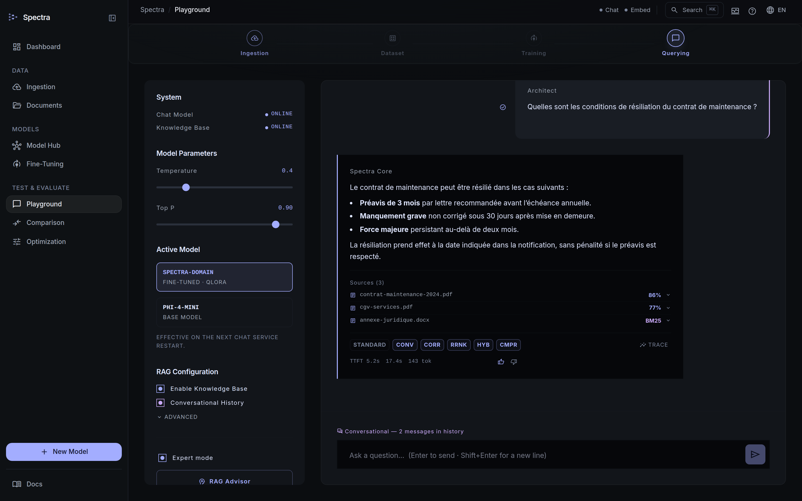
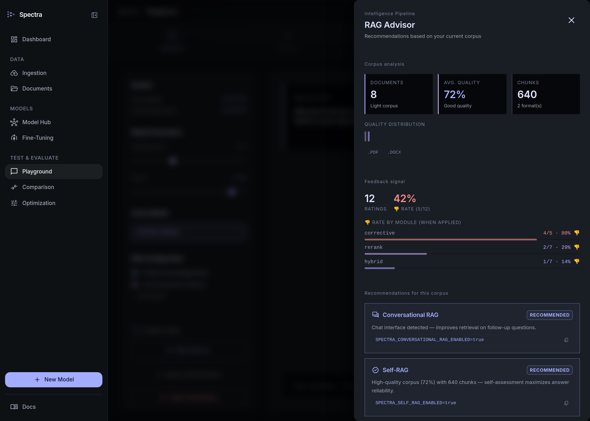
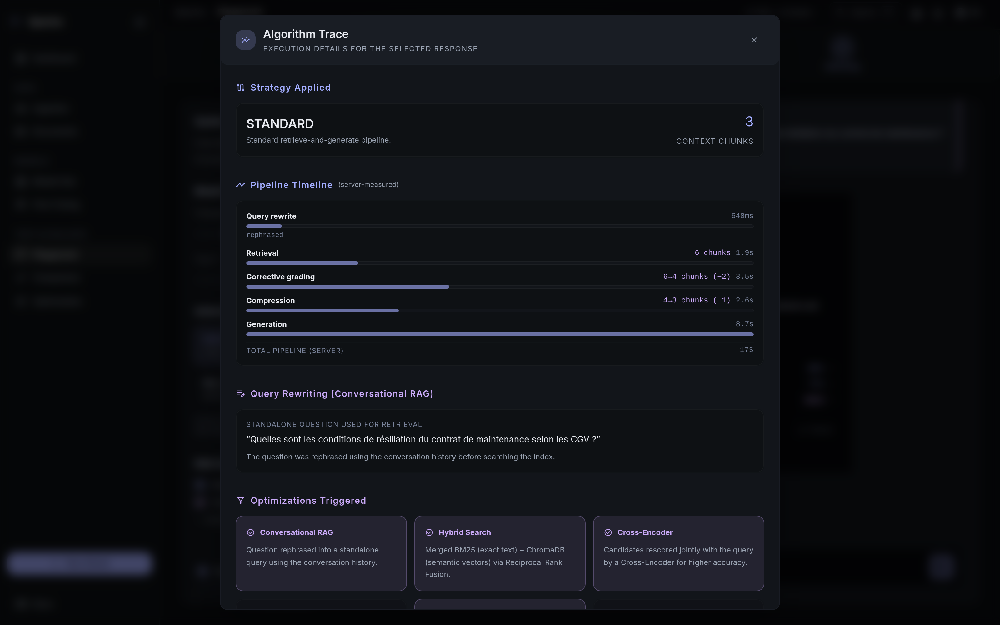

# Manuel Utilisateur : Spectra (Domain LLM Builder)

Spectra vous permet de créer votre propre assistant d'intelligence artificielle spécialisé dans **votre domaine métier**, à partir de vos propres documents. L'assistant fonctionne **entièrement en local** — aucune donnée ne quitte votre poste.

L'inférence LLM est assurée par [llama-cpp-turboquant](https://github.com/TheTom/llama-cpp-turboquant), un fork de llama.cpp optimisé pour la quantization. Les modèles sont au format **GGUF**, le standard de facto pour l'inférence locale.

---

## 1. Prérequis

Avant le premier lancement, vérifiez que vous avez installé :

- **Docker Desktop** (version 4.x ou plus récente) — démarré et opérationnel

Vous avez besoin de deux fichiers **GGUF** placés dans `data/models/` :

| Variable | Fichier par défaut | Rôle |
|----------|--------------------|------|
| `LLM_CHAT_MODEL_FILE` | `Phi-4-mini-reasoning-UD-IQ1_S.gguf` | Répond aux questions, génère le dataset |
| `LLM_EMBED_MODEL_FILE` | `embed.gguf` | Convertit le texte en vecteurs pour la recherche |

Si un fichier est absent au démarrage, le service `model-init` affiche les commandes de téléchargement exactes et interrompt la stack avant que les serveurs LLM ne démarrent.

### Télécharger les modèles

```bash
# Modèle de chat (~1.1 Go) — Phi-4-mini par défaut
huggingface-cli download unsloth/Phi-4-mini-reasoning-GGUF \
  Phi-4-mini-reasoning-UD-IQ1_S.gguf --local-dir data/models/

# Modèle d'embedding (~81 Mo) — nomic-embed-text par défaut
huggingface-cli download nomic-ai/nomic-embed-text-v1.5-GGUF \
  nomic-embed-text-v1.5.Q4_0.gguf \
  --local-dir data/models/ --filename embed.gguf
```

> **Pas de GPU requis** pour l'ingestion, le RAG et l'interrogation. Le fine-tuning avec poids LoRA réels est optionnel et nécessite Python + CUDA.

---

## 2. Démarrage

```bash
docker compose --project-directory . -f deploy/docker/docker-compose.yml up -d
```

Cette commande lance les services principaux en une fois :

| Service | Rôle |
|---------|------|
| `spectra-frontend` | Interface web (port **80**) |
| `spectra-api` | Backend API (port 8080) |
| `spectra-llama-chat` | Serveur d'inférence chat (llama.cpp, interne) |
| `spectra-llama-embed` | Serveur d'embeddings (llama.cpp, interne) |
| `spectra-chromadb` | Base de données vectorielle (interne) |
| `spectra-browserless` | Chrome headless pour le rendu des pages web dynamiques (interne) |
| `spectra-reranker` | Re-ranking Cross-Encoder (port **8002**, optionnel — voir §4 Interrogation) |
| `spectra-docparser` | Parsing PDF layout-aware (port **8003**, optionnel — voir §1 Ingestion) |

Les services `llama-chat` et `llama-embed` **ne sont pas accessibles depuis votre navigateur** — ils sont réservés à la communication interne entre `spectra-api` et les serveurs llama.cpp.

Au premier démarrage, les serveurs llama.cpp chargent leur modèle GGUF en mémoire, ce qui prend **30 à 60 secondes**. Attendez que `docker compose ps` affiche `(healthy)` pour tous les services avant d'ouvrir l'interface.

```bash
docker compose ps          # état de chaque conteneur
curl http://localhost:8080/api/status   # santé des services
```

La réponse du `/api/status` liste trois services :

| `name` | Ce qu'il surveille | Champ utile |
|--------|-------------------|-------------|
| `llama-cpp` | Serveur de chat | `details.activeModel`, `details.activeModelLoaded` |
| `llm-embed` | Serveur d'embedding | `details.activeModel`, `details.serverStatus` |
| `chromadb` | Base vectorielle | `available`, `version` |

Exemple de réponse résumée :
```json
{
  "services": [
    {"name": "llama-cpp",       "available": true,  "details": {"activeModel": "spectra-domain", "activeModelLoaded": true}},
    {"name": "llm-embed", "available": true,  "details": {"activeModel": "nomic-embed-text", "serverStatus": "ok"}},
    {"name": "chromadb",        "available": true}
  ]
}
```

---

## 3. Pipeline en 4 étapes

Voici le parcours complet pour créer votre assistant IA spécialisé :

```
[1. INGEST] ──→ [2. GENERATE] ──→ [3. FINE-TUNE] ──→ [4. QUERY]
 Vos documents    Paires Q/A        Modèle GGUF         Réponses RAG
                       │
                  (optionnel)
                  [2b. DPO]                [2c. COMMENTAIRES]
               Paires rejetées          Annotations manuelles ou IA
               → entraînement           Évaluation → paires DPO
                 par préférence         → fine-tuning par préférence
```

---

### Étape 1 — Ingestion des documents

**Objectif** : transformer vos documents (fichiers locaux ou pages web) en vecteurs stockés dans ChromaDB.

Spectra accepte deux types de sources : les **fichiers** uploadés depuis votre poste, et les **URLs** pointant vers des pages web ou des fichiers distants.

---

#### 1a — Ingestion de fichiers locaux

##### Via l'interface (recommandé)

1. Cliquez sur **Dataset Pipelines** dans le menu gauche.
2. Repérez l'indicateur de pipeline en haut : `[1 INGEST] ── [2 GENERATE] ── [3 READY]`.
3. Glissez vos fichiers dans la zone pointillée, ou cliquez sur **Browse Files**.
4. Chaque fichier apparaît dans le panneau **Live Ingestion Stream** avec son statut :
   - `UPLOADING` → envoi en cours
   - `PROCESSING` → extraction + vectorisation
   - `COMPLETED` + nombre de chunks créés → succès
   - `FAILED` + message d'erreur → problème à corriger

##### Via l'API

```bash
curl -X POST http://localhost:8080/api/ingest \
  -F "files=@manuel-technique.pdf" \
  -F "files=@lexique-metier.docx"
# → {"taskId": "abc-123", "status": "PENDING"}

# Suivre l'avancement
curl http://localhost:8080/api/ingest/abc-123
# → {"status": "COMPLETED", "chunksCreated": 42}
```

**Formats supportés :** PDF, DOCX (Word 2007+), DOC (Word 97-2003), HTML, Markdown (`.md`), CSV, JSON, XML, Avro, TXT — et archives ZIP les combinant. Table de référence : [technical-doc](../tech/technical-doc.fr.md#31-extraction).

> Les scans sans OCR (images sans texte sélectionnable) ne produiront pas de chunks utiles.

**Améliorer la qualité d'extraction PDF (tableaux, titres, hiérarchie) :**

Par défaut, les PDF sont traités avec une extraction textuelle simple. Pour les documents techniques avec tableaux ou titres hiérarchiques, activez le parsing layout-aware :

```bash
SPECTRA_LAYOUT_PARSER_ENABLED=true docker compose --project-directory . -f deploy/docker/docker-compose.yml up -d
```

Le service `spectra-docparser` démarre et convertit chaque PDF en Markdown structuré avant l'ingestion :
- Les titres deviennent `# Titre`, `## Sous-titre` (préservés dans les chunks)
- Les tableaux deviennent `| colonne A | colonne B |` (lisibles par le LLM)
- Les layouts multi-colonnes sont correctement linéarisés

Si le service de parsing est indisponible lors d'une ingestion, Spectra bascule automatiquement sur l'extraction PDFBox standard.

> **Option avancée :** pour une précision maximale sur les tableaux complexes, activez Docling (modèles IA IBM) : `USE_DOCLING=true SPECTRA_LAYOUT_PARSER_ENABLED=true docker compose up --build docparser`. L'image docparser grossit d'environ 500 Mo.

---

#### 1b — Ingestion depuis des URLs

Spectra peut ingérer directement des pages web ou des fichiers accessibles par HTTP/HTTPS — sans que vous ayez besoin de les télécharger manuellement.

**Deux situations sont gérées automatiquement :**

| Type de page | Traitement |
|---|---|
| **Page HTML statique** (pas de JavaScript requis) | Téléchargement HTTP direct + extraction jsoup |
| **Page HTML dynamique** (JavaScript, SPA, application web) | Rendu via `browserless/chrome` (Chrome headless) avant extraction |
| **Fichier PDF ou TXT distant** | Téléchargement direct, même pipeline que les fichiers locaux |

Spectra détecte le type de contenu via une requête `HEAD` avant de décider du traitement.

##### Via l'interface

Dans **Dataset Pipelines**, repérez la barre d'URL sous la zone de dépôt de fichiers. Collez l'URL et appuyez sur Entrée ou cliquez sur **Ingest URL**. La progression apparaît immédiatement dans le **Live Ingestion Stream**, comme pour un fichier.

##### Via l'API

```bash
# Ingérer une seule URL
curl -X POST http://localhost:8080/api/ingest/url \
  -H "Content-Type: application/json" \
  -d '{"urls": ["https://example.com/notice.pdf"]}'
# → {"taskId": "xyz-456", "status": "PENDING"}

# Ingérer plusieurs URLs en un seul appel (max 20)
curl -X POST http://localhost:8080/api/ingest/url \
  -H "Content-Type: application/json" \
  -d '{"urls": [
    "https://example.com/page-produit",
    "https://intranet/wiki/procedures",
    "https://example.com/doc.pdf"
  ]}'

# Suivi (même endpoint que les fichiers)
curl http://localhost:8080/api/ingest/xyz-456
# → {"status": "PROCESSING", "chunksCreated": 0}
# → {"status": "COMPLETED", "chunksCreated": 18}
```

> **Limite :** maximum 20 URLs par requête. Pour un volume plus important, effectuez plusieurs appels ou uploadez les fichiers téléchargés au préalable.

> **Pages protégées :** Spectra ne gère pas l'authentification (session, cookie, token). Pour les pages derrière un login, téléchargez manuellement le contenu et uploadez-le comme fichier.

> **Fallback browserless :** si le service `browserless` est arrêté ou inaccessible, Spectra tente quand même un téléchargement HTTP direct. Les pages nécessitant du JavaScript ne seront pas rendues correctement, mais les pages statiques fonctionneront.

---

#### Ce que fait Spectra pour chaque source

Qu'il s'agisse d'un fichier ou d'une URL, le traitement en coulisses est identique :

1. **Détection du type** : extension de fichier (fichiers) ou requête HEAD + content-type (URLs)
2. **Extraction du texte** : pdftotext (PDF), Apache POI (DOCX), jsoup (HTML), Jackson (JSON/XML)
3. **Nettoyage** : normalisation unicode, suppression en-têtes/pieds, harmonisation ponctuation
4. **Chunking** : découpage en segments de ~512 tokens avec chevauchement de 64 tokens
5. **Vectorisation** : calcul des embeddings par `nomic-embed-text` (llm-embed)
6. **Stockage** : indexation dans ChromaDB

> **Déduplication SHA-256 :** si le même fichier est soumis deux fois (même contenu, même hash), Spectra l'ignore silencieusement. Utilisez `?force=true` pour **remplacer** un document : les anciens chunks sont purgés des index (vecteur + BM25) avant la ré-indexation — pas de doublons dans les réponses, et la fiche GED s'incrémente d'une version. Les URLs suivent la même règle : le téléchargement a bien lieu à chaque soumission, mais un contenu inchangé (même hash) n'est pas ré-indexé.
>
> **Erreurs par fichier :** un fichier en échec (format non supporté, fichier trop volumineux, document corrompu) n'interrompt pas le lot — son erreur apparaît directement dans le **Live Ingestion Stream** : la ligne du fichier passe en avertissement « N chunks · partiel » avec le détail de l'erreur en dessous, un toast signale la fin de tâche partielle, et le panneau global des tâches (icône activité du header) affiche aussi ces échecs. Une tâche dont **tous** les fichiers échouent finit `FAILED` avec le détail, au lieu d'un faux succès à 0 chunk.

> **Changement de modèle d'embedding :** si vous remplacez `embed.gguf` par un autre modèle, vous devez ré-ingérer **tous** vos documents. Les vecteurs stockés dans ChromaDB sont propres à un modèle et ne sont pas interchangeables. Utilisez `?force=true` :
> ```bash
> curl -X POST "http://localhost:8080/api/ingest?force=true" -F "files=@fichier.pdf"
> ```

---

#### Étape 1c — Ingestion streaming depuis Kafka (optionnel, données vivantes)

**Objectif** : enrichir le RAG **en continu** à partir d'un flux Kafka, plutôt que par uploads ponctuels. Chaque message met l'index à jour en secondes, sans réentraîner le modèle — idéal pour des **données qui changent** (statuts, fiches, tickets).

**Principe.** La **clé** du message identifie la donnée : une nouvelle version pour la même clé **remplace** l'ancienne dans l'index (*upsert*). Un message à **valeur nulle** supprime la donnée. Les rejeux sont sans effet (idempotence).

**Démarrage** — le broker est fourni via un profil Docker optionnel (mono-nœud, pour tester) :

```bash
# Démarre la stack + un broker Kafka, avec le consumer activé sur le topic "commandes"
SPECTRA_KAFKA_ENABLED=true SPECTRA_KAFKA_TOPICS=commandes \
  docker compose --profile kafka up -d
```

Pour un **cluster existant**, ne lancez pas le profil : pointez simplement Spectra dessus.

```bash
SPECTRA_KAFKA_ENABLED=true
SPECTRA_KAFKA_BOOTSTRAP_SERVERS=broker1:9092,broker2:9092
SPECTRA_KAFKA_TOPICS=commandes,tickets
# Sécurité (si nécessaire) :
SPECTRA_KAFKA_SECURITY_PROTOCOL=SASL_SSL
SPECTRA_KAFKA_SASL_MECHANISM=SCRAM-SHA-512
SPECTRA_KAFKA_SASL_JAAS_CONFIG=org.apache.kafka.common.security.scram.ScramLoginModule required username="u" password="p";
```

**Publier un message de test** (depuis l'hôte, le broker du profil écoute sur `localhost:29092`) :

```bash
# clé = identité métier ; valeur = état courant (JSON par défaut)
echo '4271:{"statut":"clos","client":"ACME"}' | \
  docker exec -i spectra-kafka /opt/kafka/bin/kafka-console-producer.sh \
  --bootstrap-server localhost:9092 --topic commandes --property "parse.key=true" --property "key.separator=:"
```

Posez ensuite votre question habituelle dans le Playground : la réponse reflète l'état **courant** de la commande 4271.

**Options utiles**

| Variable | Effet |
|---|---|
| `SPECTRA_KAFKA_FORMAT` | Format du payload : `json` (défaut), `txt`, `xml`, `avro` |
| `SPECTRA_KAFKA_CONTENT_FIELD` | N'indexer qu'un champ JSON (ex. `body` ou `/data/text`) au lieu du message entier |
| `SPECTRA_KAFKA_METADATA_FIELDS` | Champs JSON recopiés en métadonnées (ex. `statut,auteur`) |
| `SPECTRA_KAFKA_COLLECTION` | Collection dédiée au flux (défaut `spectra_stream`, isolée du corpus statique) |
| `SPECTRA_KAFKA_RETENTION_TTL_DAYS` | Purge auto des données non mises à jour depuis N jours (0 = jamais) |

> **Suivi :** les compteurs `spectra.kafka.messages` et le timer `spectra.kafka.processing` sont exposés sur `http://localhost:8080/actuator/prometheus`. Les messages illisibles sont routés vers un topic `<topic>.DLT` sans bloquer le flux.

> **Astuce :** un message Kafka est souvent un petit événement structuré. Si un seul champ porte le texte utile, renseignez `SPECTRA_KAFKA_CONTENT_FIELD` pour éviter d'indexer les ids/timestamps techniques et garder une recherche pertinente.

---

### Étape 2 — Génération du dataset d'entraînement

**Objectif** : générer des paires question/réponse à partir de vos documents, pour entraîner le modèle.

#### Via l'interface

1. Toujours dans **Dataset Pipelines**, descendez à la section **Dataset Generation**.
2. Réglez le curseur **Max Chunks** :
   - Valeur `0` (ou `ALL`) = traite tous les documents (plusieurs heures sur CPU)
   - Valeur `5–20` = test rapide pour vérifier que le pipeline fonctionne (~10–30 min sur CPU)
3. Cliquez sur **Initialize Pipeline**.
4. La progression s'affiche en temps réel : nombre de chunks traités, paires générées.

#### Via l'API

```bash
# Lancer la génération (limité à 10 chunks pour un test)
curl -X POST "http://localhost:8080/api/dataset/generate?maxChunks=10"
# → {"taskId": "def-456", "status": "PENDING"}

# Suivre l'avancement (toutes les 30 secondes)
curl http://localhost:8080/api/dataset/generate/def-456
# → {"status": "PROCESSING", "chunksProcessed": 3, "totalChunks": 10, "pairsGenerated": 9}

# Statistiques finales
curl http://localhost:8080/api/dataset/stats
```

**Ce que génère Spectra pour chaque passage de document :**
- Une **paire Question / Réponse** vérifiée par un second appel LLM (auto-correction)
- Un **résumé technique** des points clés
- Une **classification** du contenu (procedures / evenements / nomenclatures / reglementation)
- Dans 30 % des cas, une **question "piège"** avec réponse honnête ("cette information n'est pas dans mes documents") — pour limiter les hallucinations

> **Durée estimée :** 30–120 secondes par chunk sur CPU (selon la taille du chunk et le modèle). Sur GPU, 5–10× plus rapide.
> Conseil : testez d'abord avec `maxChunks=5` avant de lancer sur l'ensemble.

---

### Étape 2b — Génération DPO (optionnel — alignement par préférence)

**Objectif** : générer des paires (réponse correcte / réponse erronée) pour affiner le modèle par alignement DPO plutôt que par SFT classique.

L'alignement DPO enseigne explicitement au modèle à rejeter les hallucinations courantes de votre domaine, en lui présentant des exemples de ce qu'il ne doit pas répondre.

#### Via l'API

```bash
# Générer des paires DPO (maxPairs=0 = toutes les paires SFT disponibles)
curl -X POST "http://localhost:8080/api/dataset/dpo/generate?maxPairs=50"
# → {"taskId": "dpo-123", "status": "PENDING"}

# Suivi
curl http://localhost:8080/api/dataset/dpo/generate/dpo-123
# → {"status": "COMPLETED", "pairsGenerated": 47}

# Statistiques du dataset DPO
curl http://localhost:8080/api/dataset/dpo/stats
```

> Lancez la génération DPO **après** la génération SFT (étape 2). Elle se base sur les paires déjà générées pour créer les réponses rejetées.

---

### Étape 2c — Commentaires d'articles (optionnel — boucle de rétroaction RAG + DPO)

**Objectif** : annoter chaque document ingéré avec des commentaires analytiques, générés par l'IA via RAG ou rédigés manuellement, puis exporter les évaluations comme paires DPO pour le prochain cycle de fine-tuning.

Cette étape crée une **boucle de rétroaction humaine** : vous lisez les commentaires générés, vous approuvez ceux qui sont pertinents, vous rejetez ceux qui ne le sont pas — et ces préférences deviennent des données d'entraînement.

#### La fiche document (cycle de vie, tags, versions)

Chaque document ingéré possède une fiche GED : hash SHA-256, format, score de qualité
(0–1), version (incrémentée à chaque ré-ingestion `force`), tags libres, collection,
date d'ingestion et — pour les documents archivés — la **date d'archivage** (`archivedAt`,
base de la purge de rétention).

Le **cycle de vie** progresse ainsi : `INGESTED` (à l'ingestion, ou automatiquement
`QUALIFIED` si le score dépasse `SPECTRA_GED_AUTO_QUALIFY_THRESHOLD`) → `QUALIFIED`
(validé pour l'entraînement) → `TRAINED` → `ARCHIVED`. Deux automatismes :

- **Fin de fine-tuning** : les documents dont des paires du dataset sont issues passent
  automatiquement en `TRAINED`, avec un lien `TRAINED_ON` vers le modèle entraîné —
  visible dans la fiche et via `GET /api/ged/models/{modelName}/documents`.
- **Rétention** : selon la configuration, les documents `INGESTED` anciens sont archivés
  chaque nuit, et les `ARCHIVED` purgés N jours après leur archivage (fiche **et** chunks
  indexés — le document disparaît des réponses du RAG).

Chaque action (transition, tag, ré-ingestion, suppression…) est tracée dans l'**audit
trail** consultable au bas de la fiche.

#### Via l'interface

1. Cliquez sur **Database** dans le menu gauche (page GED Documents).
2. Cliquez sur un document dans la liste pour ouvrir la fiche.
3. Dans la fiche, faites défiler jusqu'à la section **Commentaires**.
4. Trois onglets sont disponibles :

   - **Liste** — affiche tous les commentaires existants (humains et IA).
   - **+ Manuel** — zone de texte pour ajouter votre propre annotation.
   - **✦ IA** — génération automatique via RAG.

#### Générer un commentaire IA

1. Cliquez sur l'onglet **✦ IA**.
2. (Optionnel) Saisissez un angle d'analyse dans le champ, par exemple :
   - `procédures d'urgence et contacts`
   - `points réglementaires à surveiller`
   - Laissez vide pour un résumé général du document.
3. Cliquez sur **✦ Générer via RAG**.
4. Spectra récupère automatiquement les 6 passages les plus pertinents du document (via ChromaDB), puis le LLM rédige un commentaire analytique ancré dans ce contenu.
5. Le commentaire apparaît dans l'onglet **Liste** avec le badge `✦ IA`.

#### Évaluer les commentaires IA

Sous chaque commentaire IA, trois boutons d'évaluation sont visibles :

| Bouton | Signification | Effet |
|---|---|---|
| 👍 | APPROVED | Ce commentaire est bon — il deviendra un exemple positif (chosen) dans le dataset DPO |
| 👎 | REJECTED | Ce commentaire est mauvais — il deviendra un exemple négatif (rejected) dans le dataset DPO |
| — | NONE | Pas d'évaluation (défaut) |

> **Conseil** : évaluez au moins 10–20 commentaires avant d'exporter. La qualité du fine-tuning DPO dépend directement de la quantité et de la cohérence des évaluations.

#### Re-entraînement automatique (auto-trigger)

Spectra peut lancer un job de fine-tuning **automatiquement** chaque fois qu'un seuil d'approbations est atteint. Ce mécanisme est piloté par la variable `SPECTRA_GED_AUTO_RETRAIN_THRESHOLD` (défaut : **5**).

**Comment ça fonctionne, pas à pas :**

```
[1] Vous approuvez un commentaire IA (👍 APPROVED)
          ↓
[2] Spectra compte les commentaires IA approuvés depuis le début
    approvedCount = 5  →  5 % 5 == 0  ✓ seuil atteint
          ↓ (en arrière-plan, sans bloquer l'interface)
[3] Export automatique des paires DPO → data/dataset/comments_dpo.jsonl
          ↓
[4] Soumission automatique d'un job de fine-tuning
    nom du job : auto-dpo-1718200000000  (timestamp)
          ↓
[5] Job visible dans Fine-Tuning → Training History
    statut : QUEUED → EXPORT → TRAINING → IMPORT → COMPLETE
```

**Visualiser la progression vers le prochain trigger :**

Dans le **Dashboard**, la section "Cycle de Personnalisation" affiche :
- Le nombre de commentaires approuvés
- La barre de progression vers le prochain seuil
- Le nombre de fine-tunings déjà déclenchés automatiquement

```bash
# État détaillé via l'API
curl http://localhost:8080/api/metrics/personalization
# → {"approvedComments": 7, "nextTriggerIn": 3, "autoRetrainThreshold": 5,
#    "completedCycles": 1, "completedFineTuningJobs": 1, "latestEvalScore": 7.4, ...}
```

**Ajuster le seuil :**

```bash
# Déclencher tous les 20 approbations (recommandé en production)
SPECTRA_GED_AUTO_RETRAIN_THRESHOLD=20 docker compose --project-directory . -f deploy/docker/docker-compose.yml up -d

# Désactiver l'auto-trigger
SPECTRA_GED_AUTO_RETRAIN_THRESHOLD=0 docker compose --project-directory . -f deploy/docker/docker-compose.yml up -d
```

> **Conseil :** en développement, gardez le seuil à 5 pour tester le mécanisme rapidement. En production, utilisez 20–50 pour éviter de lancer un entraînement à chaque poignée d'évaluations.

> **Garde de qualité sur les paires DPO :** avant d'accepter une paire `(réponse choisie, réponse rejetée)`, Spectra vérifie que les deux textes sont suffisamment différents. Si leur similarité Jaccard dépasse 85 %, la paire est ignorée et un avertissement est affiché dans les logs — une paire trop similaire ne contribue pas à l'apprentissage.

#### Exporter les paires DPO manuellement

Une fois vos évaluations saisies, cliquez sur le bouton **DPO↓** (en haut de la section Commentaires).

Une notification confirme le nombre de paires exportées. Le fichier `data/dataset/comments_dpo.jsonl` est créé ou mis à jour.

> Si un commentaire approuvé n'a pas de version rejetée pour le même focus, Spectra génère automatiquement une version erronée synthétique via le LLM pour compléter la paire.

#### Via l'API

```bash
# Ajouter un commentaire humain
curl -X POST http://localhost:8080/api/ged/documents/{sha256}/comments \
  -H 'Content-Type: application/json' \
  -d '{"content": "Ce document couvre la procédure R23 du protocole opérationnel.", "generate": false}'

# Générer un commentaire IA (le champ "content" est le focus de retrieval)
curl -X POST http://localhost:8080/api/ged/documents/{sha256}/comments \
  -H 'Content-Type: application/json' \
  -d '{"content": "sécurité et contacts d'\''urgence", "generate": true}'
# → {"id": 42, "type": "AI_GENERATED", "content": "...", "rating": "NONE", ...}

# Approuver le commentaire
curl -X PATCH "http://localhost:8080/api/ged/documents/{sha256}/comments/42/rating?rating=APPROVED"

# Rejeter un autre commentaire
curl -X PATCH "http://localhost:8080/api/ged/documents/{sha256}/comments/43/rating?rating=REJECTED"

# Exporter les paires DPO
curl -X POST http://localhost:8080/api/ged/documents/export/comments-dpo
# → {"pairs": 8, "file": "./data/dataset/comments_dpo.jsonl", "exportedAt": "..."}
```

#### Utiliser les paires DPO dans le fine-tuning

Le fichier `comments_dpo.jsonl` est au même format que `dpo_pairs.jsonl`. Pour les combiner avant l'entraînement :

```bash
cat data/dataset/dpo_pairs.jsonl data/dataset/comments_dpo.jsonl > data/dataset/all_dpo.jsonl
```

Puis, lors du lancement du fine-tuning (étape 3), cochez **Alignement DPO** pour que l'entraîneur utilise ces paires.

---

### Étape 3 — Fine-Tuning (création du modèle spécialisé)

**Objectif** : affiner les poids du modèle sur votre dataset pour qu'il maîtrise votre domaine.

#### Via l'interface (recommandé)

1. Cliquez sur **Fine-Tuning Command** dans le menu gauche.
2. Cliquez sur **New Training Job** (bouton en haut à droite).
3. (Optionnel) Sélectionnez une **recette prédéfinie** en haut du formulaire :
   - **CPU Rapide** : TinyLlama, LoRA rank 8, 1 époque, multipacking activé — idéal pour un premier test
   - **GPU Qualité** : Phi-4-mini, LoRA rank 64, 3 époques — pour un modèle de production
   - **DPO Alignement** : alignement DPO, rank 32, 2 époques — pour réduire les hallucinations
   - **ORPO Alignement** : alignement ORPO (SFT + préférence en une passe, sans modèle de référence) — alternative plus simple/légère au DPO
4. Remplissez (ou ajustez) le formulaire :
   - **Model Name** : nom du modèle à créer dans le registre local (ex. `spectra-domain`)
   - **Base Model** : modèle de base (ex. `phi3`, `mistral`)
   - **Epochs** : nombre de passes d'entraînement (3 par défaut)
   - **LoRA Rank** : précision du fine-tuning (64 = bon équilibre qualité/vitesse)
   - **Min Confidence** : seuil de qualité des paires utilisées (0.8 par défaut)
   - **Multipacking** : cochez pour concaténer les exemples courts — accélère l'entraînement de 20–30 %
   - **Alignement DPO** : cochez si vous avez généré des paires DPO (étape 2b) — entraîne par préférence plutôt que par SFT
   - **Alignement ORPO** : alternative au DPO en une seule passe, sans modèle de référence (mêmes paires de préférence). DPO et ORPO sont exclusifs ; ORPO a priorité si les deux sont cochés.
5. Cliquez sur **Launch Training**.
6. Suivez la progression via la **barre d'étapes** :

```
[QUEUED] ──→ [EXPORT] ──→ [TRAINING] ──→ [IMPORT] ──→ [COMPLETE]
```

7. (Optionnel) Cliquez sur **Exporter** pour sauvegarder la configuration courante en fichier YAML réutilisable.

#### Via l'API

```bash
# SFT classique
curl -X POST http://localhost:8080/api/fine-tuning \
  -H "Content-Type: application/json" \
  -d '{"modelName": "spectra-domain", "baseModel": "phi3", "epochs": 3}'

# Avec multipacking (plus rapide sur CPU/GPU)
curl -X POST http://localhost:8080/api/fine-tuning \
  -H "Content-Type: application/json" \
  -d '{"modelName": "spectra-domain", "baseModel": "phi3", "epochs": 3, "packingEnabled": true}'

# Avec DPO (requiert génération DPO préalable)
curl -X POST http://localhost:8080/api/fine-tuning \
  -H "Content-Type: application/json" \
  -d '{"modelName": "spectra-aligned", "baseModel": "phi3", "dpoEnabled": true}'

# Avec ORPO (mêmes paires de préférence ; une passe, sans modèle de référence)
curl -X POST http://localhost:8080/api/fine-tuning \
  -H "Content-Type: application/json" \
  -d '{"modelName": "spectra-orpo", "baseModel": "phi3", "orpoEnabled": true}'

# Suivi
curl http://localhost:8080/api/fine-tuning/ghi-789
# → {"status": "COMPLETED", "modelName": "spectra-domain", ...}
```

#### Recettes YAML

Pour réutiliser une configuration ou la partager :

```bash
# Lister les recettes disponibles
curl http://localhost:8080/api/fine-tuning/recipes

# Charger une recette (valeurs à injecter dans le formulaire)
curl http://localhost:8080/api/fine-tuning/recipes/cpu-rapide

# Exporter la configuration courante
curl -X POST http://localhost:8080/api/fine-tuning/recipe/export \
  -H "Content-Type: application/json" \
  -d '{"modelName": "mon-modele", "baseModel": "phi3", "epochs": 2, "loraRank": 16, "packingEnabled": true}' \
  -o ma-recette.yml
```

#### Réglages avancés (CLI `pipeline.sh` / variables d'environnement)

Le pipeline hors-API expose des leviers supplémentaires via variables d'environnement :

```bash
# Cibler aussi les couches MLP (plus de capacité), NEFTune, warm-up en ratio, split validation
LORA_TARGET=all NEFTUNE_ALPHA=5 WARMUP_RATIO=0.05 VAL_SPLIT=0.1 \
  EPOCHS=3 LORA_RANK=32 LORA_ALPHA=64 \
  ./pipeline.sh data/documents phi3 mon-modele

# Alignement ORPO (alternative à --dpo)
./pipeline.sh data/documents phi3 mon-modele-orpo --orpo
```

| Levier | Effet | Défaut |
|---|---|---|
| `LORA_TARGET` | `attention` ou `all` (ajoute les projections MLP) | `attention` |
| `NEFTUNE_ALPHA` | bruit NEFTune sur les embeddings (0 = off, 5 courant) | `0` |
| `WARMUP_RATIO` | fraction d'étapes en warm-up | `0.03` |
| `VAL_SPLIT` | fraction tenue à l'écart pour l'`eval_loss` | `0` |

**Config serveur** (`application.yml`) :
- `spectra.dataset.refusal-every-n` — fréquence des exemples de refus « je ne sais pas » (anti-hallucination).
- `spectra.fine-tuning.sft-excluded-categories` — catégories/types exclus du SFT (faits volatils laissés au RAG, ex. `evenements,nomenclatures`).

#### Mesurer la qualité (exactitude + hallucination)

Évaluez sur le **jeu de référence tenu à l'écart** (jamais entraîné), et comparez base vs fine-tuné :

```bash
# Benchmark qualité du modèle actif (ou ?model=<nom>)
curl -X POST "http://localhost:8080/api/quality-benchmark"
# → { "avgScore": 8.1, "hallucinationRate": 0.05, "refusalAccuracy": 0.95, ... }

# Comparer deux modèles (avant/après fine-tuning)
curl -X POST "http://localhost:8080/api/quality-benchmark/compare?baseline=phi3&candidate=spectra-domain"
```

#### Mesurer le gain de chaque enrichissement (ablation A/B)

`/api/quality-benchmark` évalue le **modèle brut**. Pour mesurer ce qu'apportent les
enrichissements *de bout en bout* — RAG **et** fine-tuning — utilisez l'**ablation**
(`/api/ablation`) : chaque question du benchmark passe dans le **pipeline RAG complet**, et l'on
compare plusieurs configurations (**bras**) sur le même jeu tenu à l'écart. Trois familles de
métriques par bras :

- **Génération** : `avgScore` (exactitude LLM-juge /10), `hallucinationRate`, `refusalAccuracy`.
- **Retrieval** (déterministe, sans LLM) : `hitRate` (Hit@k), `mrr`, `recallAtK`.
- **Coût** : `avgLatencyMs`, `p50LatencyMs`.

Règle d'or : **un seul changement par bras**, pour lire le gain marginal (delta) de chaque enrichissement.

> **Écran dédié** : tout cela est piloté sans `curl` depuis la page **Optimisation** de l'interface
> (presets « Gain du RAG », « Ablation cumulative », « Leave-one-out », « Gain du fine-tuning »),
> avec tableau de deltas couleur, validation des modules réellement déclenchés et légende pédagogique.

```bash
# Matrice par défaut : LLM seul (sans RAG) vs RAG, sur le modèle actif → gain brut du RAG
curl -X POST "http://localhost:8080/api/ablation"

# Matrice explicite : isoler le gain du RAG puis celui du fine-tuning
curl -X POST "http://localhost:8080/api/ablation" -H "Content-Type: application/json" -d '{
  "maxContextChunks": 5,
  "arms": [
    {"label": "base sans rag",  "model": "phi3",           "useRag": false},
    {"label": "base + rag",     "model": "phi3",           "useRag": true},
    {"label": "fine-tuné + rag","model": "spectra-domain", "useRag": true}
  ]
}'
# → arms[].quality.avgScore, arms[].retrieval.hitRate, arms[].p50LatencyMs …
```

**Ablation module par module.** Chaque bras peut surcharger les modules d'optimisation RAG via
`overrides` (tri-état : `true` force actif *si disponible*, `false` force inactif, absent = défaut de
déploiement). On mesure ainsi l'apport marginal de chaque option (rerank, hybride, multi-query,
corrective, compression, self-RAG, adaptive, conversational) en n'en changeant qu'une à la fois :

```bash
# Ablation cumulative : RAG nu, puis +hybride, puis +rerank…
curl -X POST "http://localhost:8080/api/ablation" -H "Content-Type: application/json" -d '{
  "arms": [
    {"label": "rag nu",      "useRag": true, "overrides": {"hybrid": false, "rerank": false, "multiQuery": false, "corrective": false, "compression": false, "selfRag": false}},
    {"label": "+ hybride",   "useRag": true, "overrides": {"hybrid": true,  "rerank": false, "multiQuery": false, "corrective": false, "compression": false, "selfRag": false}},
    {"label": "+ rerank",    "useRag": true, "overrides": {"hybrid": true,  "rerank": true,  "multiQuery": false, "corrective": false, "compression": false, "selfRag": false}}
  ]
}'
# Chaque bras renvoie aussi appliedCounts (nb de requêtes où chaque module a réellement agi).
```

**Fiabiliser les deltas (`runs`).** Sur un petit benchmark, un écart de +0.3/10 peut être du bruit.
Passez `"runs": 3` (1–10) pour répéter chaque bras : les champs scalaires deviennent des **moyennes**,
`stdDev` donne l'**écart-type** par métrique, et l'écran grise les deltas **non significatifs** (≤ σ combiné).
Chaque bras renvoie aussi `avgContextTokens` — un **coût en tokens déterministe** (contrairement à la
latence, bruitée sur matériel partagé) à mettre en regard du gain de qualité.

> **Métriques de retrieval** : `hitRate`/`mrr`/`recallAtK` ne sont calculées que pour les questions
> du benchmark annotées d'un champ `expectedSources` — la liste des fichiers sources attendus (un
> match = `sourceFile` contient le libellé, insensible à la casse). Le benchmark fourni
> `highway_benchmark.jsonl` est **déjà annoté** et aligné sur le corpus `examples/highway/` : ingérez
> ce corpus (cf. `examples/README.md`) pour activer ces métriques sans configuration. Exemple
> de ligne JSONL :
>
> ```json
> {"question": "...", "reference": "...", "category": "procedures", "answerable": true, "expectedSources": ["guide_securite", "procedure_intervention.pdf"]}
> ```
>
> Sans annotation, seules les métriques de génération et de latence sont remontées (`evaluatedQuestions = 0`).

#### Servir l'adaptateur à chaud (sans fusion)

Au lieu de fusionner+quantifier (`export_gguf.py`), exportez l'adaptateur seul et chargez-le par-dessus le modèle de base :

```bash
python scripts/export_lora_gguf.py --adapter data/fine-tuning/adapter \
  --output data/fine-tuning/adapter-lora.gguf --base-model phi3

# Au lancement de llama-server (cf. scripts/llama-autostart.sh)
LLAMA_LORA=data/fine-tuning/adapter-lora.gguf LLAMA_LORA_SCALE=1.0 ...
```

Avantage : pas de duplication du modèle de base, et permutation d'adaptateurs à chaud via l'endpoint `/lora-adapters` (scale 0→1) sans redémarrage.

**Ce que fait Spectra selon votre configuration matérielle :**

| Matériel | Mode | Résultat |
|----------|------|---------|
| Sans GPU (Docker seul) | Simulation + system-prompt | Profil logique enregistré dans le registre local |
| CPU + Python installé | HuggingFace PEFT | Adaptateur LoRA CPU (lent mais réel) |
| GPU NVIDIA + Python | Unsloth QLoRA 4-bit | Adaptateur GGUF haute qualité dans `data/fine-tuning/merged/model.gguf` |

Après le fine-tuning, le modèle est automatiquement enregistré dans `data/models/registry.json`. Dès que vous l'**activez** (Playground ou `POST /api/config/model`), le superviseur de `llm-chat` détecte le changement via le pointeur `data/models/active-chat-model` et recharge `llama-server` automatiquement en quelques secondes — aucun redémarrage manuel n'est nécessaire.

---

### Étape 4 — Interrogation avec RAG

**Objectif** : poser des questions à votre assistant spécialisé.

#### Via l'interface Playground

1. Cliquez sur **Playground** dans le menu gauche.
2. Dans le panneau gauche, ajustez les paramètres :
   - **Temperature** (0–2) : plus bas = réponses plus déterministes, plus haut = plus créatif
   - **Top P** (0–1) : diversité du vocabulaire
   - **Enable Knowledge Base** : active/désactive le RAG (recherche dans vos documents)
3. Tapez votre question dans la zone de saisie et appuyez sur Entrée.

#### Via l'API

```bash
curl -X POST http://localhost:8080/api/query \
  -H "Content-Type: application/json; charset=utf-8" \
  --data-binary '{"question": "Quelle est la procédure décrite dans le document X ?", "maxContextChunks": 2}'
```

Réponse :
```json
{
  "answer": "Selon le document, la procédure consiste à...",
  "sources": [
    {"text": "extrait du document source...", "sourceFile": "manuel.pdf", "distance": 0.42, "rerankScore": 0.91}
  ],
  "durationMs": 28500,
  "rerankApplied": false
}
```

> **Paramètre `maxContextChunks`** : contrôle le nombre d'extraits injectés dans le contexte du LLM. Valeur par défaut : 5. Si vous obtenez une erreur de contexte dépassé, réduisez à 2 ou 3. Le modèle fine-tuné standard a un contexte maximal de **2048 tokens**, ce qui limite le nombre de chunks utilisables par requête.

> **Paramètre `topCandidates`** : utilisé uniquement si le re-ranking est activé. Contrôle combien de candidats sont récupérés dans ChromaDB avant que le Cross-Encoder les re-classe pour ne garder que `maxContextChunks`. Valeur par défaut : 20. Plus cette valeur est haute, plus le filet est large, mais le service de re-ranking prend un peu plus de temps.

**Ce que fait le RAG :**
1. *(Si Long-Context RAG activé)* Si le corpus est petit (≤ seuil configuré), tous les chunks sont chargés directement — les étapes 2 à 5 sont ignorées
2. *(Si Multi-Query activé)* N variantes de la question sont générées, le retrieval est exécuté pour chacune, et les résultats sont fusionnés en éliminant les doublons exacts
3. Votre question est convertie en vecteur par `nomic-embed-text` (llm-embed)
4. Les `topCandidates` extraits les plus proches sémantiquement sont récupérés dans ChromaDB
5. *(Si recherche hybride activée)* Une recherche BM25 parallèle récupère les extraits correspondant le mieux aux mots-clés exacts de la question ; les deux listes sont fusionnées via RRF
6. *(Si re-ranking activé)* Un modèle Cross-Encoder évalue chaque paire `(question, extrait)` et re-classe les candidats par pertinence réelle — les N meilleurs sont conservés
7. *(Si déduplication sémantique activée)* Les extraits quasi-identiques sont supprimés (similarité Jaccard sur les mots) — sans appel API supplémentaire
8. *(Si Corrective RAG activé)* Un LLM évalue la pertinence de chaque chunk ; les chunks jugés IRRELEVANT sont éliminés
9. *(Si Context Compression activé)* Pour chaque chunk conservé, seules les phrases directement utiles à la question sont extraites — le contexte est plus dense, moins bruité
10. *(Si Agentic RAG activé)* Le LLM analyse le contexte disponible ; s'il juge l'information insuffisante, il formule une requête de recherche complémentaire (jusqu'à 3 tours par défaut) avant de répondre
11. Les extraits pertinents sont injectés dans le prompt comme "contexte"
12. Le modèle spécialisé formule une réponse précise et sourcée (llm-chat)

**Activer la recherche hybride (BM25 + vecteurs) :**

La recherche hybride récupère les termes techniques exacts (codes, numéros, acronymes) que l'embedding peut diluer. Aucun service supplémentaire n'est requis — l'index BM25 est en mémoire.

```bash
SPECTRA_HYBRID_SEARCH_ENABLED=true docker compose --project-directory . -f deploy/docker/docker-compose.yml up -d
```

Au démarrage, Spectra reconstruit automatiquement l'index BM25 depuis ChromaDB en arrière-plan. Les premières requêtes peuvent être vectorielles seules si l'index n'est pas encore prêt.

**Activer le re-ranking :**

Le re-ranking améliore significativement la précision des sources retournées, au prix d'une légère latence supplémentaire (~100–300 ms sur CPU). Il est désactivé par défaut.

```bash
SPECTRA_RERANKER_ENABLED=true docker compose --project-directory . -f deploy/docker/docker-compose.yml up -d

# Changer de modèle (multilingue, meilleur pour le français)
RERANKER_MODEL=cross-encoder/mmarco-mMiniLMv2-L12-H384-v1 SPECTRA_RERANKER_ENABLED=true docker compose --project-directory . -f deploy/docker/docker-compose.yml up -d
```

**Activer les deux (meilleure précision) :**

```bash
SPECTRA_HYBRID_SEARCH_ENABLED=true SPECTRA_RERANKER_ENABLED=true docker compose --project-directory . -f deploy/docker/docker-compose.yml up -d
```

Pipeline complet : `BM25 + Vecteurs → RRF → Cross-Encoder → LLM`

**Activer l'Agentic RAG (raisonnement multi-étapes) :**

Quand le contexte initial est insuffisant pour répondre avec certitude, le LLM peut formuler de nouvelles requêtes de recherche et enrichir son contexte avant de répondre. Cette boucle ReAct peut effectuer jusqu'à 3 tours de recherche par défaut.

> **Prérequis :** votre modèle doit avoir une fenêtre de contexte ≥ 4096 tokens. L'Agentic RAG consomme plusieurs appels LLM par requête — comptez 2–4× plus de temps qu'une requête RAG standard.

```bash
SPECTRA_AGENTIC_RAG_ENABLED=true docker compose --project-directory . -f deploy/docker/docker-compose.yml up -d

# Augmenter le nombre de tours si les questions sont très complexes
SPECTRA_AGENTIC_RAG_ENABLED=true SPECTRA_AGENTIC_MAX_ITERATIONS=5 docker compose --project-directory . -f deploy/docker/docker-compose.yml up -d

# Combinaison optimale (recherche hybride + re-ranking + raisonnement agentique)
SPECTRA_HYBRID_SEARCH_ENABLED=true SPECTRA_RERANKER_ENABLED=true SPECTRA_AGENTIC_RAG_ENABLED=true docker compose --project-directory . -f deploy/docker/docker-compose.yml up -d
```

Pipeline complet : `BM25 + Vecteurs → RRF → Cross-Encoder → boucle ReAct → LLM`

**Activer le Multi-Query RAG (meilleur rappel) :**

Génère N variantes de la question avant le retrieval pour couvrir les synonymes et formulations alternatives.

```bash
SPECTRA_MULTI_QUERY_ENABLED=true docker compose --project-directory . -f deploy/docker/docker-compose.yml up -d

# Augmenter le nombre de variantes pour un vocabulaire très hétérogène
SPECTRA_MULTI_QUERY_ENABLED=true SPECTRA_MULTI_QUERY_COUNT=3 docker compose --project-directory . -f deploy/docker/docker-compose.yml up -d
```

> **Latence :** ajoute 1 appel LLM + N appels d'embedding par requête. Avec `MULTI_QUERY_COUNT=2` et un modèle rapide, comptez +500–800 ms.

**Activer la déduplication sémantique :**

Supprime les chunks quasi-identiques après reranking. Aucun service supplémentaire — pur Java.

```bash
SPECTRA_SEMANTIC_DEDUP_ENABLED=true docker compose --project-directory . -f deploy/docker/docker-compose.yml up -d

# Seuil plus strict (0.70) pour corpus très redondants
SPECTRA_SEMANTIC_DEDUP_ENABLED=true SPECTRA_SEMANTIC_DEDUP_THRESHOLD=0.70 docker compose --project-directory . -f deploy/docker/docker-compose.yml up -d
```

**Activer la compression de contexte :**

Extrait uniquement les phrases pertinentes dans chaque chunk avant la génération. Réduit le bruit, améliore la précision.

```bash
SPECTRA_CONTEXT_COMPRESSION_ENABLED=true docker compose --project-directory . -f deploy/docker/docker-compose.yml up -d
```

> **Latence :** ajoute 1 appel LLM par chunk récupéré. Avec 5 chunks, comptez +2–5 s supplémentaires.

**Activer le Long-Context RAG bypass (petits corpus) :**

Si votre corpus tient entièrement dans la fenêtre du modèle, charge tous les documents directement sans recherche vectorielle.

```bash
SPECTRA_LONG_CONTEXT_RAG_ENABLED=true docker compose --project-directory . -f deploy/docker/docker-compose.yml up -d

# Ajuster le seuil (défaut : 100 chunks ≈ 25 documents de taille moyenne)
SPECTRA_LONG_CONTEXT_RAG_ENABLED=true SPECTRA_LONG_CONTEXT_MAX_CHUNKS=50 docker compose --project-directory . -f deploy/docker/docker-compose.yml up -d
```

Une fois activés, les champs `hybridSearchApplied`, `rerankApplied`, `agenticApplied`, `agenticIterations`, `multiQueryApplied`, `compressionApplied`, `semanticDedupApplied` et `longContextApplied` apparaissent dans les réponses API.

> **Délai de réponse :** sur CPU, comptez 20–60 secondes selon la longueur de la réponse. Sur GPU, 2–5 secondes.

---

## 4. Guide de l'Interface

### Dashboard

Le tableau de bord affiche en temps réel trois cartes de santé et le cycle de personnalisation.

**Cartes de santé des services :**

| Carte | Service surveillé | Information affichée |
|-------|------------------|---------------------|
| **Chat** | `llm-chat` | Online/Offline · nom du modèle actif |
| **Embed** | `llm-embed` | Online/Offline · nom du modèle d'embedding |
| **ChromaDB** | `chromadb` | Online/Offline · nombre de chunks indexés |

En dessous : statistiques de la base de connaissances (chunks, paires d'entraînement, score de confiance moyen, nombre de catégories).

**Section "Cycle de Personnalisation" :**

Cette section affiche l'état de la boucle de rétroaction humaine en 4 indicateurs :

| Indicateur | Signification |
|------------|--------------|
| **Approuvés** | Nombre total de commentaires IA approuvés depuis le démarrage |
| **Paires DPO** | Nombre de paires d'entraînement dans le dataset courant |
| **Fine-Tunings** | Nombre de jobs terminés (automatiques + manuels) |
| **Score Éval** | Score moyen de la dernière évaluation LLM-as-Judge (sur 10) |

Une **barre de progression** montre l'avancement vers le prochain déclencheur automatique.

**Exemple de lecture :**
```
Approuvés : 7/10       ██████████░░░░░░  70 %  →  3 approbations avant prochain entraînement
Paires DPO : 42
Fine-Tunings terminés : 1
Score Éval : 7.4/10
```

> Si l'indicateur affiche `–` pour le score, aucune évaluation n'a encore été lancée. Utilisez **Model Comparison → New Evaluation** pour obtenir une mesure de référence.

### Dataset Pipelines (Étapes 1 et 2)

L'indicateur de pipeline en haut à droite montre la progression globale :
- Cercle **gris** = étape non commencée
- Cercle **animé bleu** = étape en cours
- Cercle **vert** = étape terminée

**Section "Document Ingestion" :**
- **Zone de dépôt** (fichiers) : glisser-déposer ou clic pour sélectionner
- **Barre URL** (sous la zone de dépôt) : collez une URL et appuyez sur Entrée ou cliquez **Ingest URL** — les pages HTML dynamiques sont automatiquement rendues via Chrome headless
- **Live Ingestion Stream** : suivi de chaque source (fichier ou URL) avec son statut, mis à jour toutes les 3 secondes
- **History** : cliquez sur le bouton "History" (en haut du panneau de suivi) pour voir l'historique de tous les documents ingérés depuis le démarrage

### Fine-Tuning Command (Étape 3)

- **Sélecteur de recettes** (en haut du formulaire) : 3 boutons preset (CPU Rapide · GPU Qualité · DPO Alignement). Cliquer sur un preset pré-remplit tous les champs techniques tout en conservant le nom de modèle saisi.
- **New Training Job** : ouvre le formulaire de configuration
- **Multipacking** : case à cocher — concatène les exemples courts pour réduire le padding et accélérer l'entraînement de 20–30 %
- **Alignement DPO** : case à cocher — active l'entraînement par préférence (requiert une génération DPO via Dataset Pipelines)
- **Exporter** : télécharge la configuration du job courant au format YAML
- **Barre d'étapes** : indique visuellement où en est le job (EXPORT → TRAINING → IMPORT → COMPLETE)
- **Telemetry Stream** : logs en temps réel issus du script d'entraînement (Server-Sent Events)
- **Training History** : cliquez sur une ligne de l'historique pour afficher ses détails

### Playground (Étape 4)

Le Playground est l'atelier de conversation : vous posez une question, le modèle répond **en streaming** à partir de vos documents, et l'interface rend visible **comment** la réponse a été construite.



#### Panneau latéral (colonne gauche)

- **System** : état en direct des services (Chat Model, Knowledge Base). Un service indisponible est signalé en rouge et l'envoi est bloqué plutôt que d'échouer en timeout.
- **Sélecteur de modèle** (section "Active Model") : liste tous les modèles de chat enregistrés. Cliquez sur un modèle pour l'activer.

  > **Note :** l'activation met à jour le registre, puis le superviseur de `llm-chat` recharge automatiquement le nouveau modèle en quelques secondes (période de surveillance : `LLM_CHAT_WATCH_INTERVAL`, défaut 10 s). Le healthcheck (`activeModelLoaded` dans `/api/status`) confirme la convergence. Un alias inconnu du registre est rejeté avec la liste des modèles enregistrés.

- **Temperature et Top P** : ajustent le comportement de génération (déterministe ↔ créatif).
- **Enable Knowledge Base** : active/désactive le RAG — pratique pour comparer les réponses avec et sans contexte documentaire.
- **Conversational History** : envoie l'historique de la conversation pour reformuler votre question avant la recherche (utile pour les questions de suivi du type « et pour lui ? »).
- **Advanced → Top Candidates** : nombre de candidats envoyés au re-ranker (plus élevé = meilleure couverture, plus lent).
- **Advanced → Pipeline Modules** : un interrupteur par module d'optimisation (Hybrid Search, Cross-Encoder, Multi-Query, Corrective, Compression, Self-RAG, Adaptive routing). **Décocher force le module OFF pour vos requêtes**, sans redéploiement — pratique pour isoler l'effet d'un module. Un module non activé côté serveur reste OFF quelle que soit la case (on ne peut pas activer par ce biais un module absent du déploiement). Le réglage est mémorisé dans le navigateur.
- **Expert mode** : affiche en plus les distances vectorielles brutes, les scores de re-ranking/BM25 et les métriques de latence (TTFT, durée, tokens).
- **RAG Advisor** : recommande les stratégies RAG à activer d'après l'état de votre corpus (volume, qualité, formats) et un **signal de feedback** — le taux de 👎 global et par module (« quand ce module a agi »), agrégé depuis vos votes. On lit directement si un module (ex. Corrective) est corrélé à plus de réponses insatisfaisantes sur votre corpus.

  
- **Export Conversation** : télécharge la discussion en Markdown ou JSON.

#### Étapes du pipeline visibles en direct

Pendant la génération, sous le curseur de réponse, l'interface affiche **l'étape en cours** du pipeline : « Searching the knowledge base… », « Grading retrieved chunks… », « Self-evaluating the answer… », ou pour une question complexe « Agentic search #2: "…" » (une ligne par recherche complémentaire décidée par le modèle). Vous voyez donc le raisonnement se dérouler, y compris sur les questions longues.

#### Sous chaque réponse

- **Badges du pipeline** : chaque réponse montre les étapes réellement appliquées (CONV, CORR, SELF, RRNK, HYB, MQ, CMPR, DEDUP, FULL) et la stratégie retenue (DIRECT / STANDARD / AGENTIC). Un bouton **Trace** ouvre le détail (voir ci-dessous).
- **Sources** : dépliez chaque source pour voir le passage récupéré et son **% de pertinence**. Un extrait retrouvé uniquement par mot-clé est étiqueté **BM25** (au lieu d'un « 0 % » trompeur). En mode expert : distance, score de re-ranking et score BM25.
- **Feedback 👍/👎** : note la réponse (signal de préférence réutilisé pour le fine-tuning DPO).
- **Copy**, **Regenerate** (avec variantes « plus factuel » / « plus créatif »), **Edit** (rééditer votre question).
- **Compare** : rejoue la **même question sans un module qui a réellement agi** (par ex. « sans Cross-Encoder »). La réponse de référence et la variante s'affichent **côte à côte** avec leurs badges et leurs sources — la contribution du module devient visible sur votre question, pas seulement en théorie.

#### Panneau Trace (bouton « Trace »)

Détaille l'exécution de la réponse sélectionnée :

- **Strategy Applied** : stratégie retenue, nombre de chunks de contexte, et — en mode agentic — nombre d'itérations et raison d'arrêt de la boucle.
- **Pipeline Timeline** : chronologie **mesurée côté serveur** (durée réelle par étape : routing, retrieval, grading, compression, boucle agentique, génération, réflexion) avec les compteurs (retrieval : N chunks ; grading : `avant→après (−N écartés)` ; etc.). Répond à « où est parti le temps ? ».
- **Query Rewriting** : la question autonome effectivement utilisée pour la recherche, quand l'historique a servi à la reformuler.
- **Optimizations Triggered** : quelles optimisations se sont déclenchées, avec une explication de chacune.
- **Final Context** : les aperçus des sources réellement envoyées au modèle.



> Les questions posées dans le Playground utilisent le **streaming SSE** (`POST /api/query/stream`) : Adaptive, Conversational, Corrective, Compression, Agentic et Self-RAG s'y appliquent tous. Utilisez **Stop** pour interrompre une génération ; la réponse partielle est conservée.

### Model Comparison

Tableau de bord des évaluations **LLM-as-a-judge** et de la **comparaison de plusieurs modèles** : après un ou plusieurs fine-tunings, mesurez objectivement la qualité — et comparez les gains d'un modèle à l'autre.

**Comment fonctionne une évaluation :**
1. Spectra échantillonne 5 % du dataset comme jeu de test (min 5, max 50 paires), ou une taille fixe via `testSetSize`.
2. Le **modèle ciblé** est chargé (le modèle actif est basculé le temps de l'évaluation, puis restauré) et génère une réponse par paire.
3. Un **juge LLM** note chaque réponse de 1 à 10 avec justification. Par défaut le modèle se juge lui-même ; configurez un **juge neutre** (voir plus bas) pour une notation impartiale.
4. Les résultats sont agrégés par catégorie, avec la **latence moyenne** de génération et un **débit estimé** (tokens/s).

**Lancer une évaluation :**
- Cliquez sur **New Evaluation** dans l'interface
- Ou via l'API : `POST /api/evaluation` avec `{"modelName": "spectra-domain", "testSetSize": 20}`

**Comparer plusieurs modèles** *(bouton **Compare**)*
Cochez au moins deux évaluations **terminées**, puis **Compare**. Spectra affiche un tableau de classement avec, pour chaque modèle : le score global, l'**écart (Δ) vs une baseline** (modifiable), la latence, le débit, et le nombre de documents qui l'ont entraîné/évalué. Un **radar superposé** et une **matrice de gains par catégorie** complètent la lecture. Chaque écart est marqué **`sig`** (statistiquement significatif, ≈ 95 %) ou **`ns`** (dans le bruit d'échantillonnage).
- API : `GET /api/evaluation/compare?evalIds=id1,id2&baseline=id1`

**Évaluer plusieurs modèles en lot** *(bouton **Batch evaluate**)*
Sélectionnez plusieurs modèles : ils sont évalués **séquentiellement sur le même jeu de test** (comparaison équitable), puis pré-sélectionnés pour la comparaison.
- API : `POST /api/evaluation/batch` avec `{"modelNames": ["v1","v2"], "testSetSize": 20}`

**Comparaison directe A/B** *(bouton **A/B head-to-head**)*
Choisissez deux modèles : pour chaque paire, un juge voit les deux réponses **côte à côte** (ordre tiré au hasard, pour neutraliser le biais de position) et désigne la meilleure. Vous obtenez un **taux de victoire** A vs B et le verdict paire par paire — plus robuste qu'une différence de moyennes.
- API : `POST /api/evaluation/ab` avec `{"modelA":"v1","modelB":"v2","testSetSize":20}`

**Juge neutre (recommandé pour comparer).** Par défaut le modèle évalué se juge lui-même (biais de complaisance). Fixez un juge tiers, identique pour tous, dans `.env` :
```
SPECTRA_EVALUATION_JUDGE_MODEL=phi-4-mini
```
L'évaluation se fait alors en deux temps : génération de toutes les réponses avec le modèle évalué, puis notation avec le juge (un seul changement de modèle, pour ne pas recharger le serveur à chaque paire).

> **Interprétation des scores :** un score ≥ 7 indique que le modèle répond correctement et précisément. Un score entre 4 et 6 suggère des réponses partielles ou trop vagues. En dessous de 4, le modèle hallucine ou est hors-sujet. **Ne promouvez pas un écart marqué `ns`** : élargissez le jeu de test (`testSetSize`) ou tranchez par un A/B head-to-head.

---

## 5. Gestion des Modèles

Spectra maintient un **registre local** des modèles dans `data/models/registry.json`, géré automatiquement par l'application.

### Voir les modèles disponibles

```bash
curl http://localhost:8080/api/fine-tuning/models
```

### Enregistrer manuellement un modèle GGUF

Vous pouvez enregistrer n'importe quel fichier GGUF placé dans `data/models/` ou `data/fine-tuning/` :

```bash
curl -X POST http://localhost:8080/api/fine-tuning/models/register \
  -H "Content-Type: application/json" \
  -d '{
    "name": "mon-modele",
    "type": "chat",
    "source": "./data/models/mon-modele.gguf",
    "activate": true
  }'
```

### Changer de modèle actif

**Via l'interface Playground** (recommandé) : la colonne gauche liste les modèles disponibles. Cliquez sur le modèle souhaité.

**Via l'API :**
```bash
curl -X POST http://localhost:8080/api/config/model \
  -H "Content-Type: application/json" \
  -d '{"model": "mon-modele"}'
# → {"model": "mon-modele", "status": "updated"}
```

> **Note :** le changement met à jour le registre **et** le pointeur `data/models/active-chat-model` ; l'entrypoint superviseur de `llm-chat` (`scripts/llm-chat-entrypoint.sh`) le détecte et recharge `llama-server` avec le nouveau GGUF en quelques secondes — sans redémarrage manuel. Prérequis : le modèle doit être **enregistré dans le registre** avec une source GGUF présente dans `data/models/` (c'est automatique pour les modèles issus du Model Hub ou du fine-tuning). Un alias inconnu est rejeté en 400.

> **Astuce :** le nom du modèle actif est affiché en permanence dans le **header** de l'interface, à côté de l'indicateur « Chat » — cliquez dessus pour ouvrir le Playground et en changer.

### Superviser le stockage des modèles (Model Hub)

Les GGUF pèsent plusieurs Go chacun. Le panneau **Stockage** du Model Hub (et l'API `GET /api/models/hub/storage`) inventorie l'espace réellement consommé :

- **`data/models/`** : chaque fichier GGUF avec sa taille, les alias du registre qui le référencent et son statut actif. Un fichier référencé se supprime via le bouton **Supprimer** (retrait du registre + suppression du fichier, refusé pour le modèle actif). Un fichier **orphelin** — présent sur le disque mais absent du registre (déposé à la main, laissé par un incident) — a désormais lui aussi un bouton **Supprimer**, avec confirmation (`DELETE /api/models/hub/storage/files?file=modele.gguf`).
- **Cache llmfit** : les GGUF du cache de téléchargement de l'outil `llmfit` (`LLMFIT_CACHE_DIR`, défaut `~/.llmfit`), avec un badge **doublon** quand un fichier de même nom et même taille existe déjà dans `data/models/`. Le bouton **Purger les doublons** (`POST /api/models/hub/storage/llmfit-cache/purge`) ne supprime que ces doublons sûrs — les téléchargements partiels (installations annulées) sont conservés, `llmfit` peut les reprendre.

```bash
# Inventaire complet (volume des modèles + cache llmfit)
curl http://localhost:8080/api/models/hub/storage

# Purger les doublons du cache llmfit
curl -X POST http://localhost:8080/api/models/hub/storage/llmfit-cache/purge

# Supprimer un GGUF orphelin (refusé en 409 s'il est référencé par le registre)
curl -X DELETE "http://localhost:8080/api/models/hub/storage/files?file=modele.gguf"
```

### Historique des installations

Chaque téléchargement lancé via le Model Hub est suivi de bout en bout (PENDING → DOWNLOADING → REGISTERING → COMPLETED/FAILED/CANCELLED), survit aux redémarrages de l'API, et s'affiche dans le panneau **Historique des installations**. Un téléchargement **FAILED** ou **CANCELLED** se relance en un clic avec le bouton **Réessayer** (mêmes modèle, quantisation et auto-activation).

L'historique se purge automatiquement si vous définissez une rétention (désactivée par défaut) :

```bash
# .env — purge nocturne des jobs terminés depuis plus de 90 jours
LLMFIT_INSTALL_RETENTION_DAYS=90
```

---

## 6. Rapport de Session

Chaque job de fine-tuning produit un rapport `REPORT.md` dans `data/fine-tuning/{jobId}/`. Il contient :
- La date et l'identifiant de session
- La configuration LoRA utilisée (rank, alpha, learning rate, époques)
- La taille et la composition du dataset (nombre de paires, taux d'exemples d'honnêteté)
- Le nom et le chemin exact du modèle produit

---

## 7. Conseils pour de Meilleurs Résultats

**Qualité des documents**
- Préférez des PDF "natifs" (générés par Word/LibreOffice) aux scans. Les scans sans OCR produisent des chunks vides.
- Les documents structurés (procédures, nomenclatures, fiches techniques) donnent de meilleures paires que les textes narratifs.
- Pour les URLs : les pages trop riches en navigation, publicités ou menus seront nettoyées automatiquement (jsoup supprime les balises `nav`, `footer`, `script`, etc.). Préférez les URLs qui pointent directement vers du contenu documentaire plutôt que des pages d'accueil.

**Volume**
- Visez au moins 200–300 pages de documents pertinents pour un dataset utile.
- Ingérez les lexiques et glossaires métier pour que Spectra maîtrise la terminologie de votre domaine.

**Contexte RAG et taille de modèle**
- Le modèle fine-tuné standard a un contexte de 2048 tokens. Avec `maxContextChunks=2`, chaque chunk fait ~600 tokens, laissant ~800 tokens pour le prompt système et la réponse.
- Pour des contextes plus longs, utilisez un modèle de base avec une fenêtre de contexte plus grande (ex. Phi-4-mini = 4096 tokens).

**Workflow recommandé**
1. Testez d'abord le RAG avec `maxContextChunks=2` pour vérifier que Spectra retrouve les bons documents.
2. Lancez une génération avec `maxChunks=5` pour valider le format des paires générées.
3. Si satisfait, relancez sans limite pour le dataset complet.
4. Fine-tunez (recette "CPU Rapide" pour un premier essai) et comparez les réponses avec/sans RAG dans le Playground.
5. Lancez une **évaluation** (onglet Model Comparison) pour mesurer le score moyen avant d'aller en production.
6. Si le score est insuffisant (< 6) : générez des paires DPO (`POST /api/dataset/dpo/generate`) et relancez le fine-tuning avec l'option "Alignement DPO".
7. **Boucle de personnalisation continue** : générez des commentaires IA sur vos documents (étape 2c), approuvez/rejetez-les. Dès que `SPECTRA_GED_AUTO_RETRAIN_THRESHOLD` approbations sont atteintes, Spectra lance automatiquement un nouveau fine-tuning DPO. Suivez la progression dans **Dashboard → Cycle de Personnalisation**.

```
Documents → RAG → Commentaires IA → 👍 Approbations
     ↑                                      │
     │                         seuil atteint │ auto-trigger
     │                                      ↓
     └──────── Modèle affiné ← Fine-tuning DPO
```

---

## 8. Performances et ressources

### Auto-tuning au démarrage

Spectra ajuste automatiquement ses paramètres d'inférence en fonction des ressources disponibles dans chaque conteneur. Cette détection a lieu à chaque démarrage des serveurs `llm-chat` et `llm-embed`, via le script `scripts/llama-autostart.sh`.

**Ce que le système détecte et configure automatiquement :**

- **CPU** : nombre de cœurs disponibles (quotas Docker inclus) → nombre de threads de calcul
- **RAM disponible** → taille de la fenêtre de contexte (plus de RAM = contexte plus grand = réponses plus riches)
- **GPU** : NVIDIA (via `nvidia-smi`), AMD ROCm (via `/dev/kfd`), Vulkan (via `/dev/dri/renderD128`) → nombre de couches du modèle chargées sur le GPU

Sur CPU seul (configuration par défaut), le contexte est fixé à 2048 tokens — ce qui correspond exactement au plafond d'entraînement du modèle fine-tuné standard.

### Vérifier ce qui a été détecté

```bash
# Inspecter le profil détecté et les arguments CLI calculés
curl http://localhost:8080/api/config/resources
```

La réponse indique le type de matériel détecté (CPU-only, NVIDIA, AMD, Vulkan), les paramètres calculés pour le chat et pour l'embedding, et les arguments CLI qui seront passés à `llama-server`.

```bash
# Forcer une nouvelle détection (utile si vous avez ajouté un GPU ou modifié les limites Docker)
curl -X POST http://localhost:8080/api/config/resources/refresh
```

### Surcharger un paramètre

Si les valeurs auto-détectées ne correspondent pas à votre usage, vous pouvez les surcharger via des variables d'environnement dans `.env` (à la racine du projet) :

```env
# Forcer un contexte de 4096 tokens pour le chat
LLAMA_CHAT_CONTEXT_SIZE=4096

# Forcer 8 threads CPU pour le chat
LLAMA_CHAT_THREADS=8

# Désactiver le GPU pour le chat (forcer CPU uniquement)
LLAMA_CHAT_NGL=0
```

Après modification du `.env`, relancez le service concerné :

```bash
docker compose --project-directory . -f deploy/docker/docker-compose.yml up -d llm-chat
```

**Variables disponibles :**

| Variable | Description |
|----------|-------------|
| `LLAMA_CHAT_CONTEXT_SIZE` | Fenêtre de contexte en tokens pour le chat |
| `LLAMA_CHAT_THREADS` | Threads de calcul pour le chat |
| `LLAMA_CHAT_NGL` | Couches GPU pour le chat (-1 = tout sur GPU, 0 = CPU) |
| `LLAMA_CHAT_FLASH_ATTN` | Flash attention (1 = activé) — réduit la mémoire KV d'environ 2× |
| `LLAMA_CHAT_PARALLELISM` | Conversations simultanées (slots parallèles) |
| `LLAMA_CHAT_CPUSET` | Cœurs CPU réservés au chat (ex. `0-3`) |
| `LLAMA_EMBED_CPUSET` | Cœurs CPU réservés à l'embedding (ex. `4-5`) |
| `LLAMA_EMBED_THREADS` | Threads de calcul pour l'embedding |

### Performances de référence (CPU uniquement)

Ces résultats ont été mesurés sur une configuration CPU-only (aucun GPU), avec le modèle fine-tuné standard et le contexte par défaut de 2048 tokens :

| Scénario | Médiane (P50) | Débit | Succès |
|----------|--------------|-------|--------|
| Embedding (10 requêtes × ~512 tokens) | 801 ms | 639 vecteurs/s | 10/10 |
| Génération LLM pure (3 générations) | 9 234 ms | 36,7 tokens/s | 3/3 |
| RAG complet (5 requêtes, maxChunks=2) | 17 909 ms | 18,0 tokens/s | 5/5 |

**Interprétation pour l'utilisateur :**

- **Embedding** : très rapide — l'indexation de vos documents et la recherche sémantique ne sont pas le goulot d'étranglement.
- **Génération LLM** (~9 s) : c'est le temps de traitement "pur" sans contexte documentaire. Une réponse courte (50 tokens) prend ~1,4 s ; une réponse longue (300 tokens) prend ~8 s.
- **RAG complet** (~18 s) : inclut l'embedding de la question, la recherche dans ChromaDB, et la génération. C'est le temps ressenti lors d'une utilisation normale du Playground.

> Sur GPU NVIDIA avec 8 Go de VRAM, ces temps sont typiquement **5 à 10 fois plus rapides**. Sur un GPU avec 4 Go, le gain est moindre (les couches qui ne tiennent pas en VRAM restent sur CPU).

Pour reproduire ces mesures :
```bash
./scripts/benchmark.sh --api-only
```

---

## 9. Dépannage

**Les services ne démarrent pas**
```bash
docker compose ps                              # état des conteneurs
docker compose logs spectra-api --tail=50      # logs backend
docker compose logs llm-chat --tail=30   # logs serveur chat
docker compose logs llm-embed --tail=30  # logs serveur embedding
```

**L'interface n'est pas accessible sur http://localhost**
```bash
docker compose logs spectra-frontend --tail=20   # logs nginx
# Vérifier que le port 80 n'est pas occupé par un autre service
```

**L'ingestion échoue avec "Echec de l'appel embeddings après 3 tentatives"**
- Vérifiez que `llm-embed` est démarré et healthy : `docker compose ps`
- Vérifiez que `data/models/embed.gguf` existe et est un GGUF valide
- Consultez les logs du serveur d'embedding : `docker compose logs llm-embed --tail=30`
- Si le log indique `input too large` : vos chunks dépassent 2048 tokens — vérifiez la configuration du chunking

**L'ingestion d'URL échoue ou retourne 0 chunks**
- La page peut nécessiter une authentification — Spectra ne gère pas les sessions
- Si la page est dynamique (JavaScript) et que browserless est arrêté, le contenu sera vide ou partiel
- Consultez les logs : `docker compose logs spectra-api --tail=30 | grep -i url`
- Vérifiez que browserless tourne : `docker compose ps spectra-browserless`
- Pour une page statique, vérifiez que l'URL est bien accessible depuis Docker (réseau interne) :
  `docker exec spectra-api wget -qO- "https://example.com/page" | head -20`

**La requête RAG retourne "contexte dépassé"**
- Réduisez `maxContextChunks` à 2 dans votre requête
- Ou augmentez `LLAMA_CHAT_CONTEXT_SIZE` dans `.env` (en divisant par `LLAMA_CHAT_PARALLELISM` pour obtenir le contexte par slot)

**La génération de dataset reste bloquée à 0 paires**
```bash
docker compose logs spectra-api | grep -E "WARN|ERROR|chunk"
```
Causes courantes : modèle trop lent (timeout LLM), chunk trop long pour le contexte du modèle.

**Le modèle génère des caractères illisibles**
- Le fichier GGUF est peut-être corrompu ou tronqué (téléchargement incomplet)
- Vérifiez les 8 premiers octets du fichier : `od -A x -t x1z data/fine-tuning/merged/model.gguf | head -1`
- Les 4 premiers octets doivent être `47 47 55 46` (= `GGUF` en ASCII)

**Réinitialisation complète**
```bash
docker compose down -v    # supprime les volumes (ChromaDB inclus)
docker compose --project-directory . -f deploy/docker/docker-compose.yml up -d
```

> ⚠️ `down -v` efface toutes les données vectorisées. Vous devrez ré-ingérer vos documents.

---

*Spectra — Transformez vos documents en intelligence artificielle locale.*
